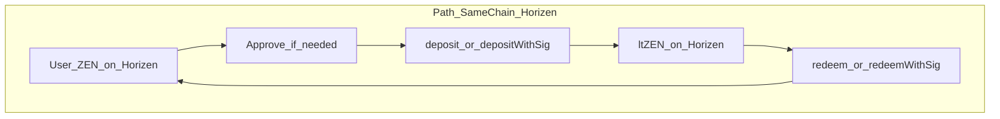
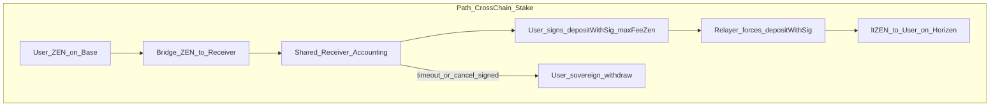
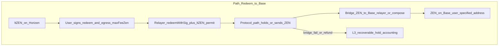

# stLighter 跨链与 Gasless 规范

> **用途**: 产品原则、双路径用户旅程、半编排状态机、合约信任边界、前端/BFF 行为、非目标与落地里程碑。  
> **状态**: 需求已锁定（2026-07-18 访谈；Q8 / B1 修订；**2026-07-21 Station 设计锁定** — 见 [`stLighter-station-design.md`](./stLighter-station-design.md)）。本阶段为文档规范，**不**包含合约/前端实现。  
> **关联**: [`stLighter-station-design.md`](./stLighter-station-design.md)（InboundStation / EgressStation 权威细节）、[`stLighter-relayer-design.md`](./stLighter-relayer-design.md)、[`gasless-acceptance.md`](./gasless-acceptance.md)、[`stLighter-frontend-plan.md`](./stLighter-frontend-plan.md)、[`Lighter-Bridge-Zen-Staking.md`](./Lighter-Bridge-Zen-Staking.md)、`ltzen-frontend/src/lib/chainGating.ts`  
> **最后更新**: 2026-07-21（Station 设计回链）

---

## 0. 背景与约束

1. **ZEN** 是标准 ERC20，**不支持** EIP-2612 / `IERC20Permit`。因此不存在「完全 & 完美」的 ZEN deposit gasless：至少需要一次对 spender（如 StLighter 或桥）的链上 `approve`，或采用本规范的跨链绕过路径。
2. **ZEN 主要在 Base 发行**；staking program 在 **Horizen (L3)**。许多用户在 L3 没有原生 gas（ETH），同链 stake/unstake 不便。
3. **ltZEN** 支持 EIP-2612，同链 / 跨链路径上的 **redeem 可以做到真·零 gas**（relayer 代发 + permit）。
4. 产品动机：不无限度堆无意义 gasless；提供务实的 **跨链 stake**（Base ZEN → Horizen ltZEN）与 **Redeem to Base**（Horizen ltZEN → Base ZEN）。

---

## 1. 原则与术语

### 1.1 原则

| # | 原则 |
|---|------|
| P1 | **保留有意义的真零 gas**（Horizen `redeemWithSig`；跨链 stake 的 L3 deposit；**Redeem to Base 的 L3 redeem+出桥**均由 relayer 代发，用户 L3 无 ETH 不得卡死）。 |
| P2 | **禁止**产品降级为「一律自付 gas、关闭 relayer」。 |
| P3 | **不宣传**「完美 ZEN deposit gasless」。同链 deposit 若仍需 `approve`，文案必须诚实。 |
| P4 | **同链路径**与 **跨链路径** 分离描述、分离实现、分离验收；不得混为同一 gasless 故事。 |
| P5 | 半编排向导：统一状态机、可断点续跑；在**系统安全与用户资金不受损**前提下，尽量减少交互。 |
| P6 | Relayer / L3 代发费用从 deposit/redeem **产出中扣除**；用户通过签名约束 `maxFeeZen`（实际 `fee ≤ maxFeeZen`）。 |
| P7 | 跨链 stake **终点固定**为 Horizen 上的 ltZEN；不提供终点链/资产自选。 |
| P8 | Redeem to Base **Base 到账锁定 B1**：直接到用户**签名约束的指定地址**；须满足地址确认、L3 失败可恢复、桥退款不落入 relayer EOA（§2.5 / §3.6）。 |

### 1.2 术语

| 术语 | 定义 |
|------|------|
| **gasless** | 用户**不为该笔协议写入交易**支付本链原生 gas；由 relayer 代发。≠「零链上授权 / 零签名」。 |
| **meaningful gasless** | 用户在目标链无 ETH 也能完成关键写入。包括：ltZEN `redeemWithSig`；跨链 stake 经 **InboundStation** 持仓后由 relayer 调 Station→`StLighter.deposit`；Redeem to Base 经 **EgressStation** 由 relayer 代发 credit/bridge。 |
| **meaningless gasless** | 对外宣称「ZEN deposit 完全免授权、免一切链上操作」，或在仍需 `approve` 时隐瞒该步。**禁止。** |
| **半编排** | 前端/BFF 串起固定步骤向导；每步可有用户确认；状态可持久化与恢复；不要求后端长期、原子地跟踪全部跨链消息至终态（那是「真·编排」，非本规范 MVP）。 |
| **共享入站车站 (InboundStation)** | Horizen 上共享合约：LZ 入金会计（`lzCompose` 仅 credit）；所有者签名后由 relayer 调 `stakeToStLighter` → `StLighter.deposit`；或 withdraw。**专用**于 stLighter 跨链 stake。详见 [`stLighter-station-design.md`](./stLighter-station-design.md)。 |
| **跨链 stake** | Base ERC20 ZEN → `approve` + **OFTAdapter.send** + compose → InboundStation 会计 → relayer `depositWithSig(payer=Station)` → Horizen ltZEN。 |
| **同链 stake/redeem** | 用户钱包已在 Horizen 持有 ZEN / ltZEN；gasless redeem 终点为 **Horizen 用户钱包中的 ZEN**。 |
| **Redeem to Base** | gasless：`redeemWithSig(receiver=EgressStation)` → `creditFromRedeem` → 另 tx `bridgeToBase` → **Base 用户指定地址（B1）**。 |
| **出站车站 (EgressStation)** | 承接 redeem ZEN、会计、**仅自身调桥**、退款可恢复；不是 Base 侧 Receiver。详见 Station 设计文档。 |

---

## 2. 双路径模型

* sameChain

* xchainStake

* xchainRedeem

### 2.1 Path A — 同链（Horizen）

- **Deposit**: 用户钱包持有 ZEN。因 ZEN 无 permit，可能需要至少一次对 StLighter 的 `approve`。之后可用 `deposit` 或 `depositWithSig*`（P0-A 用户代发 / P0-B relayer）。**不得**将同链 deposit 宣传为完美 gasless。
- **Redeem（终点 Horizen）**: ltZEN 有 permit → `redeemWithSig` + relayer = **真零 gas**；ZEN 进入**用户自己的 Horizen 钱包**。这是独立产品入口，与 Redeem to Base 并列（见 §2.3）。

### 2.2 Path B — 跨链 stake（Base → Horizen ltZEN）

**Token 事实**: Base 上 ZEN 是普通 ERC20；跨链入口为已有 **`ZenTokenOFTAdapter`**。Horizen 上 ZEN 是原生 **`ZenTokenOFT`**。详见 [`stLighter-station-compose-adr.md`](./stLighter-station-compose-adr.md) §0。

1. 用户在 Base：**必要时 `approve(adapter)`** → `adapter.send(to=InboundStation, composeMsg=CreditFromCompose)`（用户付 Base gas + LZ native fee；**不得**宣传为完美 gasless）。
2. LZ：Base **lock** ZEN → Horizen OFT 向 InboundStation **credit**；`lzCompose` **仅** `credit(owner, assets)`（**不**在 compose 内 stake）。
3. 用户签名 `DepositWithSig(..., payer=InboundStation)`；**L3 上由 relayer** 调 `StLighter.depositWithSig` → Station `payForDeposit`（用户无需 L3 ETH / 无需对 StLighter 做 ZEN approve）。
4. ltZEN mint 至签名中的 `receiver`；跨链 stake **终点固定 Horizen ltZEN**。
5. 未 stake 贷记可签 `withdrawToHorizen` 撤回。

细节与 EIP-712 → [`stLighter-station-design.md`](./stLighter-station-design.md)。

**绕过 L3 上 ZEN 无 permit**: 跨链 ZEN 由 InboundStation 持有并在 Station 路径进入 StLighter；用户无需在 L3 对 StLighter 做 ZEN `approve`，也无需 L3 ETH。Base 腿的 ERC20 `approve` 仍可能需要。

### 2.3 两条 redeem 产品入口（修订）

用户在 UI 上应能明确选择终点，二者**不得**混为同一步骤叙事：

| 入口 | 终点 | L3 gas | 说明 |
|------|------|--------|------|
| **同链 Redeem**（Path A） | Horizen，用户自己钱包中的 ZEN | gasless（relayer + ltZEN permit）可选/推荐 | 语义完备：用户就是要 L3 ZEN |
| **Redeem to Base**（Path C） | **Base** 上的 ZEN | L3 上 redeem **与** 出桥相关写入均须可由 relayer 完成 | 不得要求用户先在 L3 钱包持有 ZEN 再自付 ETH 出桥 |

### 2.4 Path C — Redeem to Base（目标形态）

1. Relayer 同 tx：`redeemWithSig(..., receiver=EgressStation)` + `EgressStation.creditFromRedeem`（用户预签，防抢记）。
2. **另 tx**：用户签 `BridgeToBase` → relayer 调 EgressStation → **仅 Station 调桥** → Base `dest`（B1）。
3. 失败/退款留在 Egress 会计，可重试或 `withdrawToHorizen`。
4. **完备性约束**与 B1 配套见 §2.5；合约细节见 Station 设计文档。

> **修订说明（原 Q8=B 作废）**；**到账 B1**；**Station 专用化 2026-07-21**。

### 2.5 Redeem to Base — B1 硬性配套（地址确认 · L3 可恢复 · 退款路由）

B1 路径短，但错地址与桥失败不可靠时损失更大。下列三条为 **规范硬性要求**，实现 ADR 只能细化不能削弱。

#### 2.5.1 地址确认（前端 + 签名域）

| 要求 | 说明 |
|------|------|
| 默认收款人 | 预填**当前连接钱包**同一地址（用户在 Base 上使用的地址）；允许修改。 |
| 改地址门槛 | 若 `dest ≠` 连接钱包：须二次确认（复述短校验 / 「I understand funds are irreversible」类确认，英文文案跟 tone-guide）。 |
| 签名绑定 | EIP-712（或等价）域必须包含 `dest`（及 chainId=Base）；BFF/链上校验 `dest` 与签名一致，禁止 relayer 擅自改收款人。 |
| 展示 | 签名前展示 checksum 地址、Base 标识、**预估 Base 实到 ZEN**（扣 protocol fee + 桥费后）。 |
| 合约收款人 | 若 `dest` 在 Base 上有 code：警告「contract may not be able to release tokens」；不阻断，但不得静默。 |
| 禁止 | 不得在无确认时由 UI/深链参数静默覆盖 `dest`（防钓鱼预填）。 |

#### 2.5.2 L3 失败可恢复（Egress 会计）

| 状态 | 资金位置 | 用户可做什么（均须所有权签名；L3 写入走 relayer） |
|------|----------|--------------------------------------------------|
| `egress_credited` | redeem 已完成，ZEN 在 Egress，尚未成功锁定出桥 | 发起/重试 bridge（可改 `dest` 若协议允许新签名）、或 **改为同链提取**到用户 Horizen 钱包 |
| `bridge_pending` | 出桥消息已发、等待终局 | 等待；超时进入调查/按桥规则处理 |
| `recoverable_hold` | 桥失败、超时、或 **退款已回到 Egress** | 重试 bridge（新签名）、改 `dest` 后重试、或同链提取到 Horizen 钱包 |
| `complete` | Base `dest` 已收到 ZEN | 终态 |

**禁止**：任何失败路径把 ZEN **唯一**落到「用户 L3 EOA 且假定用户有 ETH 才能自救」。同链提取到用户 Horizen 钱包可以是**显式选项**（用户要 L3 ZEN），但是否 gasless 由 relayer 代发 withdraw，不得依赖用户自付 L3 gas。

Egress 须按 `owner`（或 `egressId`）记账，使退款入账后仍归属原用户。

#### 2.5.3 桥退款路由（安全关键）

| 要求 | 说明 |
|------|------|
| 退款接收方 | 桥配置的 `refundAddress` / 等价字段必须是 **EgressStation**，**禁止**为 relayer EOA、BFF 热钱包、或未记账地址。 |
| `msg.sender` 陷阱 | 出桥调用必须由 **EgressStation** 发起；relayer 只代发「调 EgressStation」的交易。 |
| 入账会计 | 退款到账后须增加该用户在 EgressStation 的可恢复余额，并发事件供索引/前端进入 `recoverable_hold`。 |
| 验收 | 负向用例：模拟桥失败/退款 → 断言余额在 EgressStation 用户会计下，且 relayer 地址 ZEN 余额不增加。 |
| ADR | 具体桥的 refund 参数名与调用方式在出金 ADR 中写死，并附对照表。 |

---

## 3. 合约信任边界

### 3.1 角色

| 组件 | 职责 | 不得做 |
|------|------|--------|
| **StLighter** | 池化 stake/redeem、汇率、`depositWithSig*` / `redeemWithSig`、扣 fee | 不强制内嵌具体桥厂商逻辑；出金经 EgressStation |
| **InboundStation** | 入金会计；`lzCompose` 仅 credit；`stakeToStLighter` / `withdrawToHorizen` | 不在 compose 内 stake；不做开放 Call[]；不并入 StLighter |
| **EgressStation** | redeem 入账；**自身调桥**；退款会计；重试 / withdraw | 退款不得进 relayer；不做默认 B2 |
| **ltZEN** | ERC20 + permit + OFT | 不负责 ZEN 桥入/桥出会计 |
| **Relayer + BFF** | 代发 Station / StLighter；校验 EIP-712 与 `dest` | 不得改写签名字段；不得当 refund 收款方 |
| **桥** | 入：LZ + compose→Inbound；出：Egress→Base `dest`；refund→EgressStation | 厂商细节见 ADR |

### 3.2 InboundStation / EgressStation

权威细节（动作、EIP-712、compose 边界、交接）→ [`stLighter-station-design.md`](./stLighter-station-design.md)。

摘要：共享共池会计；**专用** stLighter；模板动作；入站 stake = Station→`deposit`；出站 = redeem+credit 同 tx、bridge 另 tx；仅 Egress 调桥。

### 3.3 Relayer / 费用

- 与 [`stLighter-relayer-design.md`](./stLighter-relayer-design.md) 一致：生产流量经 BFF；链上仍为最终权威。
- **强制 relayer 的 L3 写入**:
  - 跨链 stake 的 deposit；
  - **Redeem to Base** 的 redeem 以及完成出桥所必需的 L3 交易（用户 L3 无 ETH 为常态假设）。
- 费用：从本次 deposit/redeem（及出金若并入同一结算）的 ZEN 中扣除；用户签名中的 `maxFeeZen`（及若拆分的桥费上限）须在 UI 可见、可调。

### 3.4 桥选型（开放，约束固定）

**入金**只要求：LZ 到账 **InboundStation**；`lzCompose` 绑定 owner；未 stake 可签名撤回。

**出金（Redeem to Base）**要求：

1. 终态到账 = 签名约束的 Base `dest`（**B1**）；
2. L3 无用户 ETH 假设下仍能推进；失败/退款进入 **EgressStation** `recoverable_hold`（§2.5.2）；
3. 桥退款路由满足 §2.5.3（refund → EgressStation）。

具体 LayerZero / 其他 → **另开实现 ADR**（须含 refund 参数对照与负向验收）。

### 3.5 撤回默认（入金）

- MVP：未 stake ZEN **默认退回用户 Horizen 地址**。
- 退回 Base：可选能力，需显式签名；非跨链 stake MVP 阻塞项。

### 3.6 EgressStation 能力摘要

见 [`stLighter-station-design.md`](./stLighter-station-design.md) §4.2 / §5 / §6。上级 §2.5 的 B1 / 可恢复 / 退款路由仍然适用，合约名统一为 **EgressStation**。

---

## 4. 用户旅程与半编排状态机

### 4.1 通用要求

- 每步有明确 **phase**、可展示的卡点原因、explorer / 桥状态链接（若有）。
- 进度可持久化（localStorage 或等价），刷新可续跑。
- **资金安全**: 任何失败不得导致不可达余额；卡在 **InboundStation / EgressStation** 时必须能走签名撤回。
- 安全优先于少点击：可合并确认，但不可跳过关键签名（`maxFeeZen`、withdraw 目标）。

### 4.2 跨链 stake 状态机

| Phase | 链 | 用户动作 | 成功进入 | 失败 / 恢复 |
|-------|-----|----------|----------|-------------|
| `idle` | Base | 输入金额 | `need_bridge_approve` 或 `bridging` | — |
| `need_bridge_approve` | Base | `approve` 桥/路由（若需要） | `bridging` | 拒签 → `idle` |
| `bridging` | Base | 确认 bridge tx | `await_credit` | tx 失败 → 重试 / `idle` |
| `await_credit` | — | 等待 Receiver 会计入账 | `ready_to_deposit` | 超时提示；可继续轮询或取消意图 |
| `ready_to_deposit` | 签名（off-chain） | 签 deposit + `maxFeeZen` | `relaying_deposit` | 拒签 → 仍可 `withdraw` |
| `relaying_deposit` | Horizen | 无（BFF+relayer） | `complete`（持有 ltZEN） | 可重提签名；余额仍在 Receiver |
| `withdraw` | 签名 + relayer 或用户有 gas 时自发 | 签撤回 | `idle`（ZEN 在 Horizen 钱包） | — |
| `complete` | Horizen | — | 终态 | — |

### 4.3 Redeem to Base 状态机

| Phase | 说明 |
|-------|------|
| `idle` | 选择 Redeem to Base、金额；`dest` 默认=连接钱包（§2.5.1） |
| `confirm_dest` | 若改过 `dest`：二次确认；展示 Base 实到预估 |
| `sign_redeem_egress` | 签名绑定金额、`dest`、`maxFeeZen`（等） |
| `relaying_redeem` | BFF+relayer：redeem；ZEN → Egress 会计（`egress_credited`） |
| `bridging_out` | relayer 代发「Egress 出桥」；进入 `bridge_pending` |
| `await_base` | 轮询 Base `dest` 余额/桥状态 |
| `complete` | Base `dest` 已到账 |
| `recoverable_hold` | 失败/超时/退款入 Egress；UI 提供：重试出桥 / 改 dest 重签 / 同链提取到 Horizen |

同链 Redeem（Path A）：`sign` → `relay` → `complete`（ZEN 在 Horizen 钱包），与上表分离。

### 4.4 同链路径

与现有 Stake / Redeem UI 对齐；gasless 开关语义见 §5.3。不纳入跨链 Receiver 状态机。

---

## 5. 前端 / BFF 行为规范

### 5.1 动作可用性矩阵（目标态）

相对当前 `chainGating.ts`（Base 上 deposit → 引导切链）的**目标修订**：

| 动作 | Horizen | Base |
|------|---------|------|
| view / transparency | ✅ | ✅ |
| 同链 deposit | ✅ | ❌ → 引导：切 Horizen，或使用 **Cross-chain Stake** |
| 同链 redeem | ✅ | ❌ → 若仅有 Base ltZEN：引导 bridge ltZEN 回 Horizen；若走 Redeem to Base：用组合向导 |
| **cross_chain_stake** | ❌（已在 hub 用同链） | ✅ |
| **redeem_to_base** | ✅（向导） | 引导切 Horizen 开始 |
| bridge ltZEN (OFT) | ✅ | ✅ |
| gasless | 同链 deposit/redeem；跨链 stake L3 deposit **强制**；**Redeem to Base 的 L3 redeem+出桥强制** | Base 入金桥用户自付 Base gas |

> 实现前以本文为准；代码里程碑见 §7。本阶段**不改** `chainGating.ts`。

### 5.2 BFF

- 跨链 stake L3 `depositWithSig*`：**强制** BFF + relayer。
- **Redeem to Base**：代发对象为 StLighter redeem 与/或 **Egress** 出桥/恢复动作；**强制** BFF + relayer。
- 出金校验（在既有 EIP-712 校验之上）:
  - 签名中的 Base `dest` 与请求一致；不得替换；
  - `fee`（及桥费）≤ 用户上限；
  - 模拟 Egress 出桥调用；
  - 配置/编码层保证桥 refund 指向 Egress（部署配置校验，而非每次请求临时填写 relayer 地址）。
- 入金 Receiver 校验：所有权、金额 ≤ 会计余额、`fee ≤ maxFeeZen`、chainId / nonce / deadline、simulate。
- 同链 redeem（终点 Horizen 钱包）保持现有 P0-B 路径。

### 5.3 文案与开关

- **禁止**: 「Gasless stake — no approvals ever」类文案用于 ZEN deposit。
- **跨链 stake**: 明确到账为 **InboundStation**（compose 仅 credit）；展示 fee / `maxFeeZen`。
- **同链 redeem vs Redeem to Base**: 终点文案分离（「Receive ZEN on Horizen」vs 「Receive ZEN on Base」）。
- **Redeem to Base / B1**: 签名前展示 `dest`、不可逆提示（改地址时强化）、Base 实到预估；`recoverable_hold` 须说明资金在协议出金账户、可重试或改为 Horizen 提取。
- **同链 deposit gasless**: 若仍需 `approve`，分步展示授权与签名。
- Gasless：同链 redeem 默认推荐开启；跨链 stake L3 deposit 与 Redeem to Base 的 L3 段 **强制 relayer**。

---

## 6. 非目标 / 不做清单

| 不做 | 原因 |
|------|------|
| 关闭所有 gasless / 一律用户自付 L3 gas | 访谈明确为极差选项；违背 L3 无 gas 动机 |
| 跨链 stake 终点可选或默认 Base ltZEN | 终点固定 Horizen ltZEN |
| **Redeem to Base 以「先打进用户 L3 钱包再让用户自付 ETH 出桥」为唯一/默认完成态** | 完备性约束（原 Q8=B） |
| **默认采用 Base 侧出金 Receiver（B2）** | 已锁定 B1；路径更短 |
| 桥退款进入 relayer / 热钱包 EOA | §2.5.3；资金与信任风险 |
| Relayer 擅自改写签名中的 Base `dest` | 用户主权 / 盗资面 |
| Receiver / Egress 作为 StLighter 内部模块 / 深度存储耦合 | 独立、弱耦合 |
| 将同链 approve+deposit 与跨链入金路径写成同一种「gasless」 | 路径分离 |
| 将同链 Redeem 与 Redeem to Base 混成同一按钮无终点说明 | 易误导 |
| 在本规范阶段实现合约或前端代码 | 仅文档；实现见里程碑 |
| 本规范绑定具体桥厂商 | 另开 ADR（须满足 §2.5） |

---

## 7. 落地里程碑

| ID | 内容 | 产出 |
|----|------|------|
| **M-doc** | 本规范 + 旧文档交叉链接 | ✅ 本文档任务 |
| **M0** | 同链 gasless redeem 保持；同链 deposit 按本规范诚实表述（可仍要求 approve） | 文案 / 验收更新 |
| **M1** | **InboundStation / EgressStation**（见 Station 设计 S1–S2） | 合约 + 测试 |
| **M2** | 跨链 stake 半编排 UI + BFF（Station stake） | 前端 + BFF |
| **M3** | Redeem to Base：credit 同 tx + bridge 另 tx + §2.5 | 合约/集成 + 前端 + BFF |
| **M4** | 回写 `stLighter-frontend-plan.md`、uiux-spec、`gasless-acceptance.md`、`chainGating.ts` | 文档 + 代码对齐 |

桥协议 ADR 可与 M1 并行，但 M2 依赖「入账绑定所有者」已落地。

---

## 8. 对既有文档的取代关系

| 旧假设 | 状态 |
|--------|------|
| Base **仅** ltZEN OFT bridge，不在 Base 发起 stake | **部分取代**：新增 Base 上 **cross_chain_stake**；仍不在 Base 执行同链 `deposit`/`redeem` |
| gasless deposit P0-B 因 ZEN 无 permit 无限期暂缓 | **分流**：同链 deposit 暂缓理由仍成立；**跨链**用 **InboundStation → deposit** 提供 meaningful gasless |
| Receiver / Egress 泛称 | **正式名** InboundStation / EgressStation — [`stLighter-station-design.md`](./stLighter-station-design.md) |
| `canGasless(Base) = bridge` only | **待 M4 修订**：增加跨链 stake 强制 L3 relayer 语义 |

权威顺序：冲突时以**本文** > frontend-plan 首版范围表 > 代码注释。

---

## Appendix A — 访谈决策日志（2026-07-18）

| ID | 问题摘要 | 决策 |
|----|----------|------|
| Q1 | 跨链产品形态 | **倾向 A（组合一键）**；若编排/恢复过复杂再议。落地选型为 **半编排 B**（见 Q3）。 |
| Q2 | Gasless「有意义」边界 | **A**：保留真零 gas；deposit 诚实标注；**禁止 B**（一律自付、关 gasless）。 |
| Q3 | 一键交付边界 | **B** 半编排；安全前提下尽量少交互。 |
| Q4 | Relayer 费用 | **B** 从产出扣 fee（`maxFeeZen`）。 |
| — | 跨链 stake 终点 | **固定 Horizen ltZEN**，不可选。 |
| Q5 | 跨链 redeem | **B**：保留同链 redeem + 「Redeem to Base」组合向导。 |
| Q6 | Bridge 后 L3 deposit gas | **A** 强制 gasless；到账 **Receiver 合约**（非用户钱包），以绕开 ZEN 无 permit；relayer 代发 `depositWithSig*`。L3 跨链 redeem 侧依赖 ltZEN permit。 |
| Q7 | 托管资金与失败恢复 | **A** 用户主权可撤回。接收合约为**独立共享合约**，不与 stLighter 深度关联；支持主权动作（含 depositWithSig）。 |
| Q8 | Redeem to Base 形态 | **原 B 已修订作废**。现：同链 Redeem → Horizen 钱包；Redeem to Base → gasless redeem + 协议出金 + 桥至 Base（relayer）。 |
| Q8b | Base 到账形态 | **锁定 B1**（直接到用户指定 Base 地址）。配套硬性要求：地址确认、L3 Egress 失败可恢复、桥退款→Egress 而非 relayer（§2.5）。不做默认 B2。 |
| Q9 | Receiver 形态 | **A** 共享入口 + 内部会计；主权操作须所有权签名。（**入金** Inbound Receiver。） |
| Q10 | 文档交付 | 原则/术语、旅程与状态机、前端/BFF、非目标、里程碑；合约信任边界一并写入。同链与跨链路径分离。 |

**Q8 修订理由（2026-07-18）**: 「Redeem to Base」若先把 ZEN 交给用户 Horizen 钱包，L3 无 ETH 时无法完成到 Base 的最终归属，破坏业务语义完备性。

**Q8b 理由**: B1 路径更短；Base 收款无需用户 gas。风险用 §2.5 三条配套约束，而非改回 B2。

---

## Appendix B — 与实现相关的开放项（不阻塞已锁定决策）

1. 桥协议与 payload 编码（入金 compose / 出金 ADR；**出金须含 §2.5.3 refund 对照与负向验收**）。
2. Station 会计模型与 `unassigned`/`rescue` — 见 [`stLighter-station-design.md`](./stLighter-station-design.md) Appendix B。
3. 入金撤回 / Egress withdraw 均建议支持 relayer 代发。
4. 同链 deposit 是否引入 Permit2（与 Station 路径独立）。
5. ~~Base 到账形态~~ → **已锁定 B1**。
6. ~~开放 Call[] / 通用 Station~~ → **已放弃**；专用模板见 Station 设计。
7. ~~redeem→Egress 交接~~ → **已锁定**：同 tx redeem + `creditFromRedeem`；bridge **另 tx**。
8. `recoverable_hold` 下改 `dest` 次数/限额（产品可选）。
