# stLighter 跨链与 Gasless 规范

> **用途**: 产品原则、双路径用户旅程、半编排状态机、合约信任边界、前端/BFF 行为、非目标与落地里程碑。  
> **状态**: 需求已锁定（2026-07-18 访谈）；本阶段为文档规范，**不**包含合约/前端实现。  
> **关联**: [`stLighter-relayer-design.md`](./stLighter-relayer-design.md)、[`gasless-acceptance.md`](./gasless-acceptance.md)、[`stLighter-frontend-plan.md`](./stLighter-frontend-plan.md)、[`Lighter-Bridge-Zen-Staking.md`](./Lighter-Bridge-Zen-Staking.md)、`ltzen-frontend/src/lib/chainGating.ts`  
> **最后更新**: 2026-07-18

---

## 0. 背景与约束

1. **ZEN** 是标准 ERC20，**不支持** EIP-2612 / `IERC20Permit`。因此不存在「完全 & 完美」的 ZEN deposit gasless：至少需要一次对 spender（如 StLighter 或桥）的链上 `approve`，或采用本规范的跨链绕过路径。
2. **ZEN 主要在 Base 发行**；staking program 在 **Horizen (L3)**。许多用户在 L3 没有原生 gas（ETH），同链 stake/unstake 不便。
3. **ltZEN** 支持 EIP-2612，同链 / 跨链路径上的 **redeem 可以做到真·零 gas**（relayer 代发 + permit）。
4. 产品动机：不无限度堆无意义 gasless；提供务实的 **跨链 stake**（Base ZEN → Horizen ltZEN）与 **Redeem to Base**（Horizen ltZEN → Base ZEN）。

---

## 1. 原则与术语

### 1.1 原则

| # | 原则 |
|---|------|
| P1 | **保留有意义的真零 gas**（至少 Horizen `redeemWithSig`；跨链 stake 落地段由 relayer 代发）。 |
| P2 | **禁止**产品降级为「一律自付 gas、关闭 relayer」。 |
| P3 | **不宣传**「完美 ZEN deposit gasless」。同链 deposit 若仍需 `approve`，文案必须诚实。 |
| P4 | **同链路径**与 **跨链路径** 分离描述、分离实现、分离验收；不得混为同一 gasless 故事。 |
| P5 | 半编排向导：统一状态机、可断点续跑；在**系统安全与用户资金不受损**前提下，尽量减少交互。 |
| P6 | Relayer / L3 代发费用从 deposit/redeem **产出中扣除**；用户通过签名约束 `maxFeeZen`（实际 `fee ≤ maxFeeZen`）。 |
| P7 | 跨链 stake **终点固定**为 Horizen 上的 ltZEN；不提供终点链/资产自选。 |

### 1.2 术语

| 术语 | 定义 |
|------|------|
| **gasless** | 用户**不为该笔协议写入交易**支付本链原生 gas；由 relayer 代发。≠「零链上授权 / 零签名」。 |
| **meaningful gasless** | 用户在目标链无 ETH 也能完成关键写入，且不依赖 ZEN 的 permit。包括：ltZEN `redeemWithSig`；跨链 stake 中接收合约持仓后的 `depositWithSig*`（relayer 强制代发）。 |
| **meaningless gasless** | 对外宣称「ZEN deposit 完全免授权、免一切链上操作」，或在仍需 `approve` 时隐瞒该步。**禁止。** |
| **半编排** | 前端/BFF 串起固定步骤向导；每步可有用户确认；状态可持久化与恢复；不要求后端长期、原子地跟踪全部跨链消息至终态（那是「真·编排」，非本规范 MVP）。 |
| **共享独立接收合约 (Receiver)** | Horizen 上一个共享地址，接收跨链打入的 ZEN；内部会计记录所有者；与 StLighter **弱耦合**（不共享存储布局、不作为 StLighter 升级模块）。 |
| **跨链 stake** | Base ZEN →（桥至 Receiver）→ L3 `depositWithSig*`（relayer）→ 用户 Horizen 钱包收到 ltZEN。 |
| **同链 stake/redeem** | 用户钱包已在 Horizen 持有 ZEN / ltZEN，走现有 StLighter deposit / redeem（含可选 gasless）。 |
| **Redeem to Base** | 同链 gasless redeem 到用户 Horizen 钱包 → 再独立 bridge ZEN → Base（分步，可断点）。 |

---

## 2. 双路径模型

```mermaid
flowchart TB
  subgraph sameChain [Path_SameChain_Horizen]
    ZEN_wallet[User_ZEN_on_Horizen]
    approve_or_allow[Approve_if_needed]
    dep_std[deposit_or_depositWithSig]
    red_std[redeem_or_redeemWithSig]
    ltZEN_h[ltZEN_on_Horizen]
    ZEN_wallet --> approve_or_allow --> dep_std --> ltZEN_h
    ltZEN_h --> red_std --> ZEN_wallet
  end

  subgraph xchainStake [Path_CrossChain_Stake]
    ZEN_base[User_ZEN_on_Base]
    bridge_in[Bridge_ZEN_to_Receiver]
    recv[Shared_Receiver_Accounting]
    sig_dep[User_signs_depositWithSig_maxFeeZen]
    relayer_dep[Relayer_forces_depositWithSig]
    ltZEN_out[ltZEN_to_User_on_Horizen]
    ZEN_base --> bridge_in --> recv
    recv --> sig_dep --> relayer_dep --> ltZEN_out
    recv -->|timeout_or_cancel_signed| withdraw[User_sovereign_withdraw]
  end

  subgraph xchainRedeem [Path_Redeem_to_Base]
    ltZEN2[ltZEN_on_Horizen]
    gasless_red[redeemWithSig_plus_ltZEN_permit]
    ZEN_h[ZEN_in_User_wallet_Horizen]
    bridge_out[User_bridges_ZEN_to_Base]
    ZEN_base2[ZEN_on_Base]
    ltZEN2 --> gasless_red --> ZEN_h --> bridge_out --> ZEN_base2
  end
```

### 2.1 Path A — 同链（Horizen）

- **Deposit**: 用户钱包持有 ZEN。因 ZEN 无 permit，可能需要至少一次对 StLighter 的 `approve`。之后可用 `deposit` 或 `depositWithSig*`（P0-A 用户代发 / P0-B relayer）。**不得**将同链 deposit 宣传为完美 gasless。
- **Redeem**: ltZEN 有 permit → `redeemWithSig` + relayer = **真零 gas**（已验收，见 [`gasless-acceptance.md`](./gasless-acceptance.md)）。费用从产出扣，受 `maxFeeZen` 约束。

### 2.2 Path B — 跨链 stake（Base → Horizen ltZEN）

1. 用户在 Base 发起桥出；**到账地址 = 共享 Receiver**，不是用户 Horizen 钱包。
2. Receiver 会计将跨链资产记到**所有者**（由桥 payload / memo 绑定；实现选型见 §3.4）。
3. 用户签名授权 `depositWithSig*`（含明确的 `maxFeeZen`）；**L3 上强制由 relayer 代发**。
4. ltZEN mint 至用户 Horizen 地址（终点固定，不可选 Base）。
5. 若超时或用户取消：所有者凭**所有权签名**撤回未 stake 的 ZEN（默认退至用户 Horizen 地址；退回 Base 为可选显式动作，非 MVP 必做）。

**绕过 ZEN 无 permit 的关键点**: 跨链 ZEN 由 Receiver 持有并在其授权下进入 StLighter，用户无需在 L3 对 StLighter 做 ZEN `approve`，也无需在 L3 有 ETH。

### 2.3 Path C — Redeem to Base

1. 保留同链 redeem（Path A）。
2. 「Redeem to Base」向导：**先** Path A gasless redeem → ZEN 进用户 Horizen 钱包 → **再** 用户自行 / 向导引导 bridge ZEN → Base。
3. **不做**「redeem 直出进桥合约、一键出 Base」的对称组合（若未来变更，另开 ADR）。

---

## 3. 合约信任边界

### 3.1 角色

| 组件 | 职责 | 不得做 |
|------|------|--------|
| **StLighter** | 池化 stake/redeem、汇率、`depositWithSig*` / `redeemWithSig`、扣 fee | 不内嵌跨链桥逻辑；不托管「待跨链入金」会计 |
| **Receiver（共享、独立）** | 收跨链 ZEN；会计；校验所有权签名后执行允许的主权动作（含调用 StLighter deposit、withdraw） | 不继承 StLighter；不共享其存储；不做任意 `call`；不做兑换 |
| **ltZEN** | ERC20 + permit + OFT（多链流通） | 不负责 ZEN 桥入会计 |
| **Relayer + BFF** | 校验签名后代发 L3 写入；计算 `fee ≤ maxFeeZen` | 浏览器不得持有 rrelayer API key；不代发未校验请求 |
| **桥（实现 ADR）** | 将 Base ZEN 送到 Receiver，并携带可绑定所有者的数据 | 规范不绑定具体桥厂商 |

### 3.2 Receiver 能力（规范要求）

- **共享单例**（或经治理升级的代理），服务所有用户。
- **会计**: `owner → credited ZEN balance`（或等价 depositId 模型）；入账仅来自认可的桥/入金通道。
- **主权操作**（须所有者签名，EIP-712 或等价）:
  - `depositToStLighter(amount, maxFeeZen, …)` → 调用 StLighter `depositWithSig*` / 协议约定接口，ltZEN 给所有者（或签名指定的 receiver，默认所有者）。
  - `withdraw(amount, to)` → 默认 `to` 为所有者 Horizen 地址。
  - （可选，非 MVP）`withdrawAndBridgeToBase(…)`。
- **弱耦合**: Receiver 仅通过稳定外部接口与 StLighter 交互；StLighter 升级不得破坏 Receiver 会计语义（若破坏，Receiver 侧适配，而非把 Receiver 并入 StLighter）。

### 3.3 Relayer / 费用

- 与 [`stLighter-relayer-design.md`](./stLighter-relayer-design.md) 一致：生产流量经 BFF；链上 StLighter 仍为最终权威。
- **跨链 stake 的 L3 deposit：强制 relayer**（用户 L3 无 ETH 为常态假设）。
- 费用：从本次 deposit/redeem 的 ZEN（或等价）扣除；用户签名中的 `maxFeeZen` 必须在 UI 中可见、可调（在合理上下限内）。

### 3.4 桥选型（开放，约束固定）

规范**只要求**：

1. 到账地址为 Receiver；
2. 入账能可靠绑定所有者（payload / compose / memo）；
3. 失败或超时下，未 stake 余额仍在 Receiver 会计下可由所有者撤回。

具体 Stargate / LayerZero / 其他 → **另开实现 ADR**，不阻塞本规范。

### 3.5 撤回默认

- MVP：未 stake ZEN **默认退回用户 Horizen 地址**。
- 退回 Base：可选能力，需显式签名；非跨链 stake MVP 阻塞项。

---

## 4. 用户旅程与半编排状态机

### 4.1 通用要求

- 每步有明确 **phase**、可展示的卡点原因、explorer / 桥状态链接（若有）。
- 进度可持久化（localStorage 或等价），刷新可续跑。
- **资金安全**: 任何失败不得导致不可达余额；卡在 Receiver 时必须能走签名撤回。
- 安全优先于少点击：可合并确认，但不可跳过关键签名（`maxFeeZen`、withdraw 目标）。

### 4.2 跨链 stake 状态机

| Phase | 链 | 用户动作 | 成功进入 | 失败 / 恢复 |
|-------|-----|----------|----------|-------------|
| `idle` | Base | 输入金额 | `need_bridge_approve` 或 `bridging` | — |
| `need_bridge_approve` | Base | `approve` 桥/路由（若需要） | `bridging` | 拒签 → `idle` |
| `bridging` | Base | 确认 bridge tx | `await_credit` | tx 失败 → 重试 / `idle` |
| `await_credit` | — | 等待 Receiver 会计入账 | `ready_to_deposit` | 超时提示；可继续轮询或取消意图 |
| `ready_to_deposit` | 签名（off-chain） | 签 deposit + `maxFeeZen` | `relaying_deposit` | 拒签 → 仍可 `withdraw` |
| `relaying_deposit` | Horizen | 无（BFF+relayer） | `complete`（持有 ltZEN） | 可重提签名；余额仍在 Receiver |
| `withdraw` | 签名 + relayer 或用户有 gas 时自发 | 签撤回 | `idle`（ZEN 在 Horizen 钱包） | — |
| `complete` | Horizen | — | 终态 | — |

### 4.3 Redeem to Base 状态机

| Phase | 说明 |
|-------|------|
| `redeem_sign` / `redeem_relay` | 同链 gasless redeem（ltZEN permit） |
| `redeem_done` | ZEN 在用户 Horizen 钱包 |
| `bridge_out_*` | 独立 bridge 向导（approve if needed → bridge → await Base） |
| `complete` | Base 上 ZEN 到账 |

两段之间允许用户离开；向导应检测「已有 Horizen ZEN、待桥出」并允许从 `bridge_out_*` 续跑。

### 4.4 同链路径

与现有 Stake / Redeem UI 对齐；gasless 开关语义见 §5.3。不纳入跨链 Receiver 状态机。

---

## 5. 前端 / BFF 行为规范

### 5.1 动作可用性矩阵（目标态）

相对当前 `chainGating.ts`（Base 上 deposit → 引导切链）的**目标修订**：

| 动作 | Horizen | Base |
|------|---------|------|
| view / transparency | ✅ | ✅ |
| 同链 deposit | ✅ | ❌ → 引导：切 Horizen，或使用 **Cross-chain Stake** |
| 同链 redeem | ✅ | ❌ → 若仅有 Base ltZEN：引导 bridge ltZEN 回 Horizen；若走 Redeem to Base：用组合向导 |
| **cross_chain_stake** | ❌（已在 hub 用同链） | ✅ |
| **redeem_to_base** | ✅（向导） | 引导切 Horizen 开始 |
| bridge ltZEN (OFT) | ✅ | ✅ |
| gasless | 同链 deposit/redeem；跨链 stake 的 L3 deposit **强制** gasless | Base 上桥出用户自付 Base gas |

> 实现前以本文为准；代码里程碑见 §7。本阶段**不改** `chainGating.ts`。

### 5.2 BFF

- 跨链路径 L3 `depositWithSig*`：**强制**走 BFF + relayer（不允许「用户自付 L3 gas」作为默认跨链完成方式）。
- 校验扩展（相对现有 relayer 设计）:
  - 签名者对 Receiver 会计余额的所有权；
  - 请求金额 ≤ 会计可用余额；
  - `fee ≤ maxFeeZen`；
  - `verifyingContract` / chainId / nonce / deadline 与现规一致；
  - simulate 后再广播。
- 同链 redeem 保持现有 P0-B 路径。

### 5.3 文案与开关

- **禁止**: 「Gasless stake — no approvals ever」类文案用于 ZEN deposit。
- **跨链 stake**: 明确到账为协议 Receiver；展示将扣 fee 的预估与 `maxFeeZen`。
- **同链 deposit gasless**: 若仍需历史 `approve`，UI 须分步展示「Authorization」与「Sign to deposit」，不得合并成单一「完全免 gas」叙事。
- Gasless 开关：同链 redeem 默认推荐开启；跨链 L3 deposit **无开关**（强制 relayer）。

---

## 6. 非目标 / 不做清单

| 不做 | 原因 |
|------|------|
| 关闭所有 gasless / 一律用户自付 L3 gas | 访谈明确为极差选项；违背 L3 无 gas 动机 |
| 跨链 stake 终点可选或默认 Base ltZEN | 终点固定 Horizen ltZEN |
| Redeem to Base 一键「redeem→桥合约→Base」 | 访谈选分步 B；变更需 ADR |
| Receiver 作为 StLighter 内部模块 / 深度存储耦合 | 独立合约、弱耦合 |
| 将同链 approve+deposit 与跨链 Receiver 路径写成同一种「gasless」 | 路径分离 |
| 在本规范阶段实现合约或前端代码 | 仅文档；实现见里程碑 |
| 本规范绑定具体桥厂商 | 另开 ADR |

---

## 7. 落地里程碑

| ID | 内容 | 产出 |
|----|------|------|
| **M-doc** | 本规范 + 旧文档交叉链接 | ✅ 本文档任务 |
| **M0** | 同链 gasless redeem 保持；同链 deposit 按本规范诚实表述（可仍要求 approve） | 文案 / 验收更新 |
| **M1** | 共享 Receiver：会计、所有权签名、withdraw、弱耦合 deposit | 合约 + 测试 |
| **M2** | 跨链 stake 半编排 UI + BFF 强制 relayer deposit | 前端 + BFF |
| **M3** | Redeem to Base 向导（redeem gasless + bridge 分步） | 前端 |
| **M4** | 回写 `stLighter-frontend-plan.md`、uiux-spec、`gasless-acceptance.md`、`chainGating.ts` | 文档 + 代码对齐 |

桥协议 ADR 可与 M1 并行，但 M2 依赖「入账绑定所有者」已落地。

---

## 8. 对既有文档的取代关系

| 旧假设 | 状态 |
|--------|------|
| Base **仅** ltZEN OFT bridge，不在 Base 发起 stake | **部分取代**：新增 Base 上 **cross_chain_stake**；仍不在 Base 执行同链 `deposit`/`redeem` |
| gasless deposit P0-B 因 ZEN 无 permit 无限期暂缓 | **分流**：同链 deposit 暂缓理由仍成立；**跨链**用 Receiver 路径提供 meaningful gasless deposit |
| `canGasless(Base) = bridge` only | **待 M4 修订**：增加跨链 stake 强制 L3 relayer 语义 |

权威顺序：冲突时以**本文** > frontend-plan 首版范围表 > 代码注释。

---

## Appendix A — 访谈决策日志（2026-07-18）

| ID | 问题摘要 | 决策 |
|----|----------|------|
| Q1 | 跨链产品形态 | **倾向 A（组合一键）**；若编排/恢复过复杂再议。落地选型为 **半编排 B**（见 Q3）。 |
| Q2 | Gasless「有意义」边界 | **A**：保留真零 gas；deposit 诚实标注；**禁止 B**（一律自付、关 gasless）。 |
| Q3 | 一键交付边界 | **B** 半编排；安全前提下尽量少交互。 |
| Q4 | Relayer 费用 | **B** 从产出扣 fee（`maxFeeZen`）。 |
| — | 跨链 stake 终点 | **固定 Horizen ltZEN**，不可选。 |
| Q5 | 跨链 redeem | **B**：保留同链 redeem + 「Redeem to Base」组合向导。 |
| Q6 | Bridge 后 L3 deposit gas | **A** 强制 gasless；到账 **Receiver 合约**（非用户钱包），以绕开 ZEN 无 permit；relayer 代发 `depositWithSig*`。L3 跨链 redeem 侧依赖 ltZEN permit。 |
| Q7 | 托管资金与失败恢复 | **A** 用户主权可撤回。接收合约为**独立共享合约**，不与 stLighter 深度关联；支持主权动作（含 depositWithSig）。 |
| Q8 | Redeem to Base 形态 | **B**：先 gasless redeem 到用户钱包，再单独 bridge。 |
| Q9 | Receiver 形态 | **A** 共享入口 + 内部会计；主权操作须所有权签名。 |
| Q10 | 文档交付 | 原则/术语、旅程与状态机、前端/BFF、非目标、里程碑；**合约信任边界**一并写入（列表笔误重复 4，按必要项补齐）。同链与跨链 **路径分离**。 |

---

## Appendix B — 与实现相关的开放项（不阻塞规范）

1. 桥协议与 payload 编码（ADR）。
2. Receiver 会计模型：`mapping(address => uint256)` vs depositId 队列。
3. 撤回是否支持 relayer 代发（建议：是，否则 L3 无 gas 用户无法撤回）。
4. 同链 deposit 是否引入 Permit2 / 无限 approve 产品策略（与跨链路径独立决策）。
