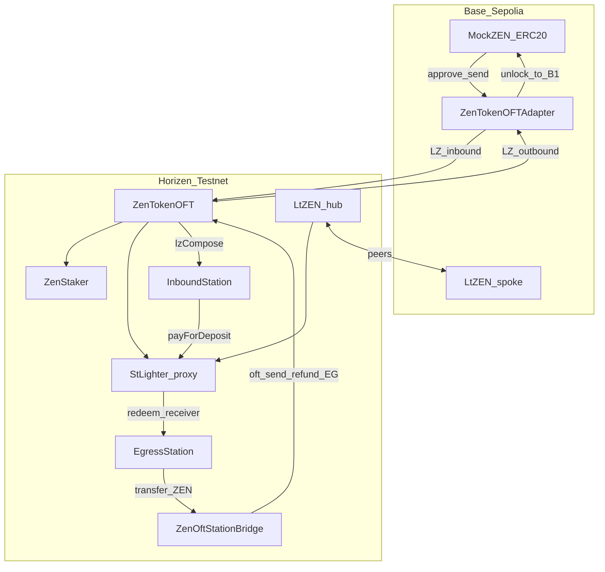

# stLighter Testnet Redeploy Checklist

> **Primary scope**: fresh deploy to **Horizen Testnet** (`2651420`) + **Base Sepolia** (`84532`).  
> Topology authority: [`stLighter-station-compose-adr.md`](./stLighter-station-compose-adr.md) §0 · OFT refs: [`stLighter-oft-reference.md`](./stLighter-oft-reference.md)  
> Station design: [`stLighter-station-design.md`](./stLighter-station-design.md) · Compose/bridge ADR: [`stLighter-station-compose-adr.md`](./stLighter-station-compose-adr.md) §1–§2  
> Product: [`stLighter-crosschain-gasless-spec.md`](./stLighter-crosschain-gasless-spec.md) (Path B stake / Path C Redeem to Base)
>
> | Wave | Scope | Status in this doc |
> |------|--------|--------------------|
> | **A** | Hub+spoke + InboundStation + cross-chain stake | Phases A–F |
> | **B** | EgressStation + `ZenOftStationBridge` + Redeem to Base | Phases G–I |
>
> **Still out of this checklist**: production Timelock hard-cutover (testnet: deployer EOA as `GOVERNANCE_ADDRESS`); post-send LZ failure ops playbook beyond MVP.

## 0. Topology (do not confuse)

| Chain | ZEN | LayerZero | ltZEN |
|-------|-----|-----------|-------|
| **Base Sepolia** | `MockZEN` (plain ERC20) | **`ZenTokenOFTAdapter`** locks ERC20 on `send` / unlocks on receive | Spoke OFT, `minter = 0` |
| **Horizen Testnet** | **`ZenTokenOFT`** (native OFT = token) | Peer of Base adapter; Inbound compose + Egress OFT `send` | Hub OFT, `minter = StLighter proxy` |

Do **not** deploy `MockZEN` on Horizen for this stack. Hub stake asset = `ZenTokenOFT`.



**Path summary**

| Path | Direction | Contracts |
|------|-----------|-----------|
| **Wave A — cross-chain stake** | Base ZEN → Horizen ltZEN | Adapter `send(to=InboundStation, compose)` → credit → `depositWithSig(payer=Station)` |
| **Wave B — Redeem to Base** | Horizen ltZEN → Base ZEN @ B1 | `redeemWithSig(receiver=Egress)` + `creditFromRedeem` → `bridgeToBase` → Bridge `oft.send` → Adapter unlocks ERC20 to `dest` |
| **Same-chain redeem** | Horizen ltZEN → Horizen ZEN | `redeem` / `redeemWithSig` to user wallet (no Egress) — keep as separate UX |

---

## 1. Preflight

- [ ] Fund deployer on Horizen Testnet and Base Sepolia
- [ ] Confirm LZ Endpoint V2 addresses + **eids** → `LZ_ENDPOINT_HORIZEN`, `LZ_ENDPOINT_BASE`, `HORIZEN_EID`, `BASE_EID`
- [ ] Confirm Send/Receive ULN libs + testnet DVNs → `LZ_SEND_LIB`, `LZ_RECEIVE_LIB`, `LZ_CONFIRMATIONS`, `DVN_ADDRESSES`
- [ ] `.env` from [`.env.template`](../.env.template): `PRIVATE_KEY`, `ADMIN_ADDRESS`, `GOVERNANCE_ADDRESS` (= deployer EOA)
- [ ] Treat this as a **new** address book (clear stale frontend env)

**RPC examples**

```bash
export HORIZEN_RPC=https://horizen-testnet.rpc.caldera.xyz/http
export BASE_RPC=https://sepolia.base.org
```

---

## 2. Script inventory

| Script | Chain | Purpose |
|--------|-------|---------|
| [`DeployZenTokenOFT.s.sol`](../script/DeployZenTokenOFT.s.sol) | Horizen | Native ZEN OFT |
| [`DeployZenStaker.s.sol`](../script/DeployZenStaker.s.sol) | Horizen | Staker |
| [`DeployStLighterHorizen.s.sol`](../script/DeployStLighterHorizen.s.sol) | Horizen | LtZEN hub + StLighter proxy |
| [`DeployInboundStation.s.sol`](../script/DeployInboundStation.s.sol) | Horizen | Wave A Station |
| [`DeployEgressStation.s.sol`](../script/DeployEgressStation.s.sol) | Horizen | Wave B: Egress + ZenOftStationBridge + `setBridge` |
| [`DeployMockZEN.s.sol`](../script/DeployMockZEN.s.sol) | Base | ERC20 ZEN faucet |
| [`DeployZenTokenOFTAdapter.s.sol`](../script/DeployZenTokenOFTAdapter.s.sol) | Base | OFTAdapter |
| [`DeployStLighterBase.s.sol`](../script/DeployStLighterBase.s.sol) | Base | LtZEN spoke |
| [`WireZenOft.s.sol`](../script/WireZenOft.s.sol) | both | ZEN Adapter ↔ ZenTokenOFT `setPeer` |
| [`WireStLighterOFT.s.sol`](../script/WireStLighterOFT.s.sol) | both | ltZEN `setPeer` |
| [`ConfigureStLighterOFTDVN.s.sol`](../script/ConfigureStLighterOFTDVN.s.sol) | both | ULN for any OApp (`OAPP_LOCAL` or `LT_ZEN_LOCAL`) |

**Wave B circular deploy** (`DeployEgressStation`):

`EgressStation` needs a non-zero `bridge_` at construct time; `ZenOftStationBridge` needs a live Egress and checks `zen() == oft.token()`. Script order:

```text
1. EgressStation(zen, address(1), deployer)   // placeholder never called
2. ZenOftStationBridge(oft, egress, BASE_EID, owner)
3. egress.setBridge(realBridge)
4. if owner ≠ deployer: transferOwnership(owner)  // Ownable2Step accept
```

Env inputs:

| Env | Value |
|-----|--------|
| `ZEN_TOKEN_ADDRESS` | Horizen ZenTokenOFT (A1) |
| `BASE_EID` | Base Sepolia LZ eid (e.g. `40245`) |
| `GOVERNANCE_ADDRESS` / Timelock | Bridge owner; Egress final owner |
| `PRIVATE_KEY` | deployer (temporary Egress owner for `setBridge`) |

Outputs: `EGRESS_STATION_ADDRESS`, `ZEN_OFT_STATION_BRIDGE_ADDRESS`.

Optional: [`DeployStLighterTimelock.s.sol`](../script/DeployStLighterTimelock.s.sol) — skip on testnet if using EOA governance.

---

## 3. Phase A — Horizen hub

### A1 — ZenTokenOFT (Horizen ZEN)

```bash
export LZ_ENDPOINT_HORIZEN=0x3aCAAf60502791D199a5a5F0B173D78229eBFe32  # testnet

forge script script/DeployZenTokenOFT.s.sol --rpc-url $HORIZEN_RPC --broadcast --private-key $PRIVATE_KEY

# → set ZEN_TOKEN_ADDRESS
export ZEN_TOKEN_ADDRESS=0x82a5B1008f29811f6183B21EaA0f7D90d7595Bb6
```

- [ ] `ZEN_TOKEN_ADDRESS` = printed ZenTokenOFT

### A2 — ZenStaker

```bash
export ADMIN_ADDRESS=$(cast wallet address --private-key=$PRIVATE_KEY)
forge script script/DeployZenStaker.s.sol --rpc-url $HORIZEN_RPC --broadcast --private-key $PRIVATE_KEY
# → set ZEN_STAKER_ADDRESS
export ZEN_STAKER_ADDRESS=0x5db9f0dD5dbBFC4dFbeeBF37320600bEF29Fb65a
```

- [ ] Staker `STAKE_TOKEN` / reward token = A1

### A3 — Governance

- [ ] `GOVERNANCE_ADDRESS` = deployer EOA (or Timelock if you ran A3 optional)

### A4 — LtZEN + StLighter

```bash
export GOVERNANCE_ADDRESS=$(cast wallet address --private-key=$PRIVATE_KEY)
forge script script/DeployStLighterHorizen.s.sol --rpc-url $HORIZEN_RPC --broadcast --private-key $PRIVATE_KEY
# → set STLIGHTER_PROXY_ADDRESS, LT_ZEN_HORIZEN
export LT_ZEN_HORIZEN=0xC6Fb040d2c5a377fF3798BaB0bC8f881BE9C17f2
export STLIGHTER_PROXY_ADDRESS=0x4a47A011E5d459D8E6dDb2f2c83a063D52F0dBe7
export ST_LIGHTER=$STLIGHTER_PROXY_ADDRESS
export LT_ZEN=$LT_ZEN_ADDRESS
cast call $LT_ZEN 'minter()(address)' --rpc-url $HORIZEN_RPC
```

- [ ] `ltZen.minter() == proxy`
- [ ] Proxy initialized with A1 ZEN + A2 staker; owner = governance

### A5 — InboundStation

```bash
forge script script/DeployInboundStation.s.sol --rpc-url $HORIZEN_RPC --broadcast --private-key $PRIVATE_KEY
# → set INBOUND_STATION_ADDRESS
export INBOUND_STATION_ADDRESS=0xcEC5Fe535052e336DE43A564De2228C9Be3D88A4
export IN_STATION=$INBOUND_STATION_ADDRESS
```

- [ ] `zen()` / `zenOft()` = A1; `stLighter()` = proxy; `composeCaller()` = `LZ_ENDPOINT_HORIZEN`

``` bash
cast call $IN_STATION 'zen()(address)' --rpc-url $HORIZEN_RPC
cast call $IN_STATION 'zenOft()(address)' --rpc-url $HORIZEN_RPC
cast call $IN_STATION 'stLighter()(address)' --rpc-url $HORIZEN_RPC
cast call $IN_STATION 'composeCaller()(address)' --rpc-url $HORIZEN_RPC
```

**Horizen ZEN inventory:** ZenTokenOFT has no faucet. Same-chain smoke needs ZEN bridged from Base (Phase C1 → send to EOA), then Phase D.

---

## 4. Phase B — Base Sepolia spoke

### B1 — MockZEN

```bash
forge script script/DeployMockZEN.s.sol --rpc-url $BASE_RPC --broadcast --private-key $PRIVATE_KEY
# → set BASE_ZEN_TOKEN_ADDRESS
export BASE_ZEN_TOKEN_ADDRESS=0xeb3b64E9Ec88D7A48Dcb1ae56aec11c3E8214063
export BASE_ZEN=$BASE_ZEN_TOKEN_ADDRESS
```

### B2 — ZenTokenOFTAdapter

```bash
export LZ_ENDPOINT_BASE=0x6EDCE65403992e310A62460808c4b910D972f10f
forge script script/DeployZenTokenOFTAdapter.s.sol --rpc-url $BASE_RPC --broadcast --private-key $PRIVATE_KEY
# → set BASE_ZEN_ADAPTER
export BASE_ZEN_ADAPTER=0xF91e475D62E6181C630bf70bCd8564c29b03486B
```

- [ ] Adapter `token()` = MockZEN

### B3 — LtZEN spoke

```bash
forge script script/DeployStLighterBase.s.sol --rpc-url $BASE_RPC --broadcast --private-key $PRIVATE_KEY
# → set LT_ZEN_BASE
export LT_ZEN_BASE=0x0d4bE6a999279c8e5Bf7d63FDb0aB626b9275a76
```

- [ ] `minter() == address(0)`

---

## 5. Phase C — LayerZero wiring (two OFT pairs)

### C1 — ZEN path (Adapter ↔ ZenTokenOFT)

**On Base** (peer = Horizen ZenTokenOFT):

```bash
export HORIZEN_EID=40435
export ZEN_OFT_LOCAL=$BASE_ZEN_ADAPTER
export PEER_EID=$HORIZEN_EID
export PEER_ZEN_OFT=$ZEN_TOKEN_ADDRESS
forge script script/WireZenOft.s.sol --rpc-url $BASE_RPC --broadcast --private-key $PRIVATE_KEY
```

**On Horizen** (peer = Base adapter):

```bash
export BASE_EID=40245
export ZEN_OFT_LOCAL=$ZEN_TOKEN_ADDRESS
export PEER_EID=$BASE_EID
export PEER_ZEN_OFT=$BASE_ZEN_ADAPTER
forge script script/WireZenOft.s.sol --rpc-url $HORIZEN_RPC --broadcast --private-key $PRIVATE_KEY
```

**DVN** (each chain; set `OAPP_LOCAL` to local ZEN OApp, `PEER_EID` = remote, `LZ_ENDPOINT` = local endpoint):

```bash
forge script script/ConfigureStLighterOFTDVN.s.sol --rpc-url $RPC --broadcast --private-key $PRIVATE_KEY
```

**Smoke C1**

- [ ] Base: `MockZEN.mint()` → `approve(adapter)` → `adapter.send` to **user EOA** on Horizen (empty `composeMsg`)
- [ ] User holds Horizen `ZenTokenOFT` balance

``` bash
cast send $BASE_ZEN 'mint()' --rpc-url $BASE_RPC --private-key=$USER1_PRIVATE_KEY
cast send $BASE_ZEN 'approve(address,uint256)' $BASE_ZEN_ADAPTER $(cast --to-wei 10000000000 ether) --rpc-url $BASE_RPC --private-key $USER1_PRIVATE_KEY

```

### C2 — ltZEN path

**Horizen → set peer Base ltZEN**

```bash
export LT_ZEN_LOCAL=$LT_ZEN_HORIZEN
export PEER_EID=$BASE_EID
export PEER_LT_ZEN=$LT_ZEN_BASE
forge script script/WireStLighterOFT.s.sol --rpc-url $HORIZEN_RPC --broadcast --private-key $PRIVATE_KEY
```

**Base → set peer Horizen ltZEN**

```bash
export LT_ZEN_LOCAL=$LT_ZEN_BASE
export PEER_EID=$HORIZEN_EID
export PEER_LT_ZEN=$LT_ZEN_HORIZEN
forge script script/WireStLighterOFT.s.sol --rpc-url $BASE_RPC --broadcast --private-key $PRIVATE_KEY
```

**DVN** for both ltZEN OApps (`OAPP_LOCAL` or `LT_ZEN_LOCAL`).

**Smoke C2**

- [ ] After Phase D has ltZEN: Hub → Base → Hub; `issuedShares` / `convertToAssets` unchanged by bridge

---

## 6. Phase D — Same-chain Horizen smoke

Requires Horizen ZEN from C1.

- [ ] `ZEN.approve(StLighter)` + `deposit` → ltZEN minted; `issuedShares` increases
- [ ] Optional: gasless `depositWithSigAndPermit` / DirectContractRelayer (`payer = user`)
- [ ] `redeem` / `redeemWithSig`
- [ ] Faucet: **Base MockZEN only** (Horizen OFT has no mint faucet)

---

## 7. Phase E — Wave A cross-chain stake smoke

| Step | Expect |
|------|--------|
| E1 | Sign `CreditFromCompose` (InboundStation domain on Horizen; read `nonces` via Horizen RPC) |
| E2 | Base: `approve(adapter)` if needed → `adapter.send(to=InboundStation, composeMsg=v1)` + LZ native fee |
| E3 | After LZ: `InboundStation.credited(user) == amountLD` |
| E4 | Sign `DepositWithSig(payer=Station)`; relayer/Direct → ltZEN; `credited == 0` |
| E5 | Escape: `withdrawToHorizen` without stake |
| E6 | Negatives: wrong payer / insufficient credit rejected |

Frontend path: `/stake-crosschain` once env is filled (Phase F).  
Redeem to Base is **Phase H** (requires Phase G deploy).

---

## 8. Phase F — Frontend / BFF env (Wave A)

Map into `ltzen-frontend/.env.local` (see `ltzen-frontend/env.local.example`):

| Frontend var | Source |
|--------------|--------|
| `NEXT_PUBLIC_HORIZEN_STLIGHTER_ADDRESS` | StLighter proxy |
| `NEXT_PUBLIC_HORIZEN_LTZEN_ADDRESS` | LtZEN hub |
| `NEXT_PUBLIC_HORIZEN_ZEN_ADDRESS` | ZenTokenOFT |
| `NEXT_PUBLIC_HORIZEN_ZENSTAKER_ADDRESS` | ZenStaker |
| `NEXT_PUBLIC_HORIZEN_INBOUND_STATION_ADDRESS` | InboundStation |
| `NEXT_PUBLIC_BASE_LTZEN_ADDRESS` | LtZEN spoke |
| `NEXT_PUBLIC_BASE_ZEN_ADDRESS` | MockZEN |
| `NEXT_PUBLIC_BASE_ZEN_OFT_ADAPTER_ADDRESS` | Adapter |
| `NEXT_PUBLIC_HORIZEN_EID` / `NEXT_PUBLIC_BASE_EID` | eids |

- [ ] Relayer: DirectContractRelayer first; BFF optional
- [ ] Transparency lists Base ERC20 + Adapter separately
- [ ] Faucet UI only on Base (`/stake-crosschain`); Horizen `/stake` has no mint

---

## 9. Phase G — Wave B deploy (EgressStation + ZenOftStationBridge)

**Prerequisites**: Phases A–C complete (especially **C1** ZEN peers + DVN). No new Base contracts — outbound unlocks via existing Adapter.

### G1 — Deploy (Horizen)

```bash         # A1 ZenTokenOFT
export BASE_EID=40245
export GOVERNANCE_ADDRESS=$(cast wallet address --private-key=$PRIVATE_KEY)

forge script script/DeployEgressStation.s.sol --rpc-url $HORIZEN_RPC --broadcast --private-key $PRIVATE_KEY

# → set:
export EGRESS_STATION_ADDRESS=0x7108eC19Ef64E2184b3C6c6450FBb5e89F9e848c
# Original Bridge (minAmountLD bug) — replaced:
# export ZEN_OFT_STATION_BRIDGE_ADDRESS=0xf9189d341642a9D047a08245078bf0B64e30215A
# Redeployed Bridge (`minAmountLD=0` dust fix) via RedeployZenOftStationBridge:
export ZEN_OFT_STATION_BRIDGE_ADDRESS=0x3D9627d7565e652D8E1A6b2E096bDA2A678BCf8d
```

- [x] G1 deployed (Horizen testnet) — addresses above; frontend `.env.local` wired
- [x] Bridge redeployed after `SlippageExceeded` / dust fix; Egress `setBridge` updated

Testnet: set `GOVERNANCE_ADDRESS` = deployer EOA so Egress ownership stays with the key that ran `setBridge`. If governance ≠ deployer, accept Ownable2Step on Egress after broadcast.

### G2 — Post-deploy checks

```bash
export EG=$EGRESS_STATION_ADDRESS
export BR=$ZEN_OFT_STATION_BRIDGE_ADDRESS

cast call $EG 'zen()(address)' --rpc-url $HORIZEN_RPC
cast call $EG 'bridge()(address)' --rpc-url $HORIZEN_RPC
cast call $BR 'egress()(address)' --rpc-url $HORIZEN_RPC
cast call $BR 'oft()(address)' --rpc-url $HORIZEN_RPC
cast call $BR 'dstEid()(uint32)' --rpc-url $HORIZEN_RPC
cast call $BR 'zen()(address)' --rpc-url $HORIZEN_RPC
```

- [ ] `Egress.zen() == ZenTokenOFT == Bridge.oft() == Bridge.zen()`
- [ ] `Egress.bridge() == ZenOftStationBridge` (not placeholder)
- [ ] `Bridge.egress() == EgressStation`
- [ ] `Bridge.dstEid() == BASE_EID`
- [ ] Owner of both = `GOVERNANCE_ADDRESS`
- [ ] Egress / Bridge are **not** upgradeable proxies (plain deploys)

### G3 — Relayer / funding notes

- Relayer pays **Horizen native** for `bridgeToBase{value}` (LZ fee); quote via `ZenOftStationBridge.quoteBridgeNativeFee(amount, dest, extraOptions)`.
- Optional `feeZen` on `bridgeToBase` pays the relayer in ZEN from credited assets (`feeZen < assets`, cap `MAX_GAS_FEE_ZEN = 10e18`).
- Excess LZ native fee refunds to **EgressStation** (`receive()`), never the relayer EOA ([ADR §2](./stLighter-station-compose-adr.md)).
- No pre-fund of Egress with ZEN required — float comes from `redeemWithSig(receiver=Egress)`.

### G4 — rrelayer allowlist (when using BFF)

Extend Horizen allowlist `to ∈ { StLighter proxy, InboundStation, EgressStation }` (Bridge is **not** called by relayer — only Egress calls Bridge).

---

## 10. Phase H — Wave B smoke (Redeem to Base)

**Prerequisites**: Phase D or E left the user with Horizen **ltZEN**; Phase G deployed; C1 peers live.

EIP-712 domains (Horizen `chainId`, `verifyingContract` = contract below):

| Type | Contract | Typehash fields |
|------|----------|-----------------|
| `RedeemWithSig` | StLighter | existing gasless redeem; **`receiver = EgressStation`** |
| `CreditFromRedeem` | EgressStation | `(assets, owner, nonce, deadline)` — `assets` = **net ZEN after redeem fee** |
| `BridgeToBase` | EgressStation | `(assets, dest, maxFeeZen, owner, nonce, deadline)` — `dest` = Base **B1** |
| `WithdrawToHorizen` | EgressStation | escape hatch after credit |

Station nonces are **separate** from StLighter nonces. Read `EgressStation.nonces(owner)` and `StLighter.nonces(owner)` independently.

| Step | Expect |
|------|--------|
| H1 | User confirms **B1** `dest` (default = connected Base wallet; change requires explicit confirm — product §2.5.1) |
| H2 | Sign `RedeemWithSig(receiver=Egress)` + `CreditFromRedeem(assets=netZen)` |
| H3 | Relayer **same tx**: `StLighter.redeemWithSig(...)` then `Egress.creditFromRedeem(...)` → `credited(owner) == netZen`; `float` cleared for that amount |
| H4 | Sign `BridgeToBase(assets, dest=B1, maxFeeZen, …)` |
| H5 | Relayer: `quoteBridgeNativeFee` → `Egress.bridgeToBase{value}(..., feeZen, extraOptions)` → Bridge `oft.send` → `onBridgeComplete` **in-tx**; `credited` / `pendingTotal` clear for that order |
| H6 | After LZ delivery: Base `MockZEN.balanceOf(B1)` increases by bridged amount (minus any OFT dust rules; testnet expect full LD) |
| H7 | Escape: after H3, skip bridge → `withdrawToHorizen` → user holds Horizen ZEN |
| H8 | Negatives: credit without matching float / wrong sig / snatch credit; non-Egress calling `bridgeZen`; `feeZen >= assets`; insufficient `msg.value` for LZ fee |

**Relayer same-tx order (H3)** — do not split redeem and credit across txs without a recovery plan; float is snatch-resistant only via EIP-712, but UX expects atomic credit:

```text
redeemWithSig(receiver=EgressStation, …)
creditFromRedeem(assets = netZenAfterRedeemFee, owner, deadline, sig)
```

**B1 / recoverable** ([crosschain-gasless-spec §2.5](./stLighter-crosschain-gasless-spec.md)):

- [ ] `dest` is signature-bound; UI shows irreversible Base destination before sign
- [ ] If user abandons after credit: `withdrawToHorizen` restores Horizen ZEN
- [ ] Pre-send bridge failures revert whole `bridgeToBase` (credit restored via tx revert) — no `onBridgeRefund` needed
- [ ] Post-send LZ failure: out of MVP; document ops escalation only

**Smoke vs same-chain redeem**: keep `/redeem` (Horizen ZEN to wallet) separate from Redeem-to-Base wizard; do not merge CTAs without endpoint copy.

---

## 11. Phase I — Frontend / BFF (Wave B)

**Status**: Wave B UI/BFF shipped in `ltzen-frontend` (`/redeem-to-base`); enable `NEXT_PUBLIC_USE_RELAYER_BFF=1` + rrelayer allowlist/native for Egress.

### I1 — Env additions

| Var | Source |
|-----|--------|
| `NEXT_PUBLIC_HORIZEN_EGRESS_STATION_ADDRESS` | EgressStation |
| (optional) `NEXT_PUBLIC_HORIZEN_ZEN_OFT_BRIDGE_ADDRESS` | ZenOftStationBridge — for quotes/transparency; writes go through Egress |

Add to `ltzen-frontend/env.local.example` when Wave B UI lands — **done**.

### I2 — Product checklist

- [x] Wizard: amount → confirm B1 `dest` → sign redeem+credit → relay → sign bridge → relay+LZ wait → Base balance (`/redeem-to-base`)
- [x] EIP-712: `CreditFromRedeem` / `BridgeToBase` / Egress `WithdrawToHorizen` (domain = Egress; Horizen chainId)
- [x] BFF kinds: `redeemWithSig` (receiver=Egress) + `creditFromRedeem` (sequential) + `bridgeToBase` with native fee
- [x] DirectContractRelayer path for testnet (user pays Horizen gas) before forcing BFF
- [x] `recoverable_hold` UX after credit: retry bridge (new sig/nonce) or withdraw to Horizen
- [x] chainGating: Redeem to Base available when on Horizen (Base → switch guide)
- [x] Transparency: list Egress + Bridge + note refundAddress = Egress

### I3 — Acceptance (product)

- [x] User with **no Horizen ETH** can complete Redeem to Base via BFF+relayer (meaningful gasless on L3 legs)
- [x] Base receipt is exactly signed B1, not relayer EOA
- [x] Same-chain Redeem copy remains “Receive ZEN on Horizen”

**Testnet smoke refs (2026-07-26, BFF + rrelayer)**

| Path | Horizen tx |
|------|------------|
| Wave B `bridgeToBase` | [`0xba09…b4e4`](https://horizen-testnet.explorer.caldera.xyz/tx/0xba09ec6bafca5a31484298fedfa38e0ae36372890a04d0dabc22053dbe75b4e4) |
| Wave A `depositWithSig` (payer=InboundStation) | [`0x602b…0597`](https://horizen-testnet.explorer.caldera.xyz/tx/0x602bc6df52a5450d475f2383e4b853a8a208017f4068a34aed8e7ea36f290597) |

---

## 12. Address book (fill after broadcast)

| Role | Chain | Address |
|------|-------|---------|
| ZenTokenOFT (ZEN) | Horizen | |
| ZenStaker | Horizen | |
| LtZEN hub | Horizen | |
| StLighter proxy | Horizen | |
| StLighter impl | Horizen | |
| InboundStation | Horizen | |
| EgressStation | Horizen | |
| ZenOftStationBridge | Horizen | |
| MockZEN | Base | |
| ZenTokenOFTAdapter | Base | |
| LtZEN spoke | Base | |
| LZ Endpoint | Horizen | |
| LZ Endpoint | Base | |
| Horizen eid | — | |
| Base eid | — | |

---

## 13. Known gaps

- Wave B on-chain smoke (Phase H) still operator-run after rrelayer allowlist + native value for Egress
- No Horizen ZEN faucet — bridge-first for same-chain smoke (Base MockZEN mint ≤256)
- DVN/confirmations must be verified on **testnet** endpoints (mainnet ZenTokenOFT refs are guidance only)
- `composeCaller` assumed = Horizen LZ Endpoint; if MessagingComposer differs, set via InboundStation owner after deploy
- Post-send LZ failure / partial refund on egress path: deferred past MVP ([ADR §2](./stLighter-station-compose-adr.md))

---

## Appendix — Mainnet delta

When promoting to mainnet:

- Prefer Timelock for StLighter / ltZEN / OFT / Station / Bridge ownership ([`DeployStLighterTimelock.s.sol`](../script/DeployStLighterTimelock.s.sol))
- Align DVN with production Horizen ZenTokenOFT / USDC path ([`stLighter-oft-reference.md`](./stLighter-oft-reference.md))
- Base may use production ERC20 ZEN + existing Adapter (not MockZEN)
- Full security review: peers, proxy upgrades, Station allowlists, Egress refund routing — [`todo-list.md`](./todo-list.md) P2
- Wave B: confirm production B1 UX + relayer native-fee treasury ops before hard-cutover
