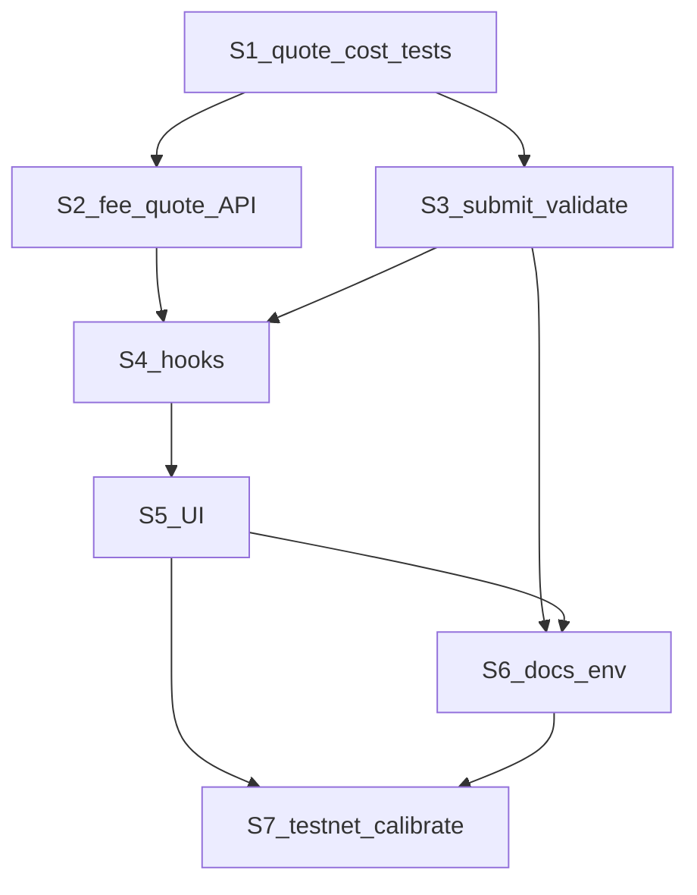

# stLighter — Gasless 费用实施计划（成本导向 `maxFeeZen`）

> **用途**: 将 [`stLighter-gasless-fee-spec.md`](./stLighter-gasless-fee-spec.md) §9 落成可编码、可验收的分步计划。  
> **上级**: [`stLighter-gasless-fee-spec.md`](./stLighter-gasless-fee-spec.md)（费用权威）；冲突以 fee-spec 为准。  
> **本轮交付**: 本文档。业务代码按 S1–S7 另开 PR 实现。  
> **最后更新**: 2026-07-29（**S1–S7 交付完成**；主网 Wave B E2E；运维 env / 可选 Bridge redeploy 见下）

---

## 0. 说明书确认纪要

[`stLighter-gasless-fee-spec.md`](./stLighter-gasless-fee-spec.md) **已确认可作为实现权威**，与锁定决策一致，无需改决策。

| 确认项 | 结论 |
|--------|------|
| 定价 | `feeZen ≈ ethCost→ZEN`；`maxFeeZen = feeZen × (1 + bufferBps/10000)`；硬顶 10 ZEN；废弃本金 bps 主路径 |
| LZ | 垫付仍用 `msg.value`；报销进 `feeZen`（覆盖旧「不从 credited 扣」） |
| 合约 | 无预言机；`feeZen` 不进签名；typehash / `MAX_GAS_FEE_ZEN` 本轮不动 |
| 协议 | `GET /api/relay/fee-quote` + `POST` 重算 + `fee_quote_stale`；UI 三路径签名前透明 |

### 0.1 实现注意（不改说明书决策）

1. **硬顶压力**: 早期示例用「1.5 gwei × 50k ZEN/ETH」会撞 10 ZEN；**2026-07-29 主网实测**（~490 ZEN/ETH、Horizen ~0.002 gwei、LZ ~2.85e-5 ETH）费用 ≪ 1 ZEN，**保持 `MAX_GAS_FEE_ZEN=10`**。若未来常态超顶 → 开治理升顶，**禁止**回退百分比定价。  
2. **`fee_hits_cap`**: 当 `feeZenRaw`（+margin）已 `> MAX_GAS_FEE_ZEN` 时直接返回不可用；**不要**先截断 `maxFeeZen` 再假装可提交。  
3. **`FEE_PROFIT_BPS`**: **S1 起即接入**成本公式（见 fee-spec §2.6）；默认 `0`（关），运营后续用 env 调高即可，无需改代码。`> 0` 时 UI 须标注「含服务费」；仍禁止用本金 bps 作为唯一/主定价（主路径永远是成本，profit 只取 `max(cost, min(basis×bps, …))`）。

### 0.2 非目标

- 不改 Solidity typehash / `MAX_GAS_FEE_ZEN` / 链上预言机  
- 不在 rrelayer yaml 做 ZEN 定价  
- 不宣传同链 ZEN deposit 完美 gasless  

---

## 1. 总览与依赖

对应 fee-spec §9：

| 步骤 | 标题 | 依赖 |
|------|------|------|
| **S1** | `quote.ts` + `cost.ts` + 单测 | — |
| **S2** | `GET /api/relay/fee-quote` | S1 |
| **S3** | 改造 `submit` / `validate`；废弃 bps | S1 |
| **S4** | Hooks 拉 quote；废除 `MAX_FEE_BPS` | S2, S3 |
| **S5** | UI 透明展示 | S4 |
| **S6** | 文档 / env / acceptance 回写 | S3, S5（可与代码 PR 并行收尾） |
| **S7** | 测试网校准 `gasLimit[*]` 与 floor | S5, S6 |



### 1.1 建议 PR 切片

| PR | 包含 | 说明 |
|----|------|------|
| PR-A | S1 + S2 | 引擎 + 只读 API；可独立测 |
| PR-B | S3 | 提交路径切成本定价；破坏性：废除 bps |
| PR-C | S4 + S5 | 前端签名与展示 |
| PR-D | S6 | 文档 / env 模板 |
| PR-E | S7 | 运维校准 checklist（可非代码 PR） |

---

## S1 — `quote.ts` + `cost.ts` + 单测

### 目标

纯服务端成本引擎，无 HTTP。给定 kind / amount / gas / FX fixture，输出与 fee-spec §2.2 一致的 `feeZen` / `maxFeeZen` / breakdown。

### 文件

| 路径 | 动作 | 职责 |
|------|------|------|
| `ltzen-frontend/src/server/relay/quote.ts` | **新增** | 默认 Aerodrome Slipstream ZEN/WETH `slot0`；可选 CoinGecko `zencash`；`ZEN_PER_ETH_FLOOR`；TTL + deviation→floor |
| `ltzen-frontend/src/server/relay/cost.ts` | **新增** | `ceilDiv`；按 kind 读 `gasLimit`；读 gas-provider FAST `suggestedMaxFeePerGas`（失败回退 RPC）；bridge 时读 `quoteBridgeNativeFee`；套 §2.2 + §2.6（`FEE_PROFIT_BPS`）；组装 breakdown（含 `profitBps`）；判定 `amount_too_small` / `fee_hits_cap` |
| `ltzen-frontend/src/server/relay/config.ts` | **改** | 增加 fee-spec §7 读取器（buffer/margin/**`FEE_PROFIT_BPS`**/floor/gasLimit/TTL/deviation/gas price URL）；`relayerFeeBps()` 标 deprecated（S3 前可仍被旧 submit 引用）；**勿**把旧 `RELAYER_FEE_BPS` 静默当成 profit |
| `ltzen-frontend/src/server/relay/fee.ts` | **改或删** | 薄封装转调 `cost.ts`，或删除并由 submit 直调 `cost`（推荐直调，避免双入口） |

> **价源**: 默认 `PRICE_PROVIDER=aerodrome`（fee-spec §3.3.1 Slipstream 深池）。CoinGecko 用 `zencash`；勿默认 `horizen`。

### 建议接口（实现可微调命名）

```typescript
// quote.ts
type RateSource = "live" | "floor";
type ZenEthQuote = {
  zenPerEth: bigint; // 1 ETH = zenPerEth/1e18 ZEN
  rateSource: RateSource;
  asOf: number; // unix sec
  providerId: string;
};

// cost.ts
type CostInput = {
  kind: RelayKind;
  basis: bigint;           // assets or previewRedeem(shares)
  amount: bigint;          // raw request amount (bridge quote 用 assets)
  dest?: `0x${string}`;
  extraOptions?: `0x${string}`;
  // injectable for tests:
  zenPerEth?: bigint;
  rateSource?: RateSource;
  effectiveGasPrice?: bigint;
  lzNativeWei?: bigint;
};

type CostResult =
  | {
      ok: true;
      feeZen: bigint;
      maxFeeZen: bigint;
      breakdown: { /* fee-spec §4.1 fields as bigint/number */ };
    }
  | { ok: false; code: "amount_too_small" | "fee_hits_cap" | "invalid_params" };
```

**`fee_hits_cap` 规则（写死）**: 若 `feeZen`（margin 后、硬顶前）`> MAX_GAS_FEE_ZEN` → `ok: false, code: "fee_hits_cap"`。不得返回 `feeZen = MAX` 且 `maxFeeZen = MAX` 冒充可提交。

**withdraw\***: 短路返回 `feeZen = 0`、`maxFeeZen = 0`，不读价、不读 gas。

### 测试

仓库前端目前无单测 runner（`package.json` 无 vitest）。S1 **一并引入** `vitest`（devDependency + `"test": "vitest run"`），测试目录建议：

- `ltzen-frontend/src/server/relay/cost.test.ts`
- `ltzen-frontend/src/server/relay/quote.test.ts`

覆盖（全部 fixture，**不打外网**）：

| 用例 | 期望 |
|------|------|
| `ceilDiv` 边界 | `(a+b-1)/b`；`a=0` → 0 |
| 标准 L3-only | 手工算 `feeZen` / `maxFeeZen`（buffer 1500） |
| withdraw* | 全 0 |
| floor 回退 | provider throw → floor |
| deviation | live 偏 floor > threshold → `rateSource=floor` |
| `amount_too_small` | `basis - 1 < feeZen` |
| `fee_hits_cap` | raw fee > 10e18 |
| `FEE_PROFIT_BPS > 0` | `feeZen = max(cost, min(basis×bps/10000, …))`；cost 更高时不抬价 |
| bridge | `lzNativeWei > 0` 进入 `ethCostWei` |

### 完成定义

- [x] `pnpm`/`npm` test 绿
- [x] 给定 fixture，输出与 fee-spec §2.2 公式一致
- [x] 无 HTTP 路由依赖

---

## S2 — `GET /api/relay/fee-quote`

### 目标

只读报价 HTTP，供 hooks 签名前调用；与 S3 共用同一 `cost.ts`。

### 文件

| 路径 | 动作 |
|------|------|
| `ltzen-frontend/src/app/api/relay/fee-quote/route.ts` | **新增** |

### 行为

1. 解析 query：`kind`（必填）、`amount`（收费 kind 必填）、`dest` / `extraOptions`（`bridgeToBase`）、可选 `verifyingContract`。  
2. 非法 → `400` `{ code: "invalid_params" }`。  
3. redeem*：用 hub public client `previewRedeem(shares)` 得 `basis`（复用 [`submit.ts`](../ltzen-frontend/src/server/relay/submit.ts) 的 client 模式）。  
4. deposit/bridge：`basis = amount`。  
5. bridge：缺 `dest` → `invalid_params`；链上 `quoteBridgeNativeFee` 失败 → `503`/`400` `{ code: "bridge_quote_failed" }`。  
6. 价源与 floor 皆不可用 → `503` `{ code: "quote_unavailable" }`。  
7. 成功 `200`：fee-spec §4.1 JSON（金额为十进制整数字符串 wei）；`expiresAt = now + QUOTE_TTL_SEC`（或签名建议窗 ≤ TTL）。  

### 测试 / 手测

- 本地 `curl` 各收费 kind + withdraw（全 0）  
- 缺参 / 过小金额 / 硬顶 错误码可区分  

### 完成定义

- [x] 响应字段与 fee-spec §4.1 对齐
- [x] 错误码表可区分
- [x] 不广播链上交易

---

## S3 — 改造 `submit.ts` / `validate`；废弃 bps

### 目标

`POST /api/relay` 与 `fee-quote` **同一**成本引擎；废除本金百分比主定价。

### 文件

| 路径 | 动作 |
|------|------|
| `ltzen-frontend/src/server/relay/submit.ts` | **改**：删除 `computeFeeZen(..., relayerFeeBps())`；调用 `cost.compute`；`req.maxFeeZen < feeZen` → 抛 `fee_quote_stale`（附 `feeZen`、`requiredMaxFeeZen`） |
| `ltzen-frontend/src/app/api/relay/route.ts` | **改**：映射 `fee_quote_stale` / cost 错误为结构化 JSON（非笼统 `"error": message`） |
| `ltzen-frontend/src/server/relay/validate.ts` | **改**：保留 `MAX_GAS_FEE_ZEN`、`feeZen < basis`、simulate；不信任客户端 estimate；可选导出错误类型 |
| `ltzen-frontend/src/server/relay/fee.ts` | **删或掏空** 旧 bps 函数，避免误用 |
| `ltzen-frontend/src/server/relay/config.ts` | **改**：主路径读 `FEE_PROFIT_BPS`（默认 0）；`relayerFeeBps` / `RELAYER_FEE_BPS` 仅 deprecation，**禁止**静默映射为 profit |

### 行为细节

1. withdraw*：继续强制 `feeZen = 0`（可在 cost 短路或 submit 分支）。  
2. bridge：`lzNativeWei` 以 **BFF 现读链上 quote** 计入 `feeZen`；`nativeValue` 仍必填且 ≥ quote（现有 encode/simulate 路径保留）。  
3. stale 响应示例（fee-spec §4.2）：

```json
{
  "error": "fee_quote_stale",
  "message": "Relayer fee rose above your signed max. Please re-quote and sign again.",
  "feeZen": "...",
  "requiredMaxFeeZen": "..."
}
```

### 完成定义

- [x] 代码库无 `computeFeeZen(basis, bps)` / `RELAYER_FEE_BPS` 主定价调用点
- [x] `fee_quote_stale`：`assertSignedMaxCoversFee` 单测（压低 signed max）
- [x] withdraw 仍 0 费
- [x] Direct 路径不受影响（不经此 BFF 扣费逻辑）

---

## S4 — Hooks 拉 quote；废除 `MAX_FEE_BPS`

### 目标

EIP-712 签名中的 `maxFeeZen` **仅**来自未过期的 BFF `fee-quote`。

### 文件

| 路径 | 动作 |
|------|------|
| `ltzen-frontend/src/lib/feeQuote.ts` | **新增**：`fetchFeeQuote`、响应类型、`isQuoteExpired`、错误解析 |
| `ltzen-frontend/src/hooks/useRedeem.ts` | **改**：删 `MAX_FEE_BPS`；金额 debounce 拉 quote；签名用 `quote.maxFeeZen`；暴露 `feeZen` est、breakdown、`expiresAt`、quote error |
| `ltzen-frontend/src/hooks/useCrossChainStake.ts` | **改**：stake 腿同上；withdraw 腿保持 `maxFeeZen = "0"` |
| `ltzen-frontend/src/hooks/useRedeemToBase.ts` | **改**：`redeemAndCredit` 与 `bridgeToBase` **分别**拉 quote |
| `ltzen-frontend/src/lib/errors.ts` | **改**：映射 `fee_quote_stale` / `amount_too_small` / `fee_hits_cap` / `quote_unavailable` |
| `ltzen-frontend/src/relayer/mockRelayer.ts` | **改**：注释标明 mock 行为，或返回接近成本的占位（避免验收当生产） |

### 行为

- BFF 模式（`NEXT_PUBLIC_USE_RELAYER_BFF=1`）：quote 失败或过期 → **禁止**签名提交。  
- Direct：可继续用户自付 gas、`feeZen=0`；若仍展示 quote 仅作参考，不阻塞（产品：Direct 不强制成本扣费）。  
- 金额变更 → debounce（建议 300–500ms）重新 quote。  
- 提交遇 `fee_quote_stale` → 清签名态、刷 quote、toast。  

### 完成定义

- [x] 三 hooks 无 `MAX_FEE_BPS`
- [x] 签名 `maxFeeZen` === 最近成功且未过期的 `fee-quote.maxFeeZen`
- [x] Redeem to Base 两腿各自独立 quote

---

## S5 — UI 透明展示

### 目标

对齐 fee-spec §5 与 uiux §4.3；跨链路径补齐签名前费用行。

### 文件

| 路径 | 动作 |
|------|------|
| `ltzen-frontend/src/components/common/GaslessFeePanel.tsx`（建议名） | **新增**：est / max / 净值 / 可选 breakdown / floor 提示 / `profitBps>0` 时「含服务费」/ 错误态；供三处复用 |
| `ltzen-frontend/src/components/redeem/RedeemForm.tsx` | **改**：签名前展示 est（非仅 confirmed 后）；接 panel；过期/过小禁用 |
| `ltzen-frontend/src/components/stake-crosschain/CrossChainStakeWizard.tsx` | **改**：L3 stake 步费用行；Base 腿文案与 ZEN fee 分离（用户自付 LZ） |
| `ltzen-frontend/src/components/redeem-to-base/RedeemToBaseWizard.tsx` | **改**：两腿分别展示；bridge 注明含跨链网络费折合 ZEN |
| `ltzen-frontend/src/lib/copy.ts` | **改**：fee-spec §5.4 文案键 |

### 信息层级（写死）

1. 主数字：`≈ feeZen` ZEN；净值  
2. 上限：`maxFeeZen`  
3. 次要：L3 gas / LZ 折合 ETH；`rateSource`；`profitBps > 0` →「含服务费」  
4. `floor` → 短提示 Using backup exchange rate  

### 完成定义

- [x] fee-spec §8.1 中 UI 相关勾选可过（组件已接；浏览器手测见 S7）
- [x] 三路径签名前可见 est + max + 净值（`GaslessFeePanel`）
- [x] `rateSource=floor` 有提示

---

## S6 — 文档 / env / acceptance 回写

### 目标

上级文档与运维模板与 fee-spec / 本实现一致（对应 fee-spec 附录 A）。

### 勾选表

| 文档 | 回写要点 | 状态 |
|------|----------|------|
| [`stLighter-crosschain-gasless-spec.md`](./stLighter-crosschain-gasless-spec.md) §3.3 | 费用含 LZ 折合 ZEN；引用 fee-spec | [x] |
| [`stLighter-station-impl-plan.md`](./stLighter-station-impl-plan.md) | 删除「LZ 不从 credited 扣」；改为经 `feeZen` 报销 | [x] |
| [`stLighter-station-design.md`](./stLighter-station-design.md) | 费用展示含 bridge 腿 LZ | [x] |
| [`stLighter-PRD.md`](./stLighter-PRD.md) §6 | 补充 BFF 成本报价；保留合约无预言机 | [x] |
| [`stLighter-relayer-design.md`](./stLighter-relayer-design.md) | `fee-quote` API、废弃 bps、`fee_quote_stale` | [x] |
| [`stLighter-dashboard-uiux-spec.md`](./stLighter-dashboard-uiux-spec.md) §4.3 | 跨链路径强制费用行 | [x] |
| [`gasless-acceptance.md`](./gasless-acceptance.md) | quote → 展示 → 签名 → 实收；floor / stale / 小额大额 | [x] |
| [`stLighter-rrelayer-setup.md`](./stLighter-rrelayer-setup.md) | 新 env；deprecate `RELAYER_FEE_BPS` | [x] |
| [`stLighter-deploy-checklist.md`](./stLighter-deploy-checklist.md) / mainnet checklist | 垫付 ETH + ZEN 报销双轨 | [x] |
| [`legal/terms-and-conditions.md`](./legal/terms-and-conditions.md) | 若需：费用含网络/跨链成本折合 ZEN | [x] |
| [`ltzen-frontend/env.local.example`](../ltzen-frontend/env.local.example) | §7 新变量；标注 deprecated bps | [x] |
| [`deploy/.env.example`](../deploy/.env.example) | 同上 | [x] |

### 完成定义

- [x] 上表全部勾选（legal 已补跨链网络费表述）
- [x] 新部署仅靠 example 能配齐 floor / gasLimit / buffer

---

## S7 — 测试网校准 `gasLimit[*]` 与 floor

### 目标

配置可上线；**不改公式**，只调 env / runbook。

### 步骤

1. 测试网跑各收费 kind（含 harvest 冷/热），记录 `gasUsed`；取 P95。  
2. 若 P95 > 当前 `RELAY_GAS_LIMIT_*` 的 **80%** → 上调该 env。  
3. 记录 `quoteBridgeNativeFee` 量级；核对 bridge `feeZen` 与垫付 ETH×汇率同量级。  
4. 设定并文档化 `ZEN_PER_ETH_FLOOR`；观察 `rateSource=floor` 占比（告警阈值由运营定）。  
5. 用真实 gas×价重算是否常撞 10 ZEN：  
   - 否 → 保持硬顶  
   - 是 → **开治理议题**（升 `MAX_GAS_FEE_ZEN` + `AUDIT_DELTA`），禁止恢复 bps  
6. 将校准后的 gasLimit 写回 deploy runbook；可选回写 fee-spec §2.5「初值表」为「已校准值」。  

### 手测（接 acceptance）

- [ ] 小额 → `amount_too_small` 或 UI 禁用（**可选**）
- [x] 大额 → 不再因「1% > 10 ZEN」失败；`maxFeeZen` ≤ 10 ZEN（主网 E2E ~20 ZEN bridge）
- [ ] 断外网价 / 拔 key → floor + UI 提示（**可选**）
- [x] `fee_quote_stale` 守卫单测覆盖（浏览器故意抬价 **可选**）
- [x] withdraw 0 费（单测）
- [x] Direct 回归（代码路径未改扣费；未强制 BFF）

### 完成定义

- [x] 硬顶风险有明确结论（正确 ~490 FX 下 **10 ZEN 足够**）
- [x] 本地校准值已写入（`ZEN_PER_ETH_FLOOR=450e18`；`scripts/calibrate-fee.ts`）
- [x] `deploy/.env.example` + [`deploy/README.md`](../deploy/README.md) 已含校准值与说明（**主机 `.env` 须运维自行同步后 `make force-recreate`**）
- [x] acceptance 成本导向段落主网 E2E 通过（bridge 腿；见 [`gasless-acceptance.md`](./gasless-acceptance.md)）

### S7 主网实测（2026-07-29）

命令：`cd ltzen-frontend && npx tsx scripts/calibrate-fee.ts`（读 `.env.local`）。

| 输入 / 输出 | 量级 |
|-------------|------|
| `zenPerEth`（Slipstream live） | ≈ **489.4 ZEN / ETH** |
| `ZEN_PER_ETH_FLOOR` | `450e18` |
| Horizen `effectiveGasPrice`（RPC / stub） | ≈ **2e6 wei**（~0.002 gwei） |
| `quoteBridgeNativeFee(1 ZEN)` | **`28545549478491` wei ≈ 2.85e-5 ETH**（与金额无关同量级） |
| `redeemWithSig` `feeZen` / `maxFeeZen` | ≈ **0.00031 / 0.00036 ZEN** |
| `depositWithSig` | ≈ **0.00034 / 0.00039 ZEN** |
| `bridgeToBase`（含 LZ） | ≈ **0.0144 / 0.0166 ZEN**（校准）；E2E ~**0.015 / 0.017** |
| 相对 `MAX_GAS_FEE_ZEN=10` | **余量巨大**；升顶非必需 |

**结论**:

1. 价源：Slipstream 深池（禁薄 vAMM）。  
2. LZ 实测 ≈ **2.85e-5 ETH**；折合 ≈ **0.014–0.015 ZEN**。  
3. 保持硬顶 10；`RELAY_GAS_LIMIT_*` 初值暂留。  
4. **交付完成**；运维侧仅需主机 env 同步 + 可选 Bridge redeploy（§1.5.1）/ 可选负向手测。

---

## 2. 现码锚点（快速跳转）

| 现码 | 变更步骤 |
|------|----------|
| [`fee.ts`](../ltzen-frontend/src/server/relay/fee.ts) `computeFeeZen` | S1/S3 替换 |
| [`submit.ts`](../ltzen-frontend/src/server/relay/submit.ts) `relayerFeeBps` | S3 |
| [`validate.ts`](../ltzen-frontend/src/server/relay/validate.ts) | S3 |
| [`useRedeem.ts`](../ltzen-frontend/src/hooks/useRedeem.ts) `MAX_FEE_BPS` | S4 |
| [`useCrossChainStake.ts`](../ltzen-frontend/src/hooks/useCrossChainStake.ts) | S4 |
| [`useRedeemToBase.ts`](../ltzen-frontend/src/hooks/useRedeemToBase.ts) | S4 |
| [`RedeemForm.tsx`](../ltzen-frontend/src/components/redeem/RedeemForm.tsx) | S5 |
| [`CrossChainStakeWizard.tsx`](../ltzen-frontend/src/components/stake-crosschain/CrossChainStakeWizard.tsx) | S5 |
| [`RedeemToBaseWizard.tsx`](../ltzen-frontend/src/components/redeem-to-base/RedeemToBaseWizard.tsx) | S5 |
| [`ZenOftStationBridge.quoteBridgeNativeFee`](../src/stlighter/station/ZenOftStationBridge.sol) | S1/S2/S3 只读 |

---

## 3. 修订历史

| 日期 | 说明 |
|------|------|
| 2026-07-28 | 初版：确认 fee-spec；按 §9 展开 S1–S7 实施计划 |
| 2026-07-28 | `FEE_PROFIT_BPS`：S1 起即接入公式与 UI「含服务费」；默认 0，运营 env 可配 |
| 2026-07-28 | S1 备注：Aerodrome 链上报价为后续可选（fee-spec §3.3.1），本步不改 |
| 2026-07-29 | S7：假汇率（薄 vAMM）作废；Slipstream ~490；**无需升 `MAX_GAS_FEE_ZEN`** |
| 2026-07-29 | S7 主网实测：`quoteBridgeNativeFee≈2.85e-5 ETH`；bridge `feeZen≈0.014`；校准脚本 `scripts/calibrate-fee.ts` |
| 2026-07-29 | 主网 E2E：`bridgeToBase` [`0x3973…beb2`](https://horizen.calderaexplorer.xyz/tx/0x3973e302afe96c27f11b429f0980045cc1d64aa08380c19a448fe753bdb9beb2)；dusty assets + 成本导向 fee 成功 |
| 2026-07-29 | **计划交付关闭**：`fee_quote_stale` 单测；deploy README 费用 env；剩余仅为运维主机同步与可选手测/Bridge redeploy |
