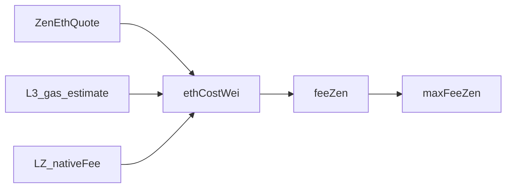
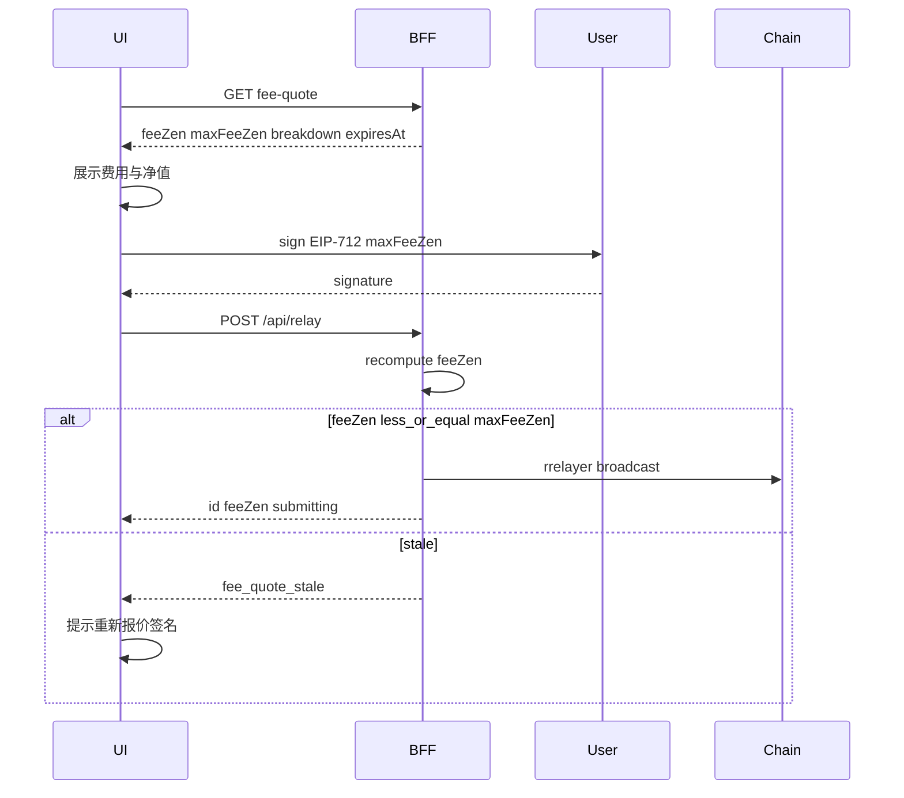

# stLighter — Gasless 费用功能说明书（成本导向 `maxFeeZen`）

> **状态**: 已确认决策定稿（2026-07-28）。实现对照本文；费用章节与上级规范冲突时**以本文为准**。  
> **上级**: [`stLighter-PRD.md`](./stLighter-PRD.md) §6、[`stLighter-crosschain-gasless-spec.md`](./stLighter-crosschain-gasless-spec.md)、[`stLighter-relayer-design.md`](./stLighter-relayer-design.md)。  
> **非目标本轮**: 改合约 typehash / 链上预言机 / 改 `MAX_GAS_FEE_ZEN`；本文只定 BFF + 前端协议与展示。

---

## 0. 决策摘要（已锁定）

| 项 | 决策 |
|----|------|
| ZEN/ETH 报价 | BFF 拉**外部价**（CEX / 聚合器）；失败或过期回退**运营 floor** |
| 成本覆盖 | **L3 gas + LZ `nativeFee`** 一并换算为 ZEN，从本次操作产出中扣除 |
| 定价模型 | `feeZen ≈ costEstimate`；`maxFeeZen = costEstimate × safetyBuffer` |
| 合约边界 | 保持：`feeZen` 不进签名；`feeZen ≤ maxFeeZen ≤ MAX_GAS_FEE_ZEN`（10 ZEN）；合约**不**引入预言机 |
| 废弃 | 以本金 `bps` 作为主定价（前端 `MAX_FEE_BPS`、BFF `RELAYER_FEE_BPS`） |

### 0.1 对上级规范的修订（权威覆盖）

以下旧表述**作废**，以本文 §2 / §5 为准：

| 旧文 | 旧规则 | 新规则 |
|------|--------|--------|
| `stLighter-station-impl-plan.md`（原生桥费） | LZ fee 由 relayer 垫付，**不从 ZEN credited 扣** | LZ `nativeFee` 折合 ZEN，计入 `feeZen` / `maxFeeZen`，从该腿产出扣 |
| `stLighter-deploy-checklist.md` / mainnet checklist 同类表述 | 同上 | 同上；垫付 ETH 仍由 relayer `msg.value` 支付，**报销**走 ZEN |
| `stLighter-PRD.md` §6「前端报价」 | 笼统；实现曾落成百分比 | 明确为 BFF 成本报价 API + 外部 FX + floor |
| 前端 hooks `MAX_FEE_BPS=100` / `RELAYER_FEE_BPS` | 本金百分比 | 废除主路径；仅可保留可选利润开关（默认关） |

未改动的原则：meaningful gasless、跨链 L3 强制 relayer、`feeZen ≤ maxFeeZen` 用户签名保护、Direct 路径可 `feeZen=0`。

---

## 1. 背景与问题

### 1.1 现状（变更前）

```
maxFeeZen_frontend = basis × 100 / 10_000          // 1%
feeZen_bff         = min(basis × RELAYER_FEE_BPS / 10_000, maxFeeZen)  // 默认 0.5%
on_chain           = feeZen ≤ maxFeeZen ≤ 10 ZEN
nativeFee_LZ       = oft.quoteSend(...).nativeFee  // ETH，与 feeZen 脱钩
```

| 痛点 | 表现 |
|------|------|
| 小额 | 0.5% ≪ 真实 L3(+LZ) 成本 → relayer 亏本 |
| 大额 | 1% 易超过 10 ZEN 合约硬顶 → 签名/提交失败 |
| 跨链 | `bridgeToBase` 垫付 LZ ETH 无 ZEN 报销；UI 不展示费用 |
| 透明 | 仅 `RedeemForm` 展示 max；跨链 wizard / Redeem-to-Base 签名前不可见 |

### 1.2 目标

1. **用户**: 支付贴近真实成本；签名前看清预估、上限、净值。  
2. **Relayer**: L3 gas +（出桥）LZ native 成本可回收，可持续运营。  
3. **效率**: 单次报价可缓存；BFF 提交时重算，避免信任客户端。  
4. **诚实**: 汇率来源（`live` / `floor`）可展示；预估标 `≈`。

---

## 2. 成本模型与公式



### 2.1 符号

| 符号 | 含义 | 单位 |
|------|------|------|
| `gasLimit[kind]` | 该 `RelayKind` 配置的 gas 上限（含 headroom） | gas units |
| `effectiveGasPrice` | 用于成本估算的单价（见 §2.3） | wei / gas |
| `l3GasWei` | `gasLimit[kind] × effectiveGasPrice` | wei ETH |
| `lzNativeWei` | 链上 `quoteBridgeNativeFee`（或 0） | wei ETH |
| `ethCostWei` | `l3GasWei + lzNativeWei` | wei ETH |
| `zenPerEth` | 1 ETH 可兑换的 ZEN 数量（18 位小数语义，见 §3.2） | 1e18 缩放整数 |
| `marginBps` | 在成本上的运营加成（首期 **0**） | bps |
| `bufferBps` | `maxFeeZen` 相对 `feeZen` 的安全缓冲（首期 **1500** = ×1.15） | bps；分母 10_000 |
| `basis` | 扣费基数：deposit/bridge = `assets`；redeem* = `previewRedeem(shares)` | wei ZEN |
| `MAX_GAS_FEE_ZEN` | 合约硬顶 `10e18` | wei ZEN |

### 2.2 核心公式

整数算术；除法向零截断处对费用侧使用**向上取整**（对用户略保守、对 relayer 略友好）：

```
l3GasWei   = gasLimit[kind] × effectiveGasPrice
lzNativeWei = (kind 需要 msg.value) ? quoteBridgeNativeFee(amount, dest, extraOptions) : 0
ethCostWei = l3GasWei + lzNativeWei

# zenCost = ethCostWei * zenPerEth / 1e18   （先算商，再 ceil 到 wei ZEN）
feeZenRaw  = ceil_div(ethCostWei × zenPerEth, 10^18)
feeZen     = ceil_div(feeZenRaw × (10_000 + marginBps), 10_000)

maxFeeZen  = min(
               ceil_div(feeZen × (10_000 + bufferBps), 10_000),
               MAX_GAS_FEE_ZEN,
               basis > 0 ? basis - 1 : 0
             )
```

其中 `ceil_div(a, b) = (a + b - 1) / b`（`a,b > 0`）；`a = 0` 则结果为 0。

**不变量（提交时必须成立）**:

```
0 ≤ feeZen ≤ maxFeeZen ≤ MAX_GAS_FEE_ZEN
feeZen < basis          // 与合约 deposit/redeem/bridge 净额要求一致
```

若 `maxFeeZen == 0` 且 kind 非 withdraw* → 报价失败 / 金额过小，禁止签名提交。

### 2.3 `effectiveGasPrice`

优先顺序：

1. **gas-provider / 链上 EIP-1559**：与生产 rrelayer 一致，取 **FAST** 档（或与 `TransactionSpeed.FAST` 对齐）的 `suggestedMaxFeePerGas`。  
2. 若 gas-provider 不可用：`eth_gasPrice` 或 `baseFee + priority` 本地估算。  
3. 运营上限钳制：不得超过 `GAS_CEIL_MAX_FEE_WEI`（与 [`deploy/gas-provider`](../deploy/gas-provider/main.go) 一致思路），避免异常报价。

说明：成本估算用 `maxFeePerGas` 偏保守（用户签名上限更宽）；实际链上可能低于估算，差额归 relayer 缓冲，不退用户。

### 2.4 按 `kind` 的成本构成

| `RelayKind` | `l3GasWei` | `lzNativeWei` | `feeZen` / `maxFeeZen` |
|-------------|------------|---------------|-------------------------|
| `depositWithSig` / `depositWithSigAndPermit` | ✓ | 0 | 成本导向 |
| `redeemWithSig` | ✓ | 0 | 成本导向 |
| `redeemAndCredit` | ✓ | 0 | 成本导向 |
| `bridgeToBase` | ✓ | ✓ `quoteBridgeNativeFee` | 成本导向（含 LZ） |
| `withdrawToHorizen` / `egressWithdrawToHorizen` | — | — | **强制 0 / 0**（产品：免费撤回入站/出站 credit） |
| `bridge`（纯 OFT，BFF 不支持） | n/a | n/a | 不在本 BFF 范围 |

**Redeem to Base 两腿**:

1. `redeemAndCredit`：仅 L3 gas → ZEN。  
2. `bridgeToBase`：L3 gas + LZ native → ZEN；`nativeValue` 仍为 ETH wei，由 relayer 垫付；ZEN 报销在同笔 `feeZen`。

**跨链 stake**:

- Base 入桥：用户自付 Base gas + LZ（**不**进本说明书 `feeZen`）。  
- L3 `depositWithSig`：仅 L3 gas → ZEN。

### 2.5 `gasLimit[kind]` 初值表（可运营调）

初值来自本地实测 / forge 量级，**上线前须用测试网/主网实测校准**（含 `_harvest` 冷热路径）。配置项见 §7。

| kind | 建议 `gasLimit`（初值） | 备注 |
|------|-------------------------|------|
| `depositWithSig` | `350_000` | 含 station `payForDeposit` + deposit + 可能 harvest |
| `depositWithSigAndPermit` | `420_000` | + permit |
| `redeemWithSig` | `320_000` | redeem + 可能 harvest |
| `redeemAndCredit` | `380_000` | redeemWithSig + Egress 入账 |
| `bridgeToBase` | `450_000` | debit + OFT send；LZ 费用在 `msg.value` 不计入 gasLimit |
| withdraw* | `0`（不计价） | fee 强制 0 |

Headroom 已含在上表；若实测 P95 超过配置的 80%，应上调配置而非在代码写死百分比。

### 2.6 可选利润开关（默认关）

**禁止**再用本金百分比作为主费。若未来需要利润：

```
feeZen = max(costBasedFeeZen, min(basis × profitBps / 10_000, maxFeeZen))
```

`profitBps` 默认 `0`；启用须显式 env，并在 UI 标注「含服务费」。本说明书首期 **不启用**。

### 2.7 与合约硬顶的关系

- 本轮**不**修改 `MAX_GAS_FEE_ZEN = 10e18`。  
- 若 `feeZen` 或缓冲后的 `maxFeeZen` 被硬顶截断，且截断后 `feeZen` 仍可能高于真实成本的缓冲需求：  
  - UI 展示「费用触及协议上限」；  
  - 若 `feeZen > maxFeeZen`（截断导致）→ 报价 API 返回不可用 / 建议拆小额或等待 gas 回落。  
- 若主网常态成本接近或超过 10 ZEN：记为**后续治理议题**（升硬顶需合约升级 + `AUDIT_DELTA`）。

---

## 3. 报价服务（BFF）

### 3.1 模块边界

建议实现路径（实现 PR 对照）：

| 模块 | 职责 |
|------|------|
| `ltzen-frontend/src/server/relay/quote.ts` | ZEN/ETH 外部价 + 缓存 + floor 回退 |
| `ltzen-frontend/src/server/relay/cost.ts` | `gasLimit` × gasPrice + LZ + 公式 → `feeZen` / `maxFeeZen` / breakdown |
| `ltzen-frontend/src/server/relay/fee.ts` | **废弃** `computeFeeZen(basis, bps)` 主路径；可保留薄封装调用 `cost.ts` 或删除 |

定价**只在 BFF**；rrelayer yaml / gas-provider 只提供原生 gas 价，不计算 ZEN。

### 3.2 `zenPerEth` 约定

- 语义：**1 ETH = `zenPerEth / 1e18` 个 ZEN**（与 ERC20 18 decimals 对齐）。  
  - 例：若市价 1 ETH = 50_000 ZEN，则 `zenPerEth = 50000 × 10^18`。  
- 换算：`zenAmount = ethCostWei * zenPerEth / 10^18`。  
- 禁止在客户端自行换算后覆盖 BFF 的 `feeZen`（提交时 BFF 重算）。

### 3.3 价源（可插拔）

```
interface ZenEthPriceProvider {
  /** Returns zenPerEth (1e18-scaled) and metadata; throws on hard failure. */
  fetch(): Promise<{ zenPerEth: bigint; asOf: number; providerId: string }>;
}
```

**首期推荐**:

1. **主路径**: CoinGecko（或运营选定聚合器）simple price：`horizen` / 项目配置的 ZEN id vs `eth`。API key 仅 server env（`PRICE_API_KEY` 等）。  
2. **回退**: `ZEN_PER_ETH_FLOOR`（同缩放约定）。  
3. **异常钳制**: 若 live 相对 floor 偏离超过 `PRICE_DEVIATION_BPS`（建议默认 3000 = 30%），强制使用 floor 并打告警日志。

**缓存**: 进程内（或共享）TTL 默认 `QUOTE_TTL_SEC=60`；缓存命中仍返回同一 `asOf`。

**`rateSource`**:

| 值 | 含义 |
|----|------|
| `live` | 来自外部价源（可能经缓存） |
| `floor` | 使用运营 floor（外部失败、过期、或偏离钳制） |

### 3.4 Floor 运营要求

- Floor 由运营按市价定期更新；过时 floor 会导致用户多付或 relayer 少收。  
- 部署检查清单须包含：主网上线前设置合理 `ZEN_PER_ETH_FLOOR`；监控 `rateSource=floor` 占比。

---

## 4. BFF ↔ 前端协议

### 4.1 只读报价 API

`GET /api/relay/fee-quote`

**Query 参数**:

| 参数 | 必填 | 说明 |
|------|------|------|
| `kind` | ✓ | `RelayKind`（withdraw* 返回全 0） |
| `amount` | ✓* | assets 或 shares（与 `RelayRequest.amount` 同语义）；withdraw 可省略 |
| `dest` | bridgeToBase | Base `0x` 收款地址 |
| `extraOptions` | bridgeToBase 可选 | hex；缺省与前端默认 options 一致 |
| `verifyingContract` | 可选 | 用于校验 / 读 `previewRedeem`；缺省用 env 地址 |

\* redeem* 的 `amount` 为 shares；BFF 用 `previewRedeem` 得 `basis`。

**成功响应** `200`:

```json
{
  "feeZen": "123456789012345678",
  "maxFeeZen": "141975307364197529",
  "basis": "1000000000000000000000",
  "breakdown": {
    "l3GasWei": "525000000000000",
    "lzNativeWei": "0",
    "ethCostWei": "525000000000000",
    "zenPerEth": "50000000000000000000000",
    "rateSource": "live",
    "rateAsOf": 1710000000,
    "effectiveGasPrice": "1500000000",
    "gasLimit": 350000,
    "bufferBps": 1500,
    "marginBps": 0
  },
  "expiresAt": 1710000060
}
```

- 所有金额字段为**十进制整数字符串**（wei）。  
- `expiresAt`: Unix 秒；建议 = 报价计算时刻 + `QUOTE_TTL_SEC`（或更短的签名建议窗，如 120s）。  
- 前端应在 `expiresAt` 前完成签名；过期须重新 `fee-quote`。

**错误** `4xx` / `503`:

| `error` code（JSON `error` 或 `code` 字段） | 含义 |
|---------------------------------------------|------|
| `quote_unavailable` | 外部价与 floor 皆不可用 |
| `amount_too_small` | `basis - 1 < feeZen` 或净额 ≤ 0 |
| `fee_hits_cap` | 成本在缓冲后无法在 `MAX_GAS_FEE_ZEN` 下覆盖（见 §2.7） |
| `invalid_params` | kind/amount/dest 非法 |
| `bridge_quote_failed` | `quoteBridgeNativeFee` 失败 |

### 4.2 提交路径 `POST /api/relay`

相对现状变更：

1. **废除** `computeFeeZen(maxFeeZen, basis, RELAYER_FEE_BPS)` 主路径。  
2. BFF 用与 `fee-quote` **同一** `cost.ts` **重新计算** `feeZen`（及内部用于校验的期望 `maxFeeZen` 下界）。  
3. 校验：
   - `req.maxFeeZen ≥ feeZen`（用户签名上限足够）；  
   - 其余现有校验不变（EIP-712、relayer EOA、simulate、`assertFeeLimits` 等）。  
4. 若因 gas/FX/LZ 漂移导致 `feeZen > req.maxFeeZen`：  
   - **拒绝**广播；  
   - 返回可重签错误，建议：

```json
{
  "error": "fee_quote_stale",
  "message": "Relayer fee rose above your signed max. Please re-quote and sign again.",
  "feeZen": "...",
  "requiredMaxFeeZen": "..."
}
```

5. `bridgeToBase`：  
   - `nativeValue` 仍必填，且应 ≥ 当前链上 quote（允许前端带小幅 buffer）；  
   - 成本模型中的 `lzNativeWei` 以 **BFF 现读链上 quote** 为准计入 `feeZen`（不信任客户端少报 LZ 成本）；  
   - 若客户端 `nativeValue` ≪ 链上 quote → 已有模拟失败路径；若 ≫ quote，多余 ETH 仍按现 ADR 退至 EgressStation（不退 relayer EOA）——运营需知垫付与 ZEN 报销按 quote 对齐，超额 ETH 可能沉淀在 Station。

### 4.3 前端签名流程



**废除**: `useRedeem` / `useCrossChainStake` / `useRedeemToBase` 内硬编码 `MAX_FEE_BPS`。  
签名使用的 `maxFeeZen` **必须**来自最新成功的 `fee-quote.maxFeeZen`（或同一次会话内未过期的缓存响应）。

### 4.4 Relayer 抽象

- `HttpRelayer`：提交前不强制改类型；可选在客户端先调 `fee-quote`（由 hooks 负责）。  
- `DirectContractRelayer`：可继续 `feeZen = 0`（用户自付 gas）；若仍签名非零 `maxFeeZen`，链上允许 0 ≤ max。  
- `MockRelayer`：测试应对齐成本公式或明确标注「mock 百分比」，避免验收混淆。

### 4.5 轮询响应

`GET /api/relay/{id}` 已有 `feeZen` 字段；保持。UI 在 confirmed 后可用实收 `feeZen` 替换「预估」。

---

## 5. UI 透明展示

对齐 [`stLighter-dashboard-uiux-spec.md`](./stLighter-dashboard-uiux-spec.md) §4.3；补齐跨链缺口。

### 5.1 路径 × 组件

| 路径 | 组件 / hooks | 签名前必须展示 |
|------|----------------|----------------|
| 同链 Redeem | `RedeemForm` + `useRedeem` | 预估手续费 `≈ feeZen`、授权上限 `maxFeeZen`、净值；可选 breakdown |
| 跨链 Stake（L3 deposit） | `CrossChainStakeWizard` + `useCrossChainStake` | **新增**同上；Base 腿另示用户自付 LZ（非 ZEN fee） |
| Redeem to Base | Redeem-to-Base UI + `useRedeemToBase` | **两腿分别**：redeem 腿费用；bridge 腿费用（含「含跨链网络费折合 ZEN」） |
| 入站/出站 withdraw | 对应 wizard 步 | 明示 **无 relayer ZEN 费** |

### 5.2 信息层级（文案原则）

1. **主数字（ZEN）**: `≈ X.xxxx ZEN` 手续费；`You receive / stake ≈ …`。  
2. **上限**: `Max fee you authorize: Y ZEN`（对应签名字段）。  
3. **次要灰字（可选展开）**: `≈ a ETH gas + b ETH LZ`；`rate: live|floor`。  
4. **`rateSource=floor`**: 短提示 *Using backup exchange rate*（或中文等价，按 `copy.ts`）。  
5. 所有预估值标 `≈`；confirmed 后可用实收替换并去掉「预估」语气。

### 5.3 交互

- 金额变更 → debounce 重新 `fee-quote`。  
- `expiresAt` 临近 → 自动刷新或禁用「签名」并提示刷新报价。  
- `fee_quote_stale` → toast + 回到可签名态并刷新 quote。  
- `amount_too_small` / `fee_hits_cap` → 禁用提交，说明原因。

### 5.4 文案键（建议新增于 `copy.ts`）

| key | 用途 |
|-----|------|
| `gaslessEstFee` | 已有；统一用于各路径 |
| `gaslessMaxFee` | 已有 |
| `gaslessNetReceive` / net stake | 净值 |
| `gaslessBreakdownGas` | L3 gas 折合 |
| `gaslessBreakdownLz` | LZ 折合 |
| `gaslessRateFloor` | 备用汇率提示 |
| `gaslessFeeStale` | 需重新签名 |
| `gaslessFeeTooHigh` | 触及上限 / 金额过小 |

---

## 6. 边界与风控

| 场景 | 行为 |
|------|------|
| `feeZen ≥ basis` | 报价失败 `amount_too_small`；UI 禁用 |
| live 偏离 floor > `PRICE_DEVIATION_BPS` | 切 `floor` + 告警 |
| 外部价与 floor 皆缺 | `quote_unavailable`；gasless 不可用，可引导 Direct（若用户有 ETH） |
| quote 过期后提交 | `fee_quote_stale` 或服务端重算后仍超 max → 同错误 |
| Direct relayer | `feeZen=0`；不强制走成本扣费 |
| Mock | 文档/UI 标明测试行为 |
| Egress 超额 `msg.value` 退款 | 仍进 Station（现 ADR）；不改变；运营监控沉淀 ETH |
| 合约 `MAX_GAS_FEE_ZEN` | 本轮不改；截断策略见 §2.7 |

---

## 7. 配置（Env）

### 7.1 新增（server-only，除非注明）

| 变量 | 默认建议 | 说明 |
|------|----------|------|
| `ZEN_PER_ETH_FLOOR` | （必填上线） | 1e18 缩放；floor |
| `PRICE_PROVIDER` | `coingecko` | 可插拔 id |
| `PRICE_API_KEY` | — | 若价源需要 |
| `PRICE_API_URL` | provider 默认 | 可覆盖 |
| `QUOTE_TTL_SEC` | `60` | FX + 组合报价缓存 |
| `PRICE_DEVIATION_BPS` | `3000` | live vs floor |
| `FEE_BUFFER_BPS` | `1500` | max 相对 fee |
| `FEE_MARGIN_BPS` | `0` | 成本加成 |
| `FEE_PROFIT_BPS` | `0` | 可选本金利润；0=关 |
| `RELAY_GAS_LIMIT_DEPOSIT_WITH_SIG` | `350000` | 见 §2.5 |
| `RELAY_GAS_LIMIT_DEPOSIT_WITH_SIG_AND_PERMIT` | `420000` | |
| `RELAY_GAS_LIMIT_REDEEM_WITH_SIG` | `320000` | |
| `RELAY_GAS_LIMIT_REDEEM_AND_CREDIT` | `380000` | |
| `RELAY_GAS_LIMIT_BRIDGE_TO_BASE` | `450000` | |
| `GAS_PRICE_PROVIDER_URL` | gas-stub / 现网 | 读 FAST maxFeePerGas；可复用部署内 gas-provider |

### 7.2 降级 / 移除

| 变量 | 处理 |
|------|------|
| `RELAYER_FEE_BPS` | **废弃**主定价；保留读取时若 `FEE_PROFIT_BPS` 未设可临时映射并打 deprecation 日志，实现 PR 中从 `env.local.example` / `deploy/.env.example` 删除或标注 deprecated |

### 7.3 模板回写

实现时更新：

- [`ltzen-frontend/env.local.example`](../ltzen-frontend/env.local.example)  
- [`deploy/.env.example`](../deploy/.env.example)  
- [`docs/stLighter-rrelayer-setup.md`](./stLighter-rrelayer-setup.md) 费用小节节

---

## 8. 验收标准

### 8.1 功能

- [ ] `GET /api/relay/fee-quote` 对各收费 kind 返回一致公式结果与 breakdown。  
- [ ] 前端三路径（同链 redeem、跨链 stake L3、Redeem to Base 两腿）签名前展示 est / max / 净值。  
- [ ] `POST /api/relay` 重算 `feeZen`；`feeZen ≤ maxFeeZen`；漂移返回 `fee_quote_stale`。  
- [ ] `bridgeToBase` 的 `feeZen` 含 LZ；relayer 仍付 `msg.value`；用户 ZEN 被扣对应报销。  
- [ ] withdraw* 仍为 0 费。  
- [ ] `rateSource=floor` 时 UI 有提示。  
- [ ] 小额导致 `amount_too_small` 时不可签名提交。  
- [ ] 大额不再因「1% > 10 ZEN」失败；`maxFeeZen` 成本导向且 ≤ 10 ZEN。

### 8.2 回归

- [ ] Direct 路径仍可用（用户付 gas，`feeZen=0`）。  
- [ ] 合约硬顶与 `feeZen < basis` 模拟仍拒绝恶意超额。  
- [ ] 更新 [`gasless-acceptance.md`](./gasless-acceptance.md) 步骤：报价 → 展示 → 签名 → 实收对照 breakdown 量级。

### 8.3 非目标验收（明确不做）

- [ ] 无链上预言机、无 typehash 变更。  
- [ ] 不宣传同链 ZEN deposit 完美 gasless。

---

## 9. 实现顺序建议（非本说明书交付）

1. `quote.ts` + `cost.ts` + 单测（公式、ceil、floor、deviation）。  
2. `GET /api/relay/fee-quote`。  
3. 改造 `submit.ts` / `validate` 错误码；废弃 bps。  
4. Hooks 改拉 quote；废除 `MAX_FEE_BPS`。  
5. UI：RedeemForm 增强 + CrossChainStakeWizard + Redeem-to-Base。  
6. 回写上级文档、env 模板、acceptance。  
7. 测试网校准 `gasLimit[*]` 与 floor。

---

## 10. 附录 A — 上级文档回写清单

实现合并前后应更新（本轮说明书只列清单；正文已在 §0.1 宣布费用权威）：

| 文档 | 回写要点 |
|------|----------|
| [`stLighter-crosschain-gasless-spec.md`](./stLighter-crosschain-gasless-spec.md) §3.3 | 费用含 LZ 折合 ZEN；引用本文 |
| [`stLighter-station-impl-plan.md`](./stLighter-station-impl-plan.md) | 删除「LZ 不从 credited 扣」；改为经 `feeZen` 报销 |
| [`stLighter-station-design.md`](./stLighter-station-design.md) | 费用展示含 bridge 腿 LZ |
| [`stLighter-PRD.md`](./stLighter-PRD.md) §6 | 补充 BFF 成本报价；保留合约无预言机 |
| [`stLighter-relayer-design.md`](./stLighter-relayer-design.md) | `fee-quote` API、废弃 bps、`fee_quote_stale` |
| [`stLighter-dashboard-uiux-spec.md`](./stLighter-dashboard-uiux-spec.md) §4.3 | 跨链路径强制费用行 |
| [`gasless-acceptance.md`](./gasless-acceptance.md) | 成本导向验收步骤 |
| [`stLighter-rrelayer-setup.md`](./stLighter-rrelayer-setup.md) / deploy env | 新 env；deprecate `RELAYER_FEE_BPS` |
| [`stLighter-deploy-checklist.md`](./stLighter-deploy-checklist.md) / mainnet checklist | 垫付 ETH + ZEN 报销双轨说明 |
| [`docs/legal/terms-and-conditions.md`](./legal/terms-and-conditions.md) | 若需：费用含网络/跨链成本折合 ZEN 的表述 |

## 11. 附录 B — 与现码锚点对照

| 现码 | 变更意向 |
|------|----------|
| [`ltzen-frontend/src/server/relay/fee.ts`](../ltzen-frontend/src/server/relay/fee.ts) | 替换为成本计算 |
| [`ltzen-frontend/src/server/relay/submit.ts`](../ltzen-frontend/src/server/relay/submit.ts) `computeFeeZen` + `relayerFeeBps` | 改调 `cost.ts` |
| [`ltzen-frontend/src/server/relay/validate.ts`](../ltzen-frontend/src/server/relay/validate.ts) `MAX_GAS_FEE_ZEN` | 保留；可增加 stale 错误映射 |
| hooks `MAX_FEE_BPS` | 删除；改 `fee-quote` |
| [`ZenOftStationBridge.quoteBridgeNativeFee`](../src/stlighter/station/ZenOftStationBridge.sol) | BFF 读取计入 `lzNativeWei` |
| `StLighter` / `EgressStation` `_enforceGaslessFeeLimits` | 不变 |

## 12. 附录 C — 数值示例（说明用）

假设：

- `effectiveGasPrice = 1.5 gwei = 1.5e9`  
- `gasLimit = 350_000` → `l3GasWei = 5.25e14`  
- `lzNativeWei = 0`  
- `zenPerEth = 50_000e18`（1 ETH = 50_000 ZEN）  
- `marginBps = 0`，`bufferBps = 1500`  
- `basis = 1000e18`

则：

```
feeZenRaw = 5.25e14 × 50000e18 / 1e18 = 2.625e19 / 1e0 … 
          = 5.25e14 × 5e4 = 2.625e19  → 26.25 ZEN
```

此例在 10 ZEN 硬顶下会触发 §2.7（成本过高）。说明：

- 低 gas L3 或更高 ZEN 单价（更少 ZEN/ETH）时费用落在硬顶内；  
- 上线前必须用**真实** Horizen gas 与 ZEN/ETH 价重算示例，并校准 floor / gasLimit；  
- 若真实成本常 > 10 ZEN，必须启动硬顶治理升级，而非恢复百分比定价。

（实现单测应使用可控 fixture，而不是本附录市价。）

---

## 修订历史

| 日期 | 说明 |
|------|------|
| 2026-07-28 | 初版：外部报价 + L3/LZ 成本导向；`feeZen`≈成本，`maxFeeZen`=成本×buffer；BFF `fee-quote` 协议与 UI/验收 |
