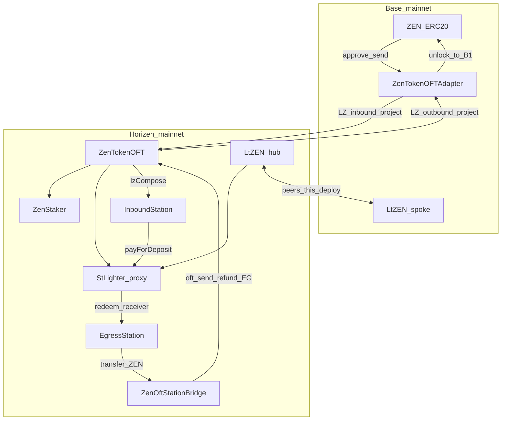

# stLighter Mainnet Deploy Checklist

> **Primary scope**: deploy **stLighter only** to **Horizen mainnet** (`26514`) + **Base** (`8453`).  
> Testnet full stack (incl. MockZEN / fresh OFT): [`stLighter-deploy-checklist.md`](./stLighter-deploy-checklist.md)  
> Topology / compose ADR: [`stLighter-station-compose-adr.md`](./stLighter-station-compose-adr.md)  
> OFT / ULN copy recipe: [`stLighter-oft-reference.md`](./stLighter-oft-reference.md)  
> Relayer design: [`stLighter-relayer-design.md`](./stLighter-relayer-design.md) · setup: [`stLighter-rrelayer-setup.md`](./stLighter-rrelayer-setup.md) · compose: [`deploy/README.md`](../deploy/README.md)
>
> | Part | Scope |
> |------|--------|
> | **0** | Preflight, ownership, LZ endpoint / ULN discovery |
> | **1** | Contracts: LtZEN + StLighter + Stations + ltZEN peer/DVN |
> | **1.5.1** | Optional: Redeploy `ZenOftStationBridge` + `Egress.setBridge` |
> | **2** | Frontend `NEXT_PUBLIC_*` |
> | **3** | rrelayer + BFF + gas-provider (`deploy/`) |
>
> **Out of this checklist (Horizen / project-owned)**: ZenTokenOFT, ZenStaker, Base ZEN ERC20, ZenTokenOFTAdapter, and their ZEN peer / ULN wiring — already live on mainnet.

---

## Mainnet cautions

- **ZEN path is not ours to redeploy.** Adapter ↔ ZenTokenOFT peers and DVN are project scope. This checklist only wires **ltZEN** and Stations on top.
- **Same address, different networks**: Horizen `ZenTokenOFT` and Base `ZenTokenOFTAdapter` share `0x57da…9280` by design. Always pair address + RPC; never assume one call hits both chains.
- **Bidirectional ltZEN peer + explicit ULN** on both chains. One-sided wire → LayerZero Scan `WAITING FOR ULN CONFIG` / locked messages. Fix wiring then **re-send**.
- **Ownership now vs later**: for stability, set `GOVERNANCE_ADDRESS` (or `TIMELOCK_ADDRESS`) to the deployer / a dedicated owner EOA. Plan a later hard-cutover to Timelock → multisig ([`DeployStLighterTimelock.s.sol`](../script/DeployStLighterTimelock.s.sol)); leave the checklist item open.
- **Deployer ≠ relayer.** Separate keys. Relayer pays Horizen native gas only; never put mnemonic / API keys in the browser or git.
- **Small-amount smoke first**, then open the frontend. Cover same-chain stake, Wave A cross-chain stake, Wave B redeem-to-Base.
- **OFT dust**: ZEN / ltZEN use shared-decimal truncation (typically 18→6 → rate `1e12`). Bridge amounts below dust rules may fail or leave dust on source — see frontend `oftDust.ts` and Bridge `minAmountLD`.
- **Audit freeze**: ship the audited / `AUDIT_DELTA`-declared implementation; do not sneak write-path changes into mainnet bytecode.
- **Secrets**: never commit Alchemy keys, mnemonics, or `RRELAYER_API_KEY`. Base RPC in docs uses `$ALCHEMY_API_KEY` placeholder only.

---

## 0. Topology (do not confuse)

| Chain | chainId | LZ eid | ZEN | LayerZero | ltZEN (this deploy) |
|-------|---------|--------|-----|-----------|---------------------|
| **Base** | `8453` | `30184` | ERC20 `0xf43e…9229` | **`ZenTokenOFTAdapter`** `0x57da…9280` (lock/unlock) | Spoke OFT, `minter = 0` |
| **Horizen** | `26514` | `30399` | **`ZenTokenOFT`** `0x57da…9280` | Peer of Base adapter (already wired) | Hub OFT, `minter = StLighter proxy` |



**Path summary**

| Path | Direction | Contracts |
|------|-----------|-----------|
| **Wave A — cross-chain stake** | Base ZEN → Horizen ltZEN | Adapter `send(to=InboundStation, compose)` → credit → `depositWithSig(payer=Station)` |
| **Wave B — Redeem to Base** | Horizen ltZEN → Base ZEN @ B1 | `Egress.redeemAndCredit` → `bridgeToBase` → Bridge `oft.send` → Adapter unlocks to `dest` |
| **Same-chain** | Horizen ltZEN ↔ Horizen ZEN | `deposit` / `redeem` (no Station) |

---

## Part 0 — Preflight

### 0.1 Known addresses (do not redeploy)

| Role | Chain | Address |
|------|-------|---------|
| ZenStaker | Horizen | `0x6BF7CF29a8bcE11Aa62Cf593d165C244fA4d3E31` |
| ZenTokenOFT (ZEN) | Horizen | `0x57da2D504bf8b83Ef304759d9f2648522D7a9280` |
| ZEN ERC20 | Base | `0xf43eB8De897Fbc7F2502483B2Bef7Bb9EA179229` |
| ZenTokenOFTAdapter | Base | `0x57da2D504bf8b83Ef304759d9f2648522D7a9280` |

### 0.2 Env / wallets

```bash
export HORIZEN_RPC=https://horizen.calderachain.xyz/http
export HORIZE_VERIFY=https://horizen.calderaexplorer.xyz/api/
export BASE_RPC=https://base-mainnet.g.alchemy.com/v2/$ALCHEMY_API_KEY
# Explorers: https://horizen.calderaexplorer.xyz/ · https://base.blockscout.com/

export PRIVATE_KEY=…   # deployer — never commit
export DEPLOYER=$(cast wallet address --private-key $PRIVATE_KEY)
# Stage-1 owner: deployer EOA or a dedicated owner EOA
export GOVERNANCE_ADDRESS=$DEPLOYER
# Optional later: TIMELOCK_ADDRESS=… (overrides GOVERNANCE_ADDRESS in scripts)

export ZEN_TOKEN_ADDRESS=0x57da2D504bf8b83Ef304759d9f2648522D7a9280
export ZEN_STAKER_ADDRESS=0x6BF7CF29a8bcE11Aa62Cf593d165C244fA4d3E31
export BASE_ZEN_TOKEN_ADDRESS=0xf43eB8De897Fbc7F2502483B2Bef7Bb9EA179229
export BASE_ZEN_ADAPTER=0x57da2D504bf8b83Ef304759d9f2648522D7a9280
export HORIZEN_EID=30399
export BASE_EID=30184
```

- [ ] Fund `$DEPLOYER` with native gas on Horizen **and** Base
- [ ] `.env` from [`.env.template`](../.env.template) — mainnet eids / addresses above; clear any testnet leftovers
- [ ] Confirm ZEN Adapter ↔ ZenTokenOFT already deliver on [LayerZero Scan](https://layerzeroscan.com/) (project path; optional sanity)

### 0.3 LayerZero Endpoint + ULN (copy from ZenTokenOFT)

Read endpoints from live OApps (do not hardcode from memory):

```bash
export LZ_ENDPOINT_HORIZEN=$(cast call $ZEN_TOKEN_ADDRESS "endpoint()(address)" --rpc-url $HORIZEN_RPC)
export LZ_ENDPOINT_BASE=$(cast call $BASE_ZEN_ADAPTER "endpoint()(address)" --rpc-url $BASE_RPC)
```

Copy send/receive libs + ULN from **Horizen ZenTokenOFT** (and Base Adapter for the Base side) using the recipe in [`stLighter-oft-reference.md`](./stLighter-oft-reference.md) §「从已知 OApp 复制配置」:

```bash
# horizen side
# Example — Horizen ZenTokenOFT toward Base eid
export HORIZEN_LZ_SEND_LIB=$(cast call $LZ_ENDPOINT_HORIZEN "getSendLibrary(address,uint32)(address)" \
  $ZEN_TOKEN_ADDRESS $BASE_EID --rpc-url $HORIZEN_RPC)

# NR==1 keeps the address; the dropped second value is `isDefault` — read it unpiped when you
# need to know whether the OApp pinned the lib or is riding the pathway default.
export HORIZEN_LZ_RECEIVE_LIB=$(cast call $LZ_ENDPOINT_HORIZEN "getReceiveLibrary(address,uint32)(address,bool)" \
  $ZEN_TOKEN_ADDRESS $BASE_EID --rpc-url $HORIZEN_RPC | awk 'NR==1')

cast call $LZ_ENDPOINT_HORIZEN "getConfig(address,address,uint32,uint32)(bytes)" \
  $ZEN_TOKEN_ADDRESS $HORIZEN_LZ_SEND_LIB $BASE_EID 2 --rpc-url $HORIZEN_RPC
# Decode confirmations + requiredDVNs → LZ_CONFIRMATIONS, DVN_ADDRESSES
# Endpoint getters return the *effective* value (falling back to the pathway default), so they
# never reveal whether the OApp actually pinned anything. Check the override directly:
cast call $LZ_ENDPOINT_HORIZEN "isDefaultSendLibrary(address,uint32)(bool)" \
  $ZEN_TOKEN_ADDRESS $BASE_EID --rpc-url $HORIZEN_RPC   # false ⇒ ZEN pinned its own send lib
cast call $HORIZEN_LZ_SEND_LIB \
  "getAppUlnConfig(address,uint32)((uint64,uint8,uint8,uint8,address[],address[]))" \
  $ZEN_TOKEN_ADDRESS $BASE_EID --rpc-url $HORIZEN_RPC   # non-zero ⇒ real override, safe to copy
export HORIZEN_LZ_CONFIRMATIONS=3
export HORIZEN_DVN_ADDRESSES=0x282b3386571f7f794450d5789911a9804fa346b4,0x84a410a8a912e333b957680998a76e526f98e207,0xdd7b5e1db4aafd5c8ec3b764efb8ed265aa5445b


# base side
export BASE_LZ_SEND_LIB=$(cast call $LZ_ENDPOINT_BASE "getSendLibrary(address,uint32)(address)" \
  $BASE_ZEN_ADAPTER $HORIZEN_EID --rpc-url $BASE_RPC)

export BASE_LZ_RECEIVE_LIB=$(cast call $LZ_ENDPOINT_BASE "getReceiveLibrary(address,uint32)(address,bool)" \
  $BASE_ZEN_ADAPTER $HORIZEN_EID --rpc-url $BASE_RPC | awk 'NR==1')

cast call $LZ_ENDPOINT_BASE "getConfig(address,address,uint32,uint32)(bytes)" \
  $BASE_ZEN_ADAPTER $BASE_LZ_SEND_LIB $HORIZEN_EID 2 --rpc-url $BASE_RPC
# Decode confirmations + requiredDVNs → LZ_CONFIRMATIONS, DVN_ADDRESSES
export BASE_LZ_CONFIRMATIONS=3
export BASE_DVN_ADDRESSES=0x9e059a54699a285714207b43b055483e78faac25,0xa7b5189bca84cd304d8553977c7c614329750d99,0xcd37ca043f8479064e10635020c65ffc005d36f6

# base
```

Repeat on Base for `$BASE_ZEN_ADAPTER` with `PEER_EID=$HORIZEN_EID`. Fill `LZ_SEND_LIB` / `LZ_RECEIVE_LIB` / `LZ_CONFIRMATIONS` / `DVN_ADDRESSES` **per chain** — do **not** cross-copy libs across chains.

These values are applied only to **new ltZEN** OApps in Part 1 (ZEN OApps already configured).

### 0.4 Script inventory (mainnet subset)

| Script | Chain | Purpose |
|--------|-------|---------|
| [`DeployStLighterHorizen.s.sol`](../script/DeployStLighterHorizen.s.sol) | Horizen | LtZEN hub + StLighter proxy |
| [`DeployInboundStation.s.sol`](../script/DeployInboundStation.s.sol) | Horizen | Wave A Station |
| [`DeployStLighterBase.s.sol`](../script/DeployStLighterBase.s.sol) | Base | LtZEN spoke |
| [`WireStLighterOFT.s.sol`](../script/WireStLighterOFT.s.sol) | both | ltZEN `setPeer` |
| [`ConfigureStLighterOFTDVN.s.sol`](../script/ConfigureStLighterOFTDVN.s.sol) | both | Pin MessageLibs + ULN for ltZEN |
| [`DeployEgressStation.s.sol`](../script/DeployEgressStation.s.sol) | Horizen | Egress + ZenOftStationBridge + `setBridge` |

**Skip on mainnet**: `DeployZenTokenOFT`, `DeployZenStaker`, `DeployMockZEN`, `DeployZenTokenOFTAdapter`, `WireZenOft`.

Optional later: [`DeployStLighterTimelock.s.sol`](../script/DeployStLighterTimelock.s.sol).

---

## Part 1 — Contracts

### 1.1 Horizen hub — LtZEN + StLighter

```bash
forge script script/DeployStLighterHorizen.s.sol \
  --rpc-url $HORIZEN_RPC --broadcast --private-key $PRIVATE_KEY

# → set:
export LT_ZEN_HORIZEN=0xDf33Ef2073a1b7205BFFC393521Fb2f46b464B7E
export STLIGHTER_PROXY_ADDRESS=0x92E0940f6dAE6e14f004bb411A7fE222EbCE4E59
export ST_LIGHTER_IMPL=0x2762dFCACbc952cA987497f01D71B8D5f52D4Dfd
export TIMELOCK=0x916652bcFF1fB63af6A5D55482e03139ebAD3578

export ST_LIGHTER=$STLIGHTER_PROXY_ADDRESS
export LT_ZEN=$LT_ZEN_HORIZEN


forge verify-contract \
  --rpc-url $HORIZEN_RPC \
  --verifier blockscout \
  --verifier-url $HORIZE_VERIFY \
  $ST_LIGHTER_IMPL \
  src/stlighter/StLighter.sol:StLighter

forge verify-contract \
  --rpc-url $HORIZEN_RPC \
  --verifier blockscout \
  --verifier-url $HORIZE_VERIFY \
  $LT_ZEN_HORIZEN \
  src/stlighter/LtZEN.sol:LtZEN
```

- [ ] `ltZen.minter() == STLIGHTER_PROXY_ADDRESS`
- [ ] Proxy initialized with mainnet ZenTokenOFT + ZenStaker; owner = `GOVERNANCE_ADDRESS`
- [ ] ltZEN ownership transferred to governance (script does this)

```bash
cast call $LT_ZEN_HORIZEN 'minter()(address)' --rpc-url $HORIZEN_RPC
cast call $LT_ZEN_HORIZEN 'owner()(address)' --rpc-url $HORIZEN_RPC
```

### 1.2 InboundStation

```bash
forge script script/DeployInboundStation.s.sol \
  --rpc-url $HORIZEN_RPC --broadcast --private-key $PRIVATE_KEY


export INBOUND_STATION_ADDRESS=0xe2721EA4955D4d4E7C060ff9a934BE4353ed87d0
export IN_STATION=$INBOUND_STATION_ADDRESS
forge verify-contract \
  --rpc-url $HORIZEN_RPC \
  --verifier blockscout \
  --verifier-url $HORIZE_VERIFY \
  $IN_STATION \
  src/stlighter/station/InboundStation.sol:InboundStation
```

- [ ] `zen()` / `zenOft()` = ZenTokenOFT
- [ ] `stLighter()` = proxy
- [ ] `composeCaller()` = `LZ_ENDPOINT_HORIZEN`
- [ ] `allowedSrcEid()` = `30184` (`BASE_EID`)

```bash
cast call $IN_STATION 'zen()(address)' --rpc-url $HORIZEN_RPC
cast call $IN_STATION 'zenOft()(address)' --rpc-url $HORIZEN_RPC
cast call $IN_STATION 'stLighter()(address)' --rpc-url $HORIZEN_RPC
cast call $IN_STATION 'composeCaller()(address)' --rpc-url $HORIZEN_RPC
cast call $IN_STATION 'allowedSrcEid()(uint32)' --rpc-url $HORIZEN_RPC
```

### 1.3 Base spoke — LtZEN only

```bash
forge script script/DeployStLighterBase.s.sol \
  --rpc-url $BASE_RPC --broadcast --private-key $PRIVATE_KEY
# → set LT_ZEN_BASE
export LT_ZEN_BASE=0x3f38dF9b1912B45d001f15D4237C97331FD5fd6f
```

- [ ] `minter() == address(0)`
- [ ] owner = governance

### 1.4 ltZEN peer + DVN (both chains)

**Peers**

```bash
# Horizen → peer Base ltZEN
export LT_ZEN_LOCAL=$LT_ZEN_HORIZEN
export PEER_EID=$BASE_EID
export PEER_LT_ZEN=$LT_ZEN_BASE
forge script script/WireStLighterOFT.s.sol \
  --rpc-url $HORIZEN_RPC --broadcast --private-key $PRIVATE_KEY

# Base → peer Horizen ltZEN
export LT_ZEN_LOCAL=$LT_ZEN_BASE
export PEER_EID=$HORIZEN_EID
export PEER_LT_ZEN=$LT_ZEN_HORIZEN
forge script script/WireStLighterOFT.s.sol \
  --rpc-url $BASE_RPC --broadcast --private-key $PRIVATE_KEY
```

**Verify peers non-zero**

```bash
cast call $LT_ZEN_HORIZEN "peers(uint32)(bytes32)" $BASE_EID --rpc-url $HORIZEN_RPC
cast call $LT_ZEN_BASE "peers(uint32)(bytes32)" $HORIZEN_EID --rpc-url $BASE_RPC
```

**ULN** — reuse Part 0 values from ZenTokenOFT / Adapter; only change `OAPP_LOCAL` to local ltZEN.

ZEN OFT / Adapter **pin their own ULN** — verified on-chain 2026-07-29: `isDefaultSendLibrary($ZEN_TOKEN_ADDRESS, $BASE_EID) == false`, and `getAppUlnConfig` equals `getUlnConfig` on both chains. So §0.3's `HORIZEN_DVN_ADDRESSES` / `BASE_DVN_ADDRESSES` are genuine per-OApp overrides, not pathway defaults, and ltZEN must be pinned to the **same** sets on **both** chains. DVN verification requires the source send set and the destination receive set to be the same operators — a half-configured pathway (one chain pinned, the other on defaults) stalls messages pending ULN in **both** directions, because a DVN the destination requires is never assigned or paid on the source.

> LayerZero Scan's *OApp Configuration* panel is **not reliable on Horizen**: it renders `sendLibrary: []` plus a DVN set containing `0x6268950b…`, which is a Horizen **default**-set member that ZEN deliberately does not use. Trust `cast` (`isDefaultSendLibrary` / `getAppUlnConfig`), not the panel.

```bash
# Base ltZEN
# LZ_SEND_LIB / LZ_RECEIVE_LIB / LZ_CONFIRMATIONS / LZ_CONFIRMATIONS = Base Adapter 
export OAPP_LOCAL=$LT_ZEN_BASE
export PEER_EID=$HORIZEN_EID
export LZ_ENDPOINT=$LZ_ENDPOINT_BASE
export LZ_SEND_LIB=$BASE_LZ_SEND_LIB
export LZ_RECEIVE_LIB=$BASE_LZ_RECEIVE_LIB
export LZ_CONFIRMATIONS=$BASE_LZ_CONFIRMATIONS
export DVN_ADDRESSES=$BASE_DVN_ADDRESSES

forge script script/ConfigureStLighterOFTDVN.s.sol \
  --rpc-url $BASE_RPC --broadcast --private-key $PRIVATE_KEY

# Horizen ltZEN
export OAPP_LOCAL=$LT_ZEN_HORIZEN
export PEER_EID=$BASE_EID
export LZ_ENDPOINT=$LZ_ENDPOINT_HORIZEN

export LZ_SEND_LIB=$HORIZEN_LZ_SEND_LIB
export LZ_RECEIVE_LIB=$HORIZEN_LZ_RECEIVE_LIB
export LZ_CONFIRMATIONS=$HORIZEN_LZ_CONFIRMATIONS
export DVN_ADDRESSES=$HORIZEN_DVN_ADDRESSES

# Pre-flight — script pins libs (idempotent) then setConfig. LZ_SEND_LIB was read from ZEN's
# custom override; if the pathway default lib differs, confirm targets before broadcast.
cast call $LZ_ENDPOINT_HORIZEN "getSendLibrary(address,uint32)(address)" \
  $LT_ZEN_HORIZEN $BASE_EID --rpc-url $HORIZEN_RPC   # must equal $HORIZEN_LZ_SEND_LIB
cast call $LZ_ENDPOINT_HORIZEN "getReceiveLibrary(address,uint32)(address,bool)" \
  $LT_ZEN_HORIZEN $BASE_EID --rpc-url $HORIZEN_RPC   # address must equal $HORIZEN_LZ_RECEIVE_LIB

# Simulate first (no --broadcast): surfaces LZ_Unauthorized / LZ_ULN_Unsorted before spending gas.
# Re-check the exports above — the Base block left DVN_ADDRESSES / LZ_ENDPOINT on Base values.
forge script script/ConfigureStLighterOFTDVN.s.sol \
  --rpc-url $HORIZEN_RPC --broadcast --private-key $PRIVATE_KEY
```

Verified 2026-07-29 on Horizen: pathway **defaults equal the libs ZEN pinned** — SendUln302
`0xC39161c743D0307EB9BCc9FEF03eeb9Dc4802de7`, ReceiveUln302 `0xe1844c5D63a9543023008D332Bd3d2e6f1FE1043`
— so ULN written via `ConfigureStLighterOFTDVN` applied while ltZEN still rode the default.
Same day: `setSendLibrary` / `setReceiveLibrary` (gracePeriod `0`) on **both** chains pinned ltZEN to
those same addresses — `isDefault == false`, matching ZEN. Future MessageLib upgrades are manual.

**Verify the writes landed on both chains** — `getAppUlnConfig` (raw override, not merged) must be
non-zero and match the chain's DVN set; all-zero means the config went to the wrong library.

```bash
export ULN_SIG="getAppUlnConfig(address,uint32)((uint64,uint8,uint8,uint8,address[],address[]))"

cast call $HORIZEN_LZ_SEND_LIB "$ULN_SIG" $LT_ZEN_HORIZEN $BASE_EID --rpc-url $HORIZEN_RPC
cast call $HORIZEN_LZ_RECEIVE_LIB "$ULN_SIG" $LT_ZEN_HORIZEN $BASE_EID --rpc-url $HORIZEN_RPC
cast call $BASE_LZ_SEND_LIB "$ULN_SIG" $LT_ZEN_BASE $HORIZEN_EID --rpc-url $BASE_RPC
cast call $BASE_LZ_RECEIVE_LIB "$ULN_SIG" $LT_ZEN_BASE $HORIZEN_EID --rpc-url $BASE_RPC
```

**Who may call `setConfig`** — the endpoint authorizes the OApp itself or its **delegate**, not its
owner (`EndpointV2._assertAuthorized`). `LtZEN` is constructed with `_owner = deployer`, which makes
the deployer the delegate (`OAppCore` calls `endpoint.setDelegate`), and the later
`transferOwnership(governance)` does **not** move the delegate. So `ConfigureStLighterOFTDVN` runs
fine from `$PRIVATE_KEY` even after governance handover — and the deployer EOA keeps LayerZero
authority (libraries, DVN set, plus `skip` / `nilify` / `burn` / `clear` on inbound nonces)
indefinitely. Hand it over **after** the ULN config is verified, since `setDelegate` is `onlyOwner`
and every later DVN change must then be routed through governance:

```bash
cast call $LT_ZEN_HORIZEN 'owner()(address)' --rpc-url $HORIZEN_RPC
cast call $LZ_ENDPOINT_HORIZEN 'delegates(address)(address)' $LT_ZEN_HORIZEN --rpc-url $HORIZEN_RPC
# then, from the owner: ltZen.setDelegate(<governance>) on each chain
```

- [ ] Peers non-zero both ways
- [x] Horizen ltZEN libs == ULN write target (`0xC39161c7…` / `0xe1844c5D…`) — ✅ 2026-07-29
- [x] Base ltZEN libs == `$BASE_LZ_SEND_LIB` / `$BASE_LZ_RECEIVE_LIB` — ✅ 2026-07-29
- [x] `getAppUlnConfig` non-zero on all four libs; `confirmations == 3`, `requiredDVNCount == 3`, no optional DVNs — ✅ 2026-07-29
- [x] Horizen set == `$HORIZEN_DVN_ADDRESSES`, Base set == `$BASE_DVN_ADDRESSES` (same operators as ZEN's proven pathway) — ✅ 2026-07-29
- [x] Both chains ULN pinned — **never leave one pinned and the other on defaults**, asymmetric DVN sets stall messages pending ULN
- [x] `setSendLibrary` / `setReceiveLibrary` on both chains (gracePeriod `0`) — `isDefaultSendLibrary` / receive `isDefault` == **false**; same lib addresses as before; ULN overrides still present — ✅ 2026-07-29 (aligned with ZEN; pathway-default library migration no longer drops ULN)
- [ ] After first ltZEN bridge smoke: [LayerZero Scan](https://layerzeroscan.com/) Delivered (not waiting on ULN) — do **not** judge config from Scan's OApp panel on Horizen
- [ ] Post-config: ltZEN LayerZero delegate moved from the deployer EOA to governance (both chains)

### 1.5 EgressStation + ZenOftStationBridge

Requires ZEN OFT path live (project) and Part 1.1 complete. Circular deploy order is inside the script:

```text
1. EgressStation(zen, address(1), deployer)
2. ZenOftStationBridge(oft, egress, BASE_EID=30184, owner)
3. egress.setBridge(realBridge)
4. if owner ≠ deployer: transferOwnership(owner)  // Ownable2Step accept
```

```bash
forge script script/DeployEgressStation.s.sol \
  --rpc-url $HORIZEN_RPC --broadcast --private-key $PRIVATE_KEY

export EGRESS_STATION_ADDRESS=0xc8493175ae5EF314bC6934A8D18cD4E49F1145D9
export ZEN_OFT_STATION_BRIDGE_ADDRESS=0xCd09D52983e0986952cF0da9a6099eC053e5Db66
export EG=$EGRESS_STATION_ADDRESS
export BR=$ZEN_OFT_STATION_BRIDGE_ADDRESS

forge verify-contract \
  --rpc-url $HORIZEN_RPC \
  --verifier blockscout \
  --verifier-url $HORIZE_VERIFY \
  $EG \
  src/stlighter/station/EgressStation.sol:EgressStation
forge verify-contract \
  --rpc-url $HORIZEN_RPC \
  --verifier blockscout \
  --verifier-url $HORIZE_VERIFY \
  $BR \
  src/stlighter/station/ZenOftStationBridge.sol:ZenOftStationBridge

```

If `GOVERNANCE_ADDRESS ≠ $DEPLOYER`, accept Ownable2Step on Egress after broadcast.

**Post-deploy checks**

```bash
cast call $EG 'zen()(address)' --rpc-url $HORIZEN_RPC
cast call $EG 'stLighter()(address)' --rpc-url $HORIZEN_RPC
cast call $EG 'bridge()(address)' --rpc-url $HORIZEN_RPC
cast call $BR 'egress()(address)' --rpc-url $HORIZEN_RPC
cast call $BR 'oft()(address)' --rpc-url $HORIZEN_RPC
cast call $BR 'dstEid()(uint32)' --rpc-url $HORIZEN_RPC
cast call $BR 'zen()(address)' --rpc-url $HORIZEN_RPC
```

- [ ] `Egress.zen() == ZenTokenOFT == Bridge.oft() == Bridge.zen()`
- [ ] `Egress.stLighter() == STLIGHTER_PROXY_ADDRESS`
- [ ] `Egress.bridge() == ZenOftStationBridge` (not placeholder)
- [ ] `Bridge.dstEid() == 30184`
- [ ] Owners = governance (Egress pending accept if two-step)
- [ ] Egress / Bridge are plain deploys (not UUPS)

**Funding notes**: relayer pays Horizen native for `bridgeToBase{value}` (quote via `ZenOftStationBridge.quoteBridgeNativeFee`). ZEN `feeZen` reimburses L3 gas + LZ cost ([`stLighter-gasless-fee-spec.md`](./stLighter-gasless-fee-spec.md)). Excess LZ fee refunds to **EgressStation**, never the relayer EOA. Configure `PRICE_PROVIDER=aerodrome`, `ZEN_PER_ETH_FLOOR`, `FEE_*` on the frontend BFF.

### 1.5.1 Redeploy ZenOftStationBridge (Horizen mainnet)

Bridge is **not UUPS**. Logic changes (e.g. `quoteBridgeNativeFee` OFT dust truncation matching `bridgeZen` — see [`AUDIT_DELTA.md`](../AUDIT_DELTA.md)) require **new deploy + `Egress.setBridge`**. Script: [`RedeployZenOftStationBridge.s.sol`](../script/RedeployZenOftStationBridge.s.sol).

**When required**

| Scenario | Need redeploy? |
|---------|----------------|
| Only BFF/frontend `truncateOftAmountLD` before quote | No (already mitigates `SlippageExceeded` on dusty amounts) |
| On-chain `quoteBridgeNativeFee` must match `bridgeZen`; direct `cast` / third-party callers | **Yes** |
| `Egress.pendingTotal() > 0` | Wait until zero, then cut over |

**Impact**

| Surface | Effect |
|---------|--------|
| `EgressStation` address / accounting / EIP-712 | **Unchanged** (signatures bind Egress, not Bridge) |
| ZenTokenOFT peers / DVN / Inbound / StLighter / ltZEN | **Unchanged** |
| Bridge address | **New**; update env + address book |
| `Egress.bridge()` | Must point at new Bridge in the same cutover window |
| ABI (`quoteBridgeNativeFee`) | Signature unchanged; view behavior fixes dust |

**Live anchors (as of 2026-07-29)**

| Role | Address |
|------|---------|
| EgressStation | `0xc8493175ae5EF314bC6934A8D18cD4E49F1145D9` |
| Current Bridge (pre-redeploy) | `0x329C63b6e0692EdAB5D149ba1EFAa214FfEf2225` |
| Owner (Egress + Bridge) | `0x916652bcFF1fB63af6A5D55482e03139ebAD3578` (**EOA** — no Timelock bytecode at this address yet) |
| ZenTokenOFT | `0x57da2D504bf8b83Ef304759d9f2648522D7a9280` |
| `dstEid` | `30184` |

Confirm before broadcast: `pendingTotal == 0`, old Bridge ZEN/native balances `0`, `owner() ==` governance EOA that holds `PRIVATE_KEY`.

**Steps**

```bash
export HORIZEN_RPC=https://horizen.calderachain.xyz/http
export HORIZE_VERIFY=https://horizen.calderaexplorer.xyz/api/
export EGRESS_STATION_ADDRESS=0xc8493175ae5EF314bC6934A8D18cD4E49F1145D9
export ZEN_TOKEN_ADDRESS=0x57da2D504bf8b83Ef304759d9f2648522D7a9280
export BASE_EID=30184
export GOVERNANCE_ADDRESS=0x916652bcFF1fB63af6A5D55482e03139ebAD3578
# PRIVATE_KEY = GOVERNANCE_ADDRESS (must be Egress.owner for setBridge)
export OLD_BR=0x329C63b6e0692EdAB5D149ba1EFAa214FfEf2225

cast call $EGRESS_STATION_ADDRESS 'owner()(address)' --rpc-url $HORIZEN_RPC
cast call $EGRESS_STATION_ADDRESS 'pendingTotal()(uint256)' --rpc-url $HORIZEN_RPC
cast call $EGRESS_STATION_ADDRESS 'bridge()(address)' --rpc-url $HORIZEN_RPC
forge test --match-contract ZenOftStationBridgeTest

# Optional short window
cast send $EGRESS_STATION_ADDRESS 'pause()' \
  --rpc-url $HORIZEN_RPC --private-key $PRIVATE_KEY

forge script script/RedeployZenOftStationBridge.s.sol \
  --rpc-url $HORIZEN_RPC --broadcast --private-key $PRIVATE_KEY
# → export NEW_BR=<logged ZenOftStationBridge>

cast call $EGRESS_STATION_ADDRESS 'bridge()(address)' --rpc-url $HORIZEN_RPC   # == NEW_BR
cast call $NEW_BR 'egress()(address)' --rpc-url $HORIZEN_RPC                  # == EGRESS
cast call $NEW_BR 'oft()(address)' --rpc-url $HORIZEN_RPC                     # == ZEN_TOKEN
cast call $NEW_BR 'dstEid()(uint32)' --rpc-url $HORIZEN_RPC                   # == 30184
cast call $NEW_BR 'owner()(address)' --rpc-url $HORIZEN_RPC                   # == GOVERNANCE

# Dusty amount must not SlippageExceeded
cast call $NEW_BR \
  $(cast calldata "quoteBridgeNativeFee(uint256,address,bytes)" \
    20002137373474450433 0x7e89c7Bc6C1223337a8CeDA8EF84696F3d4B7EfB \
    0x00030100110100000000000000000000000000030d40) \
  --rpc-url $HORIZEN_RPC

forge verify-contract --rpc-url $HORIZEN_RPC \
  --verifier blockscout --verifier-url $HORIZE_VERIFY \
  $NEW_BR src/stlighter/station/ZenOftStationBridge.sol:ZenOftStationBridge
# Pass constructor args: (oft, egress, dstEid, owner) per verifier.

cast send $EGRESS_STATION_ADDRESS 'unpause()' \
  --rpc-url $HORIZEN_RPC --private-key $PRIVATE_KEY
```

**Config follow-up (same release window)**

- [ ] Set `NEXT_PUBLIC_HORIZEN_ZEN_OFT_STATION_BRIDGE_ADDRESS=$NEW_BR` in frontend + [`deploy/.env`](../deploy/.env.example); rebuild image / restart BFF
- [ ] Update address book below (`ZenOftStationBridge` row)
- [ ] Keep `OLD_BR` for archaeology only; no sweep needed if balances were zero
- [ ] Smoke: dusty `GET /api/relay/fee-quote?kind=bridgeToBase&…` → 200; small Wave B `bridgeToBase` → Base ZEN at B1

### 1.6 Smoke (operator)

| Step | Expect |
|------|--------|
| S0 (optional) | Small Base ZEN → Horizen EOA via project Adapter (confirms ZEN path) |
| S1 | Horizen: `approve` + `deposit` → ltZEN; `issuedShares` ↑ |
| S2 | Same-chain `redeem` / `redeemWithSig` |
| S3 Wave A | Adapter `send(to=InboundStation, compose)` → credit → `depositWithSig(payer=Station)` → ltZEN |
| S4 Wave A escape | `withdrawToHorizen` without stake |
| S5 ltZEN OFT | Hub ↔ Base round-trip; `issuedShares` / exchange rate unchanged by bridge |
| S6 Wave B | ✅ 2026-07-29 `bridgeToBase` via BFF: [`0x3973…beb2`](https://horizen.calderaexplorer.xyz/tx/0x3973e302afe96c27f11b429f0980045cc1d64aa08380c19a448fe753bdb9beb2) — `from`=relayer, dusty ~20 ZEN, `feeZen`≈0.015 / `maxFeeZen`≈0.017, `msg.value`≈2.97e-5 ETH |
| S7 Wave B escape | After credit, `withdrawToHorizen` instead of bridge |

Use DirectContractRelayer first if needed; BFF after Part 3.

---

## Part 1 — Address book (fill after broadcast)

| Role | Chain | Address |
|------|-------|---------|
| ZenTokenOFT (ZEN) | Horizen | `0x57da2D504bf8b83Ef304759d9f2648522D7a9280` |
| ZenStaker | Horizen | `0x6BF7CF29a8bcE11Aa62Cf593d165C244fA4d3E31` |
| LtZEN hub | Horizen | `0xDf33Ef2073a1b7205BFFC393521Fb2f46b464B7E` |
| StLighter proxy | Horizen | `0x92E0940f6dAE6e14f004bb411A7fE222EbCE4E59` |
| StLighter impl | Horizen | `0x2762dFCACbc952cA987497f01D71B8D5f52D4Dfd` |
| InboundStation | Horizen | `0xe2721EA4955D4d4E7C060ff9a934BE4353ed87d0` |
| EgressStation | Horizen | `0xc8493175ae5EF314bC6934A8D18cD4E49F1145D9` |
| ZenOftStationBridge | Horizen | `0x329C63b6e0692EdAB5D149ba1EFAa214FfEf2225` _(replace after §1.5.1 redeploy)_ |
| ZEN ERC20 | Base | `0xf43eB8De897Fbc7F2502483B2Bef7Bb9EA179229` |
| ZenTokenOFTAdapter | Base | `0x57da2D504bf8b83Ef304759d9f2648522D7a9280` |
| LtZEN spoke | Base | `0x3f38dF9b1912B45d001f15D4237C97331FD5fd6f` |
| LZ Endpoint | Horizen | _(from `endpoint()`)_ |
| LZ Endpoint | Base | _(from `endpoint()`)_ |
| Horizen eid | — | `30399` |
| Base eid | — | `30184` |
| Governance / owner (stage-1) | — | `0x916652bcFF1fB63af6A5D55482e03139ebAD3578` (EOA) |
| Timelock / multisig (later) | — | _(not yet deployed as TimelockController)_ |

- [ ] Later: transfer ownership to Timelock / multisig and document the cutover tx
- [ ] After §1.5.1: overwrite `ZenOftStationBridge` row with `NEW_BR`

---

## Part 2 — Frontend

Map into `ltzen-frontend/.env.local` (dev) and/or [`deploy/.env`](../deploy/.env.example) (production image build).

| Frontend var | Source |
|--------------|--------|
| `NEXT_PUBLIC_HORIZEN_RPC_URL` | `https://horizen.calderachain.xyz/http` |
| `NEXT_PUBLIC_HORIZEN_EXPLORER_URL` | `https://horizen.calderaexplorer.xyz` |
| `NEXT_PUBLIC_HORIZEN_STLIGHTER_ADDRESS` | StLighter proxy |
| `NEXT_PUBLIC_HORIZEN_LTZEN_ADDRESS` | LtZEN hub |
| `NEXT_PUBLIC_HORIZEN_ZEN_ADDRESS` | ZenTokenOFT |
| `NEXT_PUBLIC_HORIZEN_ZENSTAKER_ADDRESS` | ZenStaker |
| `NEXT_PUBLIC_HORIZEN_INBOUND_STATION_ADDRESS` | InboundStation |
| `NEXT_PUBLIC_HORIZEN_EGRESS_STATION_ADDRESS` | EgressStation |
| `NEXT_PUBLIC_HORIZEN_ZEN_OFT_STATION_BRIDGE_ADDRESS` | ZenOftStationBridge |
| `NEXT_PUBLIC_BASE_CHAIN_ID` | `8453` |
| `NEXT_PUBLIC_BASE_CHAIN_NAME` | `Base` |
| `NEXT_PUBLIC_BASE_RPC_URL` | Alchemy / public Base RPC (`$ALCHEMY_API_KEY` in secret store, not git) |
| `NEXT_PUBLIC_BASE_EXPLORER_URL` | `https://base.blockscout.com` |
| `NEXT_PUBLIC_BASE_LTZEN_ADDRESS` | LtZEN spoke |
| `NEXT_PUBLIC_BASE_ZEN_ADDRESS` | Base ZEN ERC20 |
| `NEXT_PUBLIC_BASE_ZEN_OFT_ADAPTER_ADDRESS` | Adapter |
| `NEXT_PUBLIC_HORIZEN_EID` | `30399` |
| `NEXT_PUBLIC_BASE_EID` | `30184` |
| `NEXT_PUBLIC_RELAYER_FEE_ADDRESS` | rrelayer EOA (Part 3) |
| `NEXT_PUBLIC_USE_RELAYER_BFF` | `1` when BFF+rrelayer live |
| `NEXT_PUBLIC_WC_PROJECT_ID` | WalletConnect project |

- [ ] No faucet UI on mainnet
- [ ] Transparency lists Base ERC20 + Adapter separately; Egress refundAddress = Egress
- [ ] After env change in Docker: `cd deploy && make release` (`NEXT_PUBLIC_*` baked at **image build**)

---

## Part 3 — Relayer / BFF / gas-provider

Full compose layout: [`deploy/README.md`](../deploy/README.md). Testnet-oriented narrative: [`stLighter-rrelayer-setup.md`](./stLighter-rrelayer-setup.md). **Mainnet deltas below.**

### 3.1 Compose env (`deploy/.env`)

```bash
cd deploy
cp .env.example .env && chmod 600 .env
```

Critical mainnet knobs:

| Var | Mainnet value |
|-----|----------------|
| `GAS_RPC_26514` | `https://horizen.calderachain.xyz/http` |
| `RRELAYER_PROVIDER_URL` | same Horizen mainnet RPC |
| `NEXT_PUBLIC_*` | Part 2 address book + eids `30399` / `30184`, Base chain `8453` |
| `RAW_DANGEROUS_MNEMONIC` | dedicated relayer mnemonic (≠ deployer) |
| `RRELAYER_AUTH_*` | admin basic auth (CLI only) |

Also configure [`deploy/rrelayer/rrelayer.yaml`](../deploy/rrelayer/rrelayer.yaml) for **chainId `26514`** (not testnet `2651420`): provider URL, explorer, `gas_providers.custom.supported_chains: [26514]`, and allowlist.

**Allowlist** `to ∈ { StLighter proxy, InboundStation, EgressStation }`  
(Bridge is **not** called by the relayer — only Egress calls Bridge.) Prefer `disable_native_transfer: true`.

### 3.2 Bring up stack

```bash
make release
# edge nginx → FRONTEND_BIND:FRONTEND_PORT (default 127.0.0.1:6000)
```

Create relayer on **mainnet** chain id:

```bash
# from a container on the compose network (adjust auth / network name as needed)
curl -u "$RRELAYER_AUTH_USERNAME:$RRELAYER_AUTH_PASSWORD" \
  -H 'Content-Type: application/json' \
  -d '{"name":"relayer_horizen_mainnet"}' \
  http://rrelayer:8000/relayers/26514/new
```

- [ ] Fund relayer EOA with Horizen native gas
- [ ] `make gen-api-key` → `RRELAYER_API_KEY`
- [ ] Set `RRELAYER_EOA_ADDRESS` (lowercase) + `RRELAYER_RELAYER_ID`
- [ ] `NEXT_PUBLIC_RELAYER_FEE_ADDRESS` = that EOA
- [ ] `make force-recreate` so rrelayer reloads yaml/env

BFF (compose-injected): `RRELAYER_SERVER_URL=http://rrelayer:8000` — **never** expose `:8000` publicly.

### 3.3 gas-provider smoke

```bash
docker compose exec rrelayer wget -qO- http://gas-stub:8787/26514
# expect Infura-style tiers; medium tip ~ floor (e.g. 0.001 Gwei on Horizen)
```

- [ ] No `gas tip cap 0` loops in rrelayer logs ([setup §6](./stLighter-rrelayer-setup.md))

### 3.4 Acceptance

- [x] User with **no** Horizen ETH completes Wave B `bridgeToBase` via BFF — [`0x3973…beb2`](https://horizen.calderaexplorer.xyz/tx/0x3973e302afe96c27f11b429f0980045cc1d64aa08380c19a448fe753bdb9beb2) (2026-07-29); cost-oriented `feeZen`≈0.015 ZEN, `msg.value`≈2.97e-5 ETH
- [x] `tx.from` on explorer = relayer EOA `0x250b…8A83`; dest B1 = signed `0x7e89…7EfB`
- [ ] Monitor relayer native balance; rotate API keys as needed
- [ ] Wave A (Inbound compose → `depositWithSig`) reconfirm on mainnet if not already logged elsewhere

---

## Known gaps / deferred

- Timelock + multisig hard-cutover (stage-1 owner is EOA `0x9166…3578`; address may be labeled “Timelock” in older notes but has **no contract code**)
- Optional Bridge redeploy for on-chain dust-safe `quoteBridgeNativeFee` — §1.5.1 (BFF already truncates)
- ltZEN LayerZero **delegate is still the deployer EOA** on both chains (`transferOwnership` does not move it) — retains library / DVN config plus inbound `skip` / `nilify` / `burn` / `clear`; hand to the owner EOA via `setDelegate` — §1.4
- After pin: future MessageLib upgrades for ltZEN are **manual** (`setSendLibrary` / `setReceiveLibrary` + grace period) — same ops model as ZenTokenOFT; no longer auto-follow pathway default library
- Post-send LZ failure / partial refund on egress path: ops escalation only ([ADR §2](./stLighter-station-compose-adr.md))
- `composeCaller` assumed = Horizen LZ Endpoint; if MessagingComposer differs, set via InboundStation owner
- rrelayer yaml in repo may still default to testnet `2651420` — update for mainnet host before go-live
- Incomplete ltZEN peer/ULN → Scan blocked; after fix, inbound nonce gaps may need `Endpoint.skip` — [`stLighter-oft-debug-cases.md`](./stLighter-oft-debug-cases.md)
