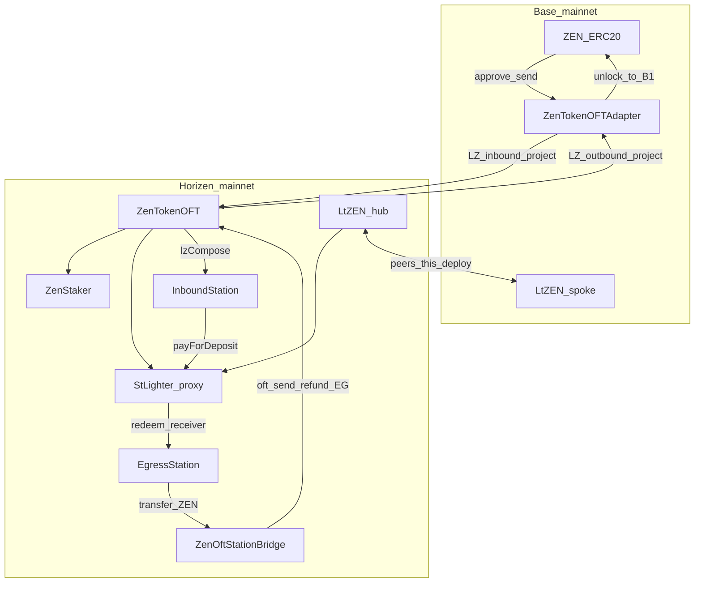

# stLighter Mainnet Deploy Checklist

> **Primary scope**: deploy **stLighter only** to **Horizen mainnet** (`26514`) + **Base** (`8453`).  
> Testnet full stack (incl. MockZEN / fresh OFT): [`stLighter-deploy-checklist.md`](./stLighter-deploy-checklist.md)  
> Topology / compose ADR: [`stLighter-station-compose-adr.md`](./stLighter-station-compose-adr.md)  
> OFT / ULN copy recipe: [`stLighter-oft-reference.md`](./stLighter-oft-reference.md)  
> Relayer design: [`stLighter-relayer-design.md`](./stLighter-relayer-design.md) · setup: [`stLighter-rrelayer-setup.md`](./stLighter-rrelayer-setup.md) · compose: [`deploy/README.md`](../deploy/README.md)
>
> | Part | Scope |
> |------|--------|
> | **0** | Preflight, ownership, LZ endpoint / ULN discovery |
> | **1** | Contracts: LtZEN + StLighter + Stations + ltZEN peer/DVN |
> | **2** | Frontend `NEXT_PUBLIC_*` |
> | **3** | rrelayer + BFF + gas-provider (`deploy/`) |
>
> **Out of this checklist (Horizen / project-owned)**: ZenTokenOFT, ZenStaker, Base ZEN ERC20, ZenTokenOFTAdapter, and their ZEN peer / ULN wiring — already live on mainnet.

---

## Mainnet cautions

- **ZEN path is not ours to redeploy.** Adapter ↔ ZenTokenOFT peers and DVN are project scope. This checklist only wires **ltZEN** and Stations on top.
- **Same address, different networks**: Horizen `ZenTokenOFT` and Base `ZenTokenOFTAdapter` share `0x57da…9280` by design. Always pair address + RPC; never assume one call hits both chains.
- **Bidirectional ltZEN peer + explicit ULN** on both chains. One-sided wire → LayerZero Scan `WAITING FOR ULN CONFIG` / locked messages. Fix wiring then **re-send**.
- **Ownership now vs later**: for stability, set `GOVERNANCE_ADDRESS` (or `TIMELOCK_ADDRESS`) to the deployer / a dedicated owner EOA. Plan a later hard-cutover to Timelock → multisig ([`DeployStLighterTimelock.s.sol`](../script/DeployStLighterTimelock.s.sol)); leave the checklist item open.
- **Deployer ≠ relayer.** Separate keys. Relayer pays Horizen native gas only; never put mnemonic / API keys in the browser or git.
- **Small-amount smoke first**, then open the frontend. Cover same-chain stake, Wave A cross-chain stake, Wave B redeem-to-Base.
- **OFT dust**: ZEN / ltZEN use shared-decimal truncation (typically 18→6 → rate `1e12`). Bridge amounts below dust rules may fail or leave dust on source — see frontend `oftDust.ts` and Bridge `minAmountLD`.
- **Audit freeze**: ship the audited / `AUDIT_DELTA`-declared implementation; do not sneak write-path changes into mainnet bytecode.
- **Secrets**: never commit Alchemy keys, mnemonics, or `RRELAYER_API_KEY`. Base RPC in docs uses `$ALCHEMY_API_KEY` placeholder only.

---

## 0. Topology (do not confuse)

| Chain | chainId | LZ eid | ZEN | LayerZero | ltZEN (this deploy) |
|-------|---------|--------|-----|-----------|---------------------|
| **Base** | `8453` | `30184` | ERC20 `0xf43e…9229` | **`ZenTokenOFTAdapter`** `0x57da…9280` (lock/unlock) | Spoke OFT, `minter = 0` |
| **Horizen** | `26514` | `30399` | **`ZenTokenOFT`** `0x57da…9280` | Peer of Base adapter (already wired) | Hub OFT, `minter = StLighter proxy` |



**Path summary**

| Path | Direction | Contracts |
|------|-----------|-----------|
| **Wave A — cross-chain stake** | Base ZEN → Horizen ltZEN | Adapter `send(to=InboundStation, compose)` → credit → `depositWithSig(payer=Station)` |
| **Wave B — Redeem to Base** | Horizen ltZEN → Base ZEN @ B1 | `Egress.redeemAndCredit` → `bridgeToBase` → Bridge `oft.send` → Adapter unlocks to `dest` |
| **Same-chain** | Horizen ltZEN ↔ Horizen ZEN | `deposit` / `redeem` (no Station) |

---

## Part 0 — Preflight

### 0.1 Known addresses (do not redeploy)

| Role | Chain | Address |
|------|-------|---------|
| ZenStaker | Horizen | `0x6BF7CF29a8bcE11Aa62Cf593d165C244fA4d3E31` |
| ZenTokenOFT (ZEN) | Horizen | `0x57da2D504bf8b83Ef304759d9f2648522D7a9280` |
| ZEN ERC20 | Base | `0xf43eB8De897Fbc7F2502483B2Bef7Bb9EA179229` |
| ZenTokenOFTAdapter | Base | `0x57da2D504bf8b83Ef304759d9f2648522D7a9280` |

### 0.2 Env / wallets

```bash
export HORIZEN_RPC=https://horizen.calderachain.xyz/http
export HORIZE_VERIFY=https://horizen.calderaexplorer.xyz/api/
export BASE_RPC=https://base-mainnet.g.alchemy.com/v2/$ALCHEMY_API_KEY
# Explorers: https://horizen.calderaexplorer.xyz/ · https://base.blockscout.com/

export PRIVATE_KEY=…   # deployer — never commit
export DEPLOYER=$(cast wallet address --private-key $PRIVATE_KEY)
# Stage-1 owner: deployer EOA or a dedicated owner EOA
export GOVERNANCE_ADDRESS=$DEPLOYER
# Optional later: TIMELOCK_ADDRESS=… (overrides GOVERNANCE_ADDRESS in scripts)

export ZEN_TOKEN_ADDRESS=0x57da2D504bf8b83Ef304759d9f2648522D7a9280
export ZEN_STAKER_ADDRESS=0x6BF7CF29a8bcE11Aa62Cf593d165C244fA4d3E31
export BASE_ZEN_TOKEN_ADDRESS=0xf43eB8De897Fbc7F2502483B2Bef7Bb9EA179229
export BASE_ZEN_ADAPTER=0x57da2D504bf8b83Ef304759d9f2648522D7a9280
export HORIZEN_EID=30399
export BASE_EID=30184
```

- [ ] Fund `$DEPLOYER` with native gas on Horizen **and** Base
- [ ] `.env` from [`.env.template`](../.env.template) — mainnet eids / addresses above; clear any testnet leftovers
- [ ] Confirm ZEN Adapter ↔ ZenTokenOFT already deliver on [LayerZero Scan](https://layerzeroscan.com/) (project path; optional sanity)

### 0.3 LayerZero Endpoint + ULN (copy from ZenTokenOFT)

Read endpoints from live OApps (do not hardcode from memory):

```bash
export LZ_ENDPOINT_HORIZEN=$(cast call $ZEN_TOKEN_ADDRESS "endpoint()(address)" --rpc-url $HORIZEN_RPC)
export LZ_ENDPOINT_BASE=$(cast call $BASE_ZEN_ADAPTER "endpoint()(address)" --rpc-url $BASE_RPC)
```

Copy send/receive libs + ULN from **Horizen ZenTokenOFT** (and Base Adapter for the Base side) using the recipe in [`stLighter-oft-reference.md`](./stLighter-oft-reference.md) §「从已知 OApp 复制配置」:

```bash
# Example — Horizen ZenTokenOFT toward Base eid
export LZ_SEND_LIB=$(cast call $LZ_ENDPOINT_HORIZEN "getSendLibrary(address,uint32)(address)" \
  $ZEN_TOKEN_ADDRESS $BASE_EID --rpc-url $HORIZEN_RPC)
export LZ_RECEIVE_LIB=$(cast call $LZ_ENDPOINT_HORIZEN "getReceiveLibrary(address,uint32)(address,bool)" \
  $ZEN_TOKEN_ADDRESS $BASE_EID --rpc-url $HORIZEN_RPC | awk 'NR==1')

cast call $LZ_ENDPOINT_HORIZEN "getConfig(address,address,uint32,uint32)(bytes)" \
  $ZEN_TOKEN_ADDRESS $LZ_SEND_LIB $BASE_EID 2 --rpc-url $HORIZEN_RPC
# Decode confirmations + requiredDVNs → LZ_CONFIRMATIONS, DVN_ADDRESSES
```

Repeat on Base for `$BASE_ZEN_ADAPTER` with `PEER_EID=$HORIZEN_EID`. Fill `LZ_SEND_LIB` / `LZ_RECEIVE_LIB` / `LZ_CONFIRMATIONS` / `DVN_ADDRESSES` **per chain** — do **not** cross-copy libs across chains.

These values are applied only to **new ltZEN** OApps in Part 1 (ZEN OApps already configured).

### 0.4 Script inventory (mainnet subset)

| Script | Chain | Purpose |
|--------|-------|---------|
| [`DeployStLighterHorizen.s.sol`](../script/DeployStLighterHorizen.s.sol) | Horizen | LtZEN hub + StLighter proxy |
| [`DeployInboundStation.s.sol`](../script/DeployInboundStation.s.sol) | Horizen | Wave A Station |
| [`DeployStLighterBase.s.sol`](../script/DeployStLighterBase.s.sol) | Base | LtZEN spoke |
| [`WireStLighterOFT.s.sol`](../script/WireStLighterOFT.s.sol) | both | ltZEN `setPeer` |
| [`ConfigureStLighterOFTDVN.s.sol`](../script/ConfigureStLighterOFTDVN.s.sol) | both | ULN for ltZEN |
| [`DeployEgressStation.s.sol`](../script/DeployEgressStation.s.sol) | Horizen | Egress + ZenOftStationBridge + `setBridge` |

**Skip on mainnet**: `DeployZenTokenOFT`, `DeployZenStaker`, `DeployMockZEN`, `DeployZenTokenOFTAdapter`, `WireZenOft`.

Optional later: [`DeployStLighterTimelock.s.sol`](../script/DeployStLighterTimelock.s.sol).

---

## Part 1 — Contracts

### 1.1 Horizen hub — LtZEN + StLighter

```bash
forge script script/DeployStLighterHorizen.s.sol \
  --rpc-url $HORIZEN_RPC --broadcast --private-key $PRIVATE_KEY

# → set:
export LT_ZEN_HORIZEN=0xDf33Ef2073a1b7205BFFC393521Fb2f46b464B7E
export STLIGHTER_PROXY_ADDRESS=0x92E0940f6dAE6e14f004bb411A7fE222EbCE4E59
export ST_LIGHTER_IMPL=0x2762dFCACbc952cA987497f01D71B8D5f52D4Dfd
export TIMELOCK=0x916652bcFF1fB63af6A5D55482e03139ebAD3578

export ST_LIGHTER=$STLIGHTER_PROXY_ADDRESS
export LT_ZEN=$LT_ZEN_HORIZEN


forge verify-contract \
  --rpc-url $HORIZEN_RPC \
  --verifier blockscout \
  --verifier-url $HORIZE_VERIFY \
  $ST_LIGHTER_IMPL \
  src/stlighter/StLighter.sol:StLighter

forge verify-contract \
  --rpc-url $HORIZEN_RPC \
  --verifier blockscout \
  --verifier-url $HORIZE_VERIFY \
  $LT_ZEN_HORIZEN \
  src/stlighter/LtZEN.sol:LtZEN
```

- [ ] `ltZen.minter() == STLIGHTER_PROXY_ADDRESS`
- [ ] Proxy initialized with mainnet ZenTokenOFT + ZenStaker; owner = `GOVERNANCE_ADDRESS`
- [ ] ltZEN ownership transferred to governance (script does this)

```bash
cast call $LT_ZEN_HORIZEN 'minter()(address)' --rpc-url $HORIZEN_RPC
cast call $LT_ZEN_HORIZEN 'owner()(address)' --rpc-url $HORIZEN_RPC
```

### 1.2 InboundStation

```bash
forge script script/DeployInboundStation.s.sol \
  --rpc-url $HORIZEN_RPC --broadcast --private-key $PRIVATE_KEY


export INBOUND_STATION_ADDRESS=0xe2721EA4955D4d4E7C060ff9a934BE4353ed87d0
export IN_STATION=$INBOUND_STATION_ADDRESS
forge verify-contract \
  --rpc-url $HORIZEN_RPC \
  --verifier blockscout \
  --verifier-url $HORIZE_VERIFY \
  $IN_STATION \
  src/stlighter/station/InboundStation.sol:InboundStation
```

- [ ] `zen()` / `zenOft()` = ZenTokenOFT
- [ ] `stLighter()` = proxy
- [ ] `composeCaller()` = `LZ_ENDPOINT_HORIZEN`
- [ ] `allowedSrcEid()` = `30184` (`BASE_EID`)

```bash
cast call $IN_STATION 'zen()(address)' --rpc-url $HORIZEN_RPC
cast call $IN_STATION 'zenOft()(address)' --rpc-url $HORIZEN_RPC
cast call $IN_STATION 'stLighter()(address)' --rpc-url $HORIZEN_RPC
cast call $IN_STATION 'composeCaller()(address)' --rpc-url $HORIZEN_RPC
cast call $IN_STATION 'allowedSrcEid()(uint32)' --rpc-url $HORIZEN_RPC
```

### 1.3 Base spoke — LtZEN only

```bash
forge script script/DeployStLighterBase.s.sol \
  --rpc-url $BASE_RPC --broadcast --private-key $PRIVATE_KEY
# → set LT_ZEN_BASE
export LT_ZEN_BASE=0x…
```

- [ ] `minter() == address(0)`
- [ ] owner = governance

### 1.4 ltZEN peer + DVN (both chains)

**Peers**

```bash
# Horizen → peer Base ltZEN
export LT_ZEN_LOCAL=$LT_ZEN_HORIZEN
export PEER_EID=$BASE_EID
export PEER_LT_ZEN=$LT_ZEN_BASE
forge script script/WireStLighterOFT.s.sol \
  --rpc-url $HORIZEN_RPC --broadcast --private-key $PRIVATE_KEY

# Base → peer Horizen ltZEN
export LT_ZEN_LOCAL=$LT_ZEN_BASE
export PEER_EID=$HORIZEN_EID
export PEER_LT_ZEN=$LT_ZEN_HORIZEN
forge script script/WireStLighterOFT.s.sol \
  --rpc-url $BASE_RPC --broadcast --private-key $PRIVATE_KEY
```

**Verify peers non-zero**

```bash
cast call $LT_ZEN_HORIZEN "peers(uint32)(bytes32)" $BASE_EID --rpc-url $HORIZEN_RPC
cast call $LT_ZEN_BASE "peers(uint32)(bytes32)" $HORIZEN_EID --rpc-url $BASE_RPC
```

**ULN** — reuse Part 0 values from ZenTokenOFT / Adapter; only change `OAPP_LOCAL` to local ltZEN.

```bash
# Base ltZEN
export OAPP_LOCAL=$LT_ZEN_BASE
export PEER_EID=$HORIZEN_EID
export LZ_ENDPOINT=$LZ_ENDPOINT_BASE
# LZ_SEND_LIB / LZ_RECEIVE_LIB / LZ_CONFIRMATIONS / DVN_ADDRESSES = Base Adapter snapshot
forge script script/ConfigureStLighterOFTDVN.s.sol \
  --rpc-url $BASE_RPC --broadcast --private-key $PRIVATE_KEY

# Horizen ltZEN
export OAPP_LOCAL=$LT_ZEN_HORIZEN
export PEER_EID=$BASE_EID
export LZ_ENDPOINT=$LZ_ENDPOINT_HORIZEN
# libs / DVN = Horizen ZenTokenOFT snapshot
forge script script/ConfigureStLighterOFTDVN.s.sol \
  --rpc-url $HORIZEN_RPC --broadcast --private-key $PRIVATE_KEY
```

- [ ] Peers non-zero both ways
- [ ] After first ltZEN bridge smoke: [LayerZero Scan](https://layerzeroscan.com/) Delivered (not waiting on ULN)

### 1.5 EgressStation + ZenOftStationBridge

Requires ZEN OFT path live (project) and Part 1.1 complete. Circular deploy order is inside the script:

```text
1. EgressStation(zen, address(1), deployer)
2. ZenOftStationBridge(oft, egress, BASE_EID=30184, owner)
3. egress.setBridge(realBridge)
4. if owner ≠ deployer: transferOwnership(owner)  // Ownable2Step accept
```

```bash
forge script script/DeployEgressStation.s.sol \
  --rpc-url $HORIZEN_RPC --broadcast --private-key $PRIVATE_KEY

export EGRESS_STATION_ADDRESS=0xc8493175ae5EF314bC6934A8D18cD4E49F1145D9
export ZEN_OFT_STATION_BRIDGE_ADDRESS=0x329C63b6e0692EdAB5D149ba1EFAa214FfEf2225
export EG=$EGRESS_STATION_ADDRESS
export BR=$ZEN_OFT_STATION_BRIDGE_ADDRESS

forge verify-contract \
  --rpc-url $HORIZEN_RPC \
  --verifier blockscout \
  --verifier-url $HORIZE_VERIFY \
  $EG \
  src/stlighter/station/EgressStation.sol:EgressStation
forge verify-contract \
  --rpc-url $HORIZEN_RPC \
  --verifier blockscout \
  --verifier-url $HORIZE_VERIFY \
  $BR \
  src/stlighter/station/ZenOftStationBridge.sol:ZenOftStationBridge

```

If `GOVERNANCE_ADDRESS ≠ $DEPLOYER`, accept Ownable2Step on Egress after broadcast.

**Post-deploy checks**

```bash
cast call $EG 'zen()(address)' --rpc-url $HORIZEN_RPC
cast call $EG 'stLighter()(address)' --rpc-url $HORIZEN_RPC
cast call $EG 'bridge()(address)' --rpc-url $HORIZEN_RPC
cast call $BR 'egress()(address)' --rpc-url $HORIZEN_RPC
cast call $BR 'oft()(address)' --rpc-url $HORIZEN_RPC
cast call $BR 'dstEid()(uint32)' --rpc-url $HORIZEN_RPC
cast call $BR 'zen()(address)' --rpc-url $HORIZEN_RPC
```

- [ ] `Egress.zen() == ZenTokenOFT == Bridge.oft() == Bridge.zen()`
- [ ] `Egress.stLighter() == STLIGHTER_PROXY_ADDRESS`
- [ ] `Egress.bridge() == ZenOftStationBridge` (not placeholder)
- [ ] `Bridge.dstEid() == 30184`
- [ ] Owners = governance (Egress pending accept if two-step)
- [ ] Egress / Bridge are plain deploys (not UUPS)

**Funding notes**: relayer pays Horizen native for `bridgeToBase{value}` (quote via `ZenOftStationBridge.quoteBridgeNativeFee`). Excess LZ fee refunds to **EgressStation**, never the relayer EOA.

### 1.6 Smoke (operator)

| Step | Expect |
|------|--------|
| S0 (optional) | Small Base ZEN → Horizen EOA via project Adapter (confirms ZEN path) |
| S1 | Horizen: `approve` + `deposit` → ltZEN; `issuedShares` ↑ |
| S2 | Same-chain `redeem` / `redeemWithSig` |
| S3 Wave A | Adapter `send(to=InboundStation, compose)` → credit → `depositWithSig(payer=Station)` → ltZEN |
| S4 Wave A escape | `withdrawToHorizen` without stake |
| S5 ltZEN OFT | Hub ↔ Base round-trip; `issuedShares` / exchange rate unchanged by bridge |
| S6 Wave B | `redeemAndCredit` → `bridgeToBase` → Base ZEN at signed B1 (mind OFT dust) |
| S7 Wave B escape | After credit, `withdrawToHorizen` instead of bridge |

Use DirectContractRelayer first if needed; BFF after Part 3.

---

## Part 1 — Address book (fill after broadcast)

| Role | Chain | Address |
|------|-------|---------|
| ZenTokenOFT (ZEN) | Horizen | `0x57da2D504bf8b83Ef304759d9f2648522D7a9280` |
| ZenStaker | Horizen | `0x6BF7CF29a8bcE11Aa62Cf593d165C244fA4d3E31` |
| LtZEN hub | Horizen | |
| StLighter proxy | Horizen | |
| StLighter impl | Horizen | |
| InboundStation | Horizen | |
| EgressStation | Horizen | |
| ZenOftStationBridge | Horizen | |
| ZEN ERC20 | Base | `0xf43eB8De897Fbc7F2502483B2Bef7Bb9EA179229` |
| ZenTokenOFTAdapter | Base | `0x57da2D504bf8b83Ef304759d9f2648522D7a9280` |
| LtZEN spoke | Base | |
| LZ Endpoint | Horizen | _(from `endpoint()`)_ |
| LZ Endpoint | Base | _(from `endpoint()`)_ |
| Horizen eid | — | `30399` |
| Base eid | — | `30184` |
| Governance / owner (stage-1) | — | |
| Timelock / multisig (later) | — | |

- [ ] Later: transfer ownership to Timelock / multisig and document the cutover tx

---

## Part 2 — Frontend

Map into `ltzen-frontend/.env.local` (dev) and/or [`deploy/.env`](../deploy/.env.example) (production image build).

| Frontend var | Source |
|--------------|--------|
| `NEXT_PUBLIC_HORIZEN_RPC_URL` | `https://horizen.calderachain.xyz/http` |
| `NEXT_PUBLIC_HORIZEN_EXPLORER_URL` | `https://horizen.calderaexplorer.xyz` |
| `NEXT_PUBLIC_HORIZEN_STLIGHTER_ADDRESS` | StLighter proxy |
| `NEXT_PUBLIC_HORIZEN_LTZEN_ADDRESS` | LtZEN hub |
| `NEXT_PUBLIC_HORIZEN_ZEN_ADDRESS` | ZenTokenOFT |
| `NEXT_PUBLIC_HORIZEN_ZENSTAKER_ADDRESS` | ZenStaker |
| `NEXT_PUBLIC_HORIZEN_INBOUND_STATION_ADDRESS` | InboundStation |
| `NEXT_PUBLIC_HORIZEN_EGRESS_STATION_ADDRESS` | EgressStation |
| `NEXT_PUBLIC_HORIZEN_ZEN_OFT_STATION_BRIDGE_ADDRESS` | ZenOftStationBridge |
| `NEXT_PUBLIC_BASE_CHAIN_ID` | `8453` |
| `NEXT_PUBLIC_BASE_CHAIN_NAME` | `Base` |
| `NEXT_PUBLIC_BASE_RPC_URL` | Alchemy / public Base RPC (`$ALCHEMY_API_KEY` in secret store, not git) |
| `NEXT_PUBLIC_BASE_EXPLORER_URL` | `https://base.blockscout.com` |
| `NEXT_PUBLIC_BASE_LTZEN_ADDRESS` | LtZEN spoke |
| `NEXT_PUBLIC_BASE_ZEN_ADDRESS` | Base ZEN ERC20 |
| `NEXT_PUBLIC_BASE_ZEN_OFT_ADAPTER_ADDRESS` | Adapter |
| `NEXT_PUBLIC_HORIZEN_EID` | `30399` |
| `NEXT_PUBLIC_BASE_EID` | `30184` |
| `NEXT_PUBLIC_RELAYER_FEE_ADDRESS` | rrelayer EOA (Part 3) |
| `NEXT_PUBLIC_USE_RELAYER_BFF` | `1` when BFF+rrelayer live |
| `NEXT_PUBLIC_WC_PROJECT_ID` | WalletConnect project |

- [ ] No faucet UI on mainnet
- [ ] Transparency lists Base ERC20 + Adapter separately; Egress refundAddress = Egress
- [ ] After env change in Docker: `cd deploy && make release` (`NEXT_PUBLIC_*` baked at **image build**)

---

## Part 3 — Relayer / BFF / gas-provider

Full compose layout: [`deploy/README.md`](../deploy/README.md). Testnet-oriented narrative: [`stLighter-rrelayer-setup.md`](./stLighter-rrelayer-setup.md). **Mainnet deltas below.**

### 3.1 Compose env (`deploy/.env`)

```bash
cd deploy
cp .env.example .env && chmod 600 .env
```

Critical mainnet knobs:

| Var | Mainnet value |
|-----|----------------|
| `GAS_RPC_26514` | `https://horizen.calderachain.xyz/http` |
| `RRELAYER_PROVIDER_URL` | same Horizen mainnet RPC |
| `NEXT_PUBLIC_*` | Part 2 address book + eids `30399` / `30184`, Base chain `8453` |
| `RAW_DANGEROUS_MNEMONIC` | dedicated relayer mnemonic (≠ deployer) |
| `RRELAYER_AUTH_*` | admin basic auth (CLI only) |

Also configure [`deploy/rrelayer/rrelayer.yaml`](../deploy/rrelayer/rrelayer.yaml) for **chainId `26514`** (not testnet `2651420`): provider URL, explorer, `gas_providers.custom.supported_chains: [26514]`, and allowlist.

**Allowlist** `to ∈ { StLighter proxy, InboundStation, EgressStation }`  
(Bridge is **not** called by the relayer — only Egress calls Bridge.) Prefer `disable_native_transfer: true`.

### 3.2 Bring up stack

```bash
make release
# edge nginx → FRONTEND_BIND:FRONTEND_PORT (default 127.0.0.1:6000)
```

Create relayer on **mainnet** chain id:

```bash
# from a container on the compose network (adjust auth / network name as needed)
curl -u "$RRELAYER_AUTH_USERNAME:$RRELAYER_AUTH_PASSWORD" \
  -H 'Content-Type: application/json' \
  -d '{"name":"relayer_horizen_mainnet"}' \
  http://rrelayer:8000/relayers/26514/new
```

- [ ] Fund relayer EOA with Horizen native gas
- [ ] `make gen-api-key` → `RRELAYER_API_KEY`
- [ ] Set `RRELAYER_EOA_ADDRESS` (lowercase) + `RRELAYER_RELAYER_ID`
- [ ] `NEXT_PUBLIC_RELAYER_FEE_ADDRESS` = that EOA
- [ ] `make force-recreate` so rrelayer reloads yaml/env

BFF (compose-injected): `RRELAYER_SERVER_URL=http://rrelayer:8000` — **never** expose `:8000` publicly.

### 3.3 gas-provider smoke

```bash
docker compose exec rrelayer wget -qO- http://gas-stub:8787/26514
# expect Infura-style tiers; medium tip ~ floor (e.g. 0.001 Gwei on Horizen)
```

- [ ] No `gas tip cap 0` loops in rrelayer logs ([setup §6](./stLighter-rrelayer-setup.md))

### 3.4 Acceptance

- [ ] User with **no** Horizen ETH completes Wave A / Wave B via BFF (meaningful gasless on L3 legs)
- [ ] `tx.from` on explorer = relayer EOA; Base receipt = signed B1, not relayer
- [ ] Monitor relayer native balance; rotate API keys as needed

---

## Known gaps / deferred

- Timelock + multisig hard-cutover (stage-1 may keep EOA owner)
- Post-send LZ failure / partial refund on egress path: ops escalation only ([ADR §2](./stLighter-station-compose-adr.md))
- `composeCaller` assumed = Horizen LZ Endpoint; if MessagingComposer differs, set via InboundStation owner
- rrelayer yaml in repo may still default to testnet `2651420` — update for mainnet host before go-live
- Incomplete ltZEN peer/ULN → Scan blocked; after fix, inbound nonce gaps may need `Endpoint.skip` — [`stLighter-oft-debug-cases.md`](./stLighter-oft-debug-cases.md)
