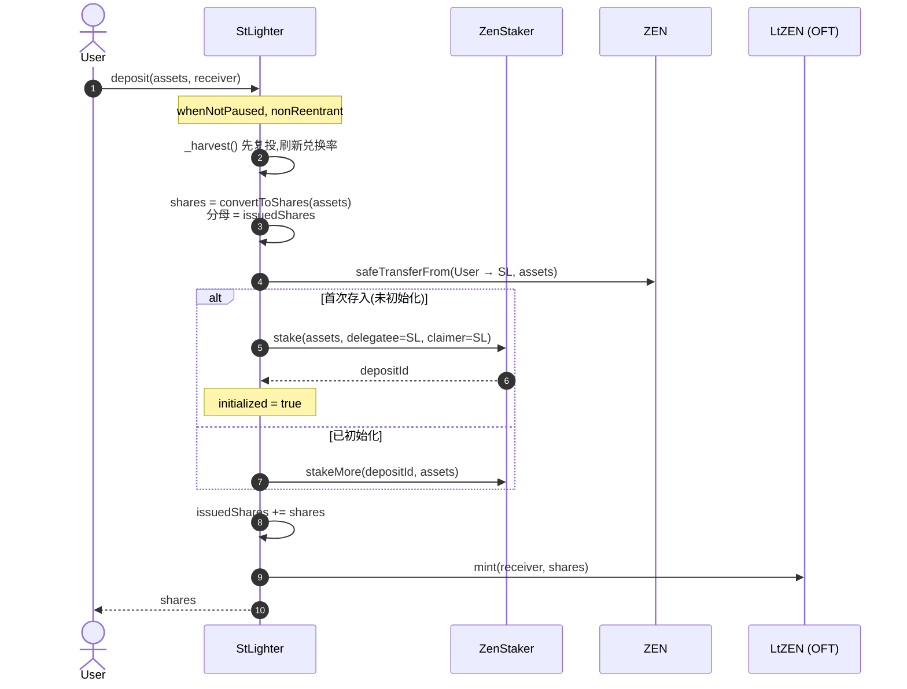
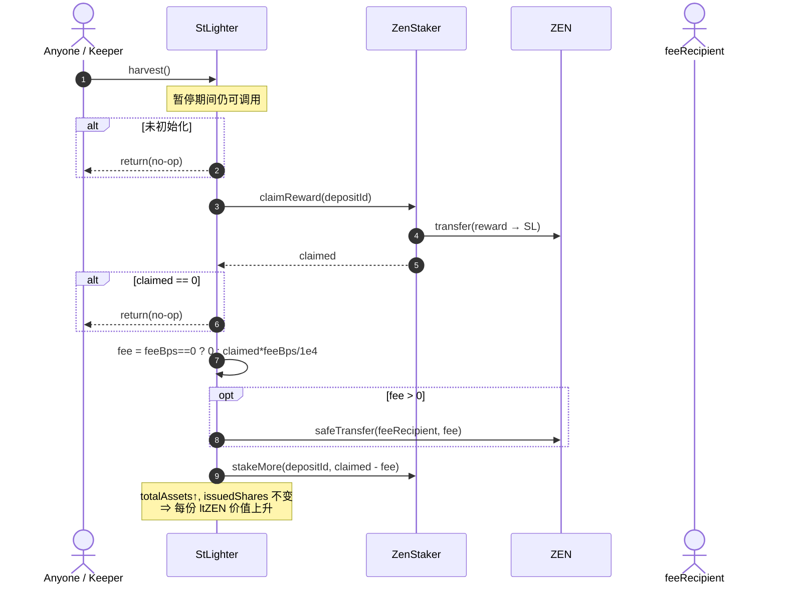
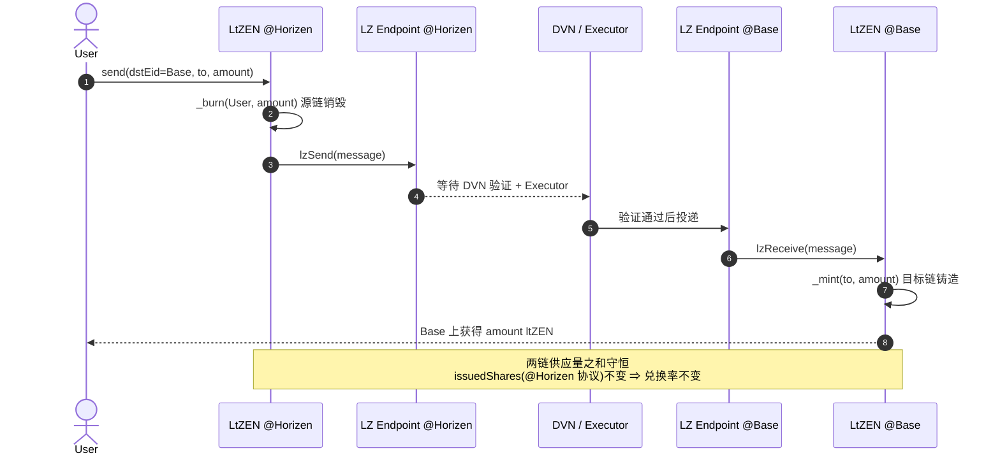
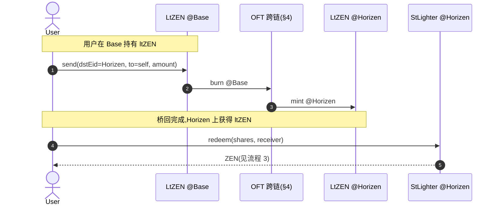

# stLighter 时序图

> 配合 `docs/stLighter-PRD.md` 与 `src/stlighter/` 合约骨架阅读。
> 参与者:**User**、**StLighter**(协议合约,Horizen)、**LtZEN**(OFT 份额代币)、**ZenStaker**(底层质押,Horizen)、**ZEN**(代币)、**LZ Endpoint**(LayerZero V2)。
> 关键不变量:兑换率 = `totalAssets / issuedShares`,其中 `issuedShares` 仅随 deposit/redeem 变动,**跨链不影响**。

---

## 1. Deposit(存入,Horizen)



---

## 2. Harvest(复投,permissionless)



> deposit 与 redeem 入口在处理用户操作前都会内部调用一次 `_harvest()`,因此"先复投再计价"是默认行为;独立 `harvest()` 供 keeper 主动触发,加快复利节奏。

---

## 3. Redeem(赎回,Horizen)

```mermaid
sequenceDiagram
    autonumber
    actor User
    participant SL as StLighter
    participant LT as LtZEN (OFT)
    participant ZS as ZenStaker
    participant ZEN

    User->>SL: redeem(shares, receiver)
    Note over SL: nonReentrant;赎回不受 pause 限制
    SL->>SL: _harvest() 强制 claim+restake<br/>已实现奖励全部进入 deposit 本金
    SL->>SL: assets = convertToAssets(shares)<br/>分母 = issuedShares
    SL->>SL: issuedShares -= shares
    SL->>LT: burn(User, shares)
    SL->>ZS: withdraw(depositId, assets)
    ZS->>ZEN: transfer(surrogate → SL, assets)
    SL->>ZEN: safeTransfer(receiver, assets)
    SL-->>User: assets
```

> 先 harvest 的意义:`withdraw` 的可提取上限是 deposit 的 `balance`。把未领取奖励先 claim+restake 进本金,可避免大额赎回因"奖励尚未复投"而被卡在余额上限(PRD §5.6)。

---

## 4. 跨链转移(Horizen → Base,OFT)



> **关键**:跨链只搬动 ltZEN,不触碰 `StLighter.issuedShares`,也不触碰 ZenStaker 头寸。因此兑换率完全不受跨链影响。Base 端 ltZEN 的"可兑换 ZEN 价值"始终引用 Horizen 的 `convertToAssets`。

---

## 5. Base 用户赎回(Phase 1 体验)



> Phase 1:Base 用户赎回需"先桥回 Horizen 再 redeem"两步。前端可编排为"一键桥回并赎回"引导(纯前端,非合约)。Base 端直接发起赎回属 Phase 2 的跨链写入范畴。
