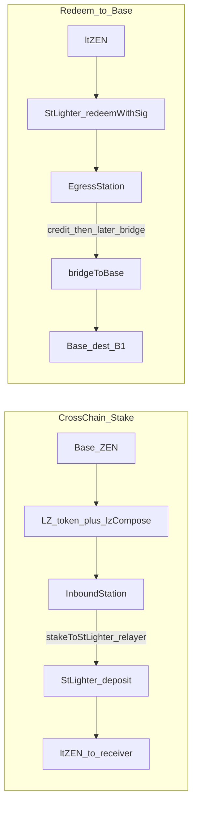

# stLighter Station 设计规范（InboundStation / EgressStation）

> **用途**: 跨链 stake / Redeem to Base 专用车站合约的职责、动作模板、EIP-712、入账/出桥交接与安全约束。  
> **定位**: **仅服务 stLighter** 跨链场景（专用化）；不做通用开放 `Call[]` 执行器。  
> **上级规范**: [`stLighter-crosschain-gasless-spec.md`](./stLighter-crosschain-gasless-spec.md)（产品原则、B1、gasless、状态机）。冲突时产品原则以上级为准；**合约接口与交接细节以本文为准**。  
> **状态**: 需求已锁定（2026-07-21 访谈 Q11–Q31）；本阶段为设计规范，**不含**合约实现。  
> **最后更新**: 2026-07-21

---

## 1. 目标与非目标

### 1.1 目标

| 目标 | 说明 |
|------|------|
| 跨链 stake | Base ZEN →（LZ 收 token + `lzCompose` 入账）→ `InboundStation` 会计 → 用户签 + relayer → `StLighter.deposit` → Horizen ltZEN |
| Redeem to Base | `redeemWithSig(receiver=EgressStation)` → 用户签 `creditFromRedeem` → 另 tx `bridgeToBase` → Base 用户指定地址（B1） |
| Gasless L3 | Station 上主权动作由 **relayer 代发**；用户 L3 无 ETH 不得卡死 |
| 用户主权 | 未 stake / 未成功出桥的贷记余额可签名提取或重试 |
| 安全优先 | 共享共池 + 有限模板；放弃任意 Multicall / 目标白名单通用执行器 |

### 1.2 非目标

| 不做 | 原因 |
|------|------|
| 开放 `Call[]` / 任意 `execute` | 共池下攻击面过大（访谈放弃通用性） |
| `lzCompose` 内自动 stake | 编排与费用控制；降低对 LZ 最后一程依赖 |
| Base 侧出金 Receiver（B2） | 已锁定 B1 |
| 将 Station 并入 StLighter 存储/升级域 | 独立合约；通过调用交接 |
| 修改 StLighter `deposit`/`redeem` 的 `receiver` 语义 | 不增不减，沿用现实现 |
| 为通用性引入临时子账户隔离仓 | Q16=C；模板化已足够 |
| relayer 直接调桥 | 退款须回 EgressStation（§5.3） |

---

## 2. 命名与角色

| 合约 | 隐喻 | 职责 |
|------|------|------|
| **InboundStation** | 入站车站 | 接收跨链 ZEN、会计、送「最后一程」stake、或 withdraw 到 Horizen |
| **EgressStation** | 出站车站 | 承接 redeem 产出、会计、发起出桥、失败/退款可恢复、或 withdraw 到 Horizen |

二者均为 Horizen 上**共享单例**（或可升级代理），多用户共池会计：`mapping(address => uint256) credited`（实现可改为 depositId，语义等价）。



---

## 3. 与 StLighter 的交接（专用路径）

### 3.1 入站 stake（不走 `depositWithSig`）

`StLighter.depositWithSig` 从 **`_user` 钱包** `transferFrom`，无法直接抽 Station 贷记余额。

**锁定路径**:

1. 用户签 `StakeToStLighter`（InboundStation 域）。
2. Relayer 调 `InboundStation.stakeToStLighter(...)`。
3. Station：校验签名与 nonce → 扣 `credited[owner]` → 可选将 `feeZen ≤ maxFeeZen` 转给 `msg.sender`（relayer）→ `ZEN.approve(StLighter, net)` → `StLighter.deposit(net, ltZenReceiver)`。

此时 `msg.sender`（对 StLighter）为 Station，符合现有 `_deposit` 的 payer 语义。  
**Gasless** = 用户不为调 Station / StLighter 的 L3 tx 付 gas。

`ltZenReceiver`：完全遵循 `StLighter.deposit` 现有 `receiver` 参数，不增不减。

### 3.2 出站 redeem → Egress 入账（两步同 tx，两阶段出桥）

`StLighter.redeemWithSig` 可将 ZEN 转到任意 `_receiver`。

**锁定路径（同 tx）**:

1. Relayer 调 `StLighter.redeemWithSig(..., receiver = EgressStation, user = owner)`（现有 EIP-712 + ltZEN permit 若需要）。
2. 同 tx 内 Relayer 调 `EgressStation.creditFromRedeem(..., sig)`（用户预签 EIP-712）。
3. 无有效 owner 签名则 **不得** 增加该用户 `credited`；多出 ZEN 进不可分配余额（见 §7）。

**出桥（另 tx，Q22=B）**:

4. 用户另签 `BridgeToBase` → relayer 调 `EgressStation.bridgeToBase` → **仅 EgressStation** 调桥；`dest` 为 Base B1。
5. 失败/退款 → 仍记在该用户 Egress 会计 → `retryBridgeToBase` 或 `withdrawToHorizen`。

---

## 4. 动作清单（MVP 全部公开动作）

### 4.1 InboundStation

| 动作 | 谁触发 | 说明 |
|------|--------|------|
| `lzCompose` / 入金适配 | LZ executor | **仅** `credit(owner, assets)`；**禁止** stake |
| `stakeToStLighter` | relayer + owner EIP-712 | §3.1 |
| `withdrawToHorizen` | relayer（推荐）+ owner EIP-712 | 未 stake 贷记提到 `to`（默认 owner） |

### 4.2 EgressStation

| 动作 | 谁触发 | 说明 |
|------|--------|------|
| `creditFromRedeem` | relayer + owner EIP-712 | 与同 tx redeem 配合；防抢记 |
| `bridgeToBase` | relayer + owner EIP-712 | 出桥；Station 为桥调用方 |
| `retryBridgeToBase` | 同 `BridgeToBase` 类型再签 | recoverable 后重试 / 改 dest |
| `withdrawToHorizen` | relayer + owner EIP-712 | 放弃出桥，提到 Horizen |
| 桥退款入账 | 桥 / 适配器 | 增加对应用户 `credited`，进入 `recoverable_hold` |

---

## 5. 入账与桥

### 5.1 Inbound：`lzCompose` 仅 credit

LayerZero **收 token** 与 **`lzCompose`** 为两步；入账信任 LZ 通道（endpoint / peer / guid）。

**Compose 边界（硬性）**:

- 解码 payload：至少 `owner`、`assets`（及实现所需字段）。
- 校验 LZ 来源与 guid 防重放。
- 执行 `credited[owner] += assets`（或等价）。
- **不得**调用 StLighter / 不得自动 stake。

**不**在 payload 内嵌套 owner EIP-712（Q29=A）。若未来「桥发送者 ≠ owner」再议。

### 5.2 Egress：仅 Station 调桥 + refund → Station

| 要求 | 说明 |
|------|------|
| 调用方 | 只有 `EgressStation` 调桥；relayer 只调 Station |
| refund | `refundAddress`（或等价）= EgressStation；**禁止** relayer EOA |
| 退款会计 | 退回 ZEN 记入原 `owner` 的 `credited` |
| 验收 | 负向：退款后 relayer 地址 ZEN 不增加 |

具体 LZ/Stargate 参数 → 出金 ADR。

### 5.3 Base 到账（B1）

见上级规范 §2.5.1（地址确认、签名绑 `dest`、合约收款人警告）。

---

## 6. EIP-712

### 6.1 通用规则

| 规则 | 说明 |
|------|------|
| `verifyingContract` | 分别为 InboundStation / EgressStation 地址 |
| Nonce | **每 Station 每用户一条**递增计数；所有该站动作共用（Q27=A） |
| Deadline | 酌情使用；过期拒收 |
| Relayer tx 签 | 仅付 gas；**业务授权只认用户 EIP-712** |
| 两套业务签（Egress） | `CreditFromRedeem` 与 `BridgeToBase` **分开签、各耗一次 nonce**（Q30=A） |

### 6.2 InboundStation 类型

```text
StakeToStLighter(uint256 assets, address ltZenReceiver, uint256 maxFeeZen, address owner, uint256 nonce, uint256 deadline)

WithdrawToHorizen(uint256 assets, address to, address owner, uint256 nonce, uint256 deadline)
```

### 6.3 EgressStation 类型

```text
CreditFromRedeem(uint256 assets, address owner, uint256 nonce, uint256 deadline)

BridgeToBase(uint256 assets, address dest, uint256 maxFeeZen, address owner, uint256 nonce, uint256 deadline)

WithdrawToHorizen(uint256 assets, address to, address owner, uint256 nonce, uint256 deadline)
```

`RetryBridgeToBase`：与 `BridgeToBase` **同一 typehash**（再签一次、耗 nonce）；前端可作别名。

### 6.4 仍使用的 StLighter 类型（不变）

- `RedeemWithSig` — `receiver` = EgressStation  
- 同链 redeem / 其它 gasless 路径不经 Station 时仍用现有类型  

入站 **不**依赖 `DepositWithSig` 抽 Station 余额（改由 Station 调 `deposit`）。

---

## 7. 无主 / 非法资金（Q24）

| 层级 | 行为 |
|------|------|
| MVP | 非法 compose / 无法校验的入金：**revert 或不入用户可花余额**（实现含「C」：拒收） |
| 严格会计 | redeem 打入 Egress 但 `creditFromRedeem` 缺失/过期：ZEN 进 **unassigned**（不可被任意 credit 抢走） |
| 救援 | 超时后 **治理/多签 `rescue`**（Q24=A）；不得自动送给 relayer |

---

## 8. 安全约束摘要

1. **共池禁止裸任意 call**；仅模板动作。  
2. **debit 贷记后再转出**；禁止超额。  
3. **creditFromRedeem 无 owner 签不可入账**（防抢记）。  
4. **出桥仅 Egress 调用**；refund 回 Egress。  
5. **relayer 不得改写** 签名中的 `dest` / `ltZenReceiver` / `assets`。  
6. **`lzCompose` 不 stake**。  
7. 批末如有 `approve`，Station 应清零对 StLighter 的残余 allowance（实现注意）。

---

## 9. 与上级规范的术语对齐

| 上级规范旧称 | 本文正式名 |
|--------------|------------|
| 共享独立接收合约 / Inbound Receiver | **InboundStation** |
| Egress / 出金路径 | **EgressStation** |
| 跨链 stake 的 L3 depositWithSig | **InboundStation.stakeToStLighter → StLighter.deposit** |

产品层仍称「跨链 stake / Redeem to Base」；实现与 ABI 用 Station 名。

---

## 10. 实现里程碑（相对上级 §7）

| ID | 内容 |
|----|------|
| S1 | `InboundStation`：会计、`lzCompose` credit、`stakeToStLighter`、`withdrawToHorizen`、测试 |
| S2 | `EgressStation`：`creditFromRedeem`、`bridgeToBase`、refund 会计、`withdrawToHorizen`、负向退款测试 |
| S3 | BFF：校验 Station EIP-712；编排 redeem+credit 同 tx；bridge 另 tx |
| S4 | 前端半编排向导 + 地址确认（B1） |
| S5 | 出金/入金桥 ADR（LZ 参数、compose payload 编码、refund 对照表） |
| S6 | `rescue` / unassigned（可后于 S1–S4） |

---

## Appendix A — 访谈决策日志（Station，2026-07-21）

| ID | 决策 |
|----|------|
| Q11 | Egress **始终**在 Redeem to Base 资金路径上；尽量独立，但最终锁定为 stLighter **专用**（Q18） |
| Q12 / Q13 | 命名 **InboundStation / EgressStation** |
| Q14–Q16 | 作废开放 Call[] 路线；**模板化**；不为通用性做复杂隔离仓 |
| Q15 | 半通用模板，必要时专用 → **Q18=C 专用** |
| Q17 | 接受推荐 MVP 动作集 |
| Q18 | **C** 明确仅服务 stLighter 跨链 stake/redeem |
| Q19 | 入站：**Station 调 `StLighter.deposit`**，不走 `depositWithSig` 抽 user |
| Q20 | 出站：同 tx `redeemWithSig` + `creditFromRedeem` |
| Q21 | credit 防抢：**用户 EIP-712 预授权** |
| Q22 | credit 与 bridge：**固定两阶段（另 tx）** |
| Q23 | 入账绑定：**LZ payload + compose**；信任 LZ 两步 |
| Q24 | 无主资金：治理救援；实现上 MVP 拒收非法入金 |
| Q25 | compose **仅 credit**，不 stake |
| Q27 | 每站每用户 **单 nonce** + 酌情 deadline；不按动作拆 nonce |
| Q28 | **仅 EgressStation 调桥** |
| Q29 | compose payload **不**嵌套 owner EIP-712 |
| Q30 | 「两套签名」= `CreditFromRedeem` + `BridgeToBase` EIP-712 |
| Q31 | EIP-712 字段表通过 |

---

## Appendix B — 开放实现项

1. Compose payload 精确 ABI / 与 OFT 收 token 顺序。  
2. `unassigned` 与 `rescue` 权限、超时参数。  
3. Egress 退款如何映射回 `owner`（桥回调携带 id / 本地 pending 表）。  
4. `maxFeeZen` 在 Station stake / bridge 与 StLighter redeem fee 的叠加展示。  
5. Inbound / Egress 是否 UUPS；治理谁有权改 LZ peer / StLighter 地址。  
