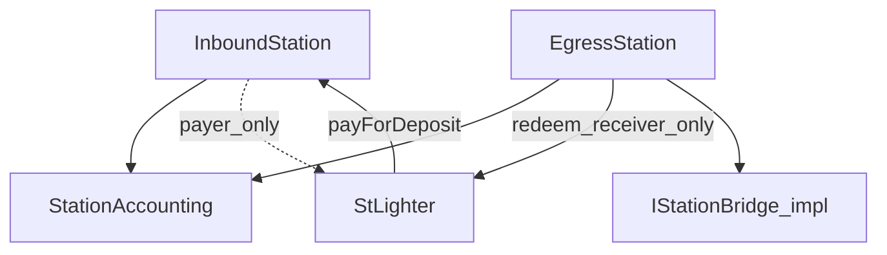

# stLighter Station 合约实现计划

> **用途**: 将 [`stLighter-station-design.md`](./stLighter-station-design.md) 落成可编码的合约结构、存储、接口、分阶段交付与测试。  
> **不改** `Staker.sol` 写路径；Station 为 **新增** 合约，不进入 StLighter 存储布局。  
> **上级**: [`stLighter-station-design.md`](./stLighter-station-design.md)、[`stLighter-crosschain-gasless-spec.md`](./stLighter-crosschain-gasless-spec.md)  
> **最后更新**: 2026-07-21

---

## 0. 实现原则（写死）

| # | 原则 |
|---|------|
| 1 | Station：`0.8.28`、**非 UUPS** `Ownable2Step` + `Pausable` + `ReentrancyGuard` + `EIP712` + `Nonces`、2-space / scopelint |
| 2 | **专用模板**，无开放 `Call[]` |
| 3 | 入站 stake = `StLighter.depositWithSig(..., payer=Station)` → `payForDeposit`；**改** StLighter typehash（加 `payer`） |
| 4 | 桥细节经 **适配器接口** 隔离；MVP 可用 Mock，真 LZ 走 S5 ADR |
| 5 | `lzCompose` **只 credit**（+ owner EIP-712）；非法入金 revert |
| 6 | 错误命名：`InboundStation__*` / `EgressStation__*` / `StationAccounting__*` |

---

## 1. 目录与模块

```text
src/stlighter/station/
  IStationDepositPayer.sol   # payForDeposit(user, assets) — StLighter callback
  IStationBridge.sol         # 出桥适配器（Egress 唯一出口）
  StationAccounting.sol      # abstract：credited / unassigned / debit-credit / rescue 钩子
  InboundStation.sol         # 非 UUPS：compose credit + payForDeposit + withdraw
  EgressStation.sol          # 非 UUPS：creditFromRedeem + bridge + withdraw + refund 钩子
  libraries/
    StationPayload.sol       # compose payload encode/decode（owner, assets, sig, …）

test/stlighter/station/
  InboundStation.t.sol
  EgressStation.t.sol
  StationAccounting.t.sol
  mocks/
    MockStLighterDeposit.sol
    MockStationBridge.sol
    MockLZComposerEndpoint.sol   # 可选：模拟 compose 调用方

script/ 或 deploy/
  DeployStations.s.sol       # 直接部署（无 proxy）
```

**依赖方向**（禁止环）：



---

## 2. 共享会计：`StationAccounting`

### 2.1 状态

```solidity
IERC20 internal zen;                    // initialize 写入
mapping(address => uint256) public credited; // 用户可花贷记
uint256 public unassigned;              // 合约内未归属用户的 ZEN（会计）
uint256 public totalCredited;           // 可选：∑ credited，便于不变量
```

**不变量（每次状态变更后应成立）**:

```text
zen.balanceOf(address(this)) >= totalCredited + unassigned
```

（出桥锁定中的金额若从 `credited` 扣到 `pendingBridge`，须纳入不变量，见 §4.4。）

### 2.2 原语

| 函数 | 可见性 | 行为 |
|------|--------|------|
| `_credit(owner, amount)` | internal | `credited[owner] += amount`；`totalCredited +=`；`amount > 0` |
| `_debit(owner, amount)` | internal | 不足则 `StationAccounting__InsufficientCredit`；再减 |
| `_addUnassigned(amount)` | internal | 增加 `unassigned` |
| `_pullUnassignedToCredit(owner, amount)` | internal | 仅治理/明确规则用；MVP 可不暴露给用户 |
| `rescueUnassigned(to, amount)` | onlyOwner | 超时策略由 owner 链下把握；**不得**救援 `credited` |

事件：`Credited(owner, amount, reason)`、`Debited(owner, amount, reason)`、`UnassignedIncreased`、`UnassignedRescued`。

### 2.3 MVP 范围

- S1/S2：**实现** `credited` / `unassigned` / `rescueUnassigned`。
- 超时参数、自动 reclaim：**S6**，不阻塞 S1。

---

## 3. InboundStation

### 3.1 继承与存储

```text
Ownable2Step, Pausable, ReentrancyGuard, EIP712, Nonces, StationAccounting,
IStationDepositPayer
(+ ILayerZeroComposer 或薄包装，见 §3.3)
```

| 存储 | 说明 |
|------|------|
| `address stLighter` | 可 `onlyOwner` 更换；唯一可调 `payForDeposit` 的调用方 |
| `address trustedComposer` / 后续 `lzEndpoint` + peer | compose 来源校验（S5 定稿） |
| （无 `usedGuids`） | 幂等靠 owner EIP-712 + Station Nonces |

EIP-712 domain：`("InboundStation", "1")`。

### 3.2 外部接口（S1）

```solidity
function creditFromTrustedComposer(
  uint256 assets,
  address owner,
  uint256 deadline,
  bytes calldata signature
) external; // onlyTrustedComposer；CreditFromCompose EIP-712

function payForDeposit(address user, uint256 assets) external; // only stLighter

function withdrawToHorizen(
  uint256 assets,
  address to,
  address owner,
  uint256 deadline,
  bytes calldata signature
) external nonReentrant whenNotPaused;
```

Stake **不**在 Station 上：relayer 调 `StLighter.depositWithSig(..., payer=station, user=owner, ...)`。

### 3.3 Compose 入账（两阶段落地）

**S1（单测可测）** — 不绑真 LZ：

```solidity
function creditFromTrustedComposer(uint256 assets, address owner, uint256 deadline, bytes signature)
  external; // msg.sender == trustedComposer
```

逻辑：验 `CreditFromCompose` + `_useNonce(owner)` → `_credit(owner, assets)`；**禁止**调 `stLighter`。

**S5** — 实现 `ILayerZeroComposer.lzCompose`：同一 EIP-712 体放入 compose message；仍**不**用 guid 作为唯一幂等键。

### 3.4 Stake 路径（StLighter + Station）

```text
1. User 已有 credited（compose）
2. User 签 StLighter DepositWithSig(assets, receiver, maxFeeZen, payer=Station, user, nonce, deadline)
3. Relayer: StLighter.depositWithSig(..., feeZen, payer=Station, user, ...)
4. StLighter: IStationDepositPayer(Station).payForDeposit(user, assets)
5. Station: _debit(user, assets); zen.safeTransfer(StLighter, assets)
6. StLighter: 扣 fee → stake → mint ltZEN(receiver)
```

**无** `forceApprove`。

### 3.5 `withdrawToHorizen`

验签 → `_debit` → `zen.safeTransfer(to, assets)`。  
允许 `msg.sender == owner`（自付 gas）或任意地址代发（relayer）；**授权只认签名**。

---

## 4. EgressStation

### 4.1 存储（相对 Accounting 增量）

| 存储 | 说明 |
|------|------|
| `IStationBridge bridge` | 出桥适配器；`onlyOwner` 可换 |
| `mapping(bytes32 => BridgePending) pending` | 出桥中订单，供退款归属 |
| `uint256 pendingTotal` | 锁定中、已 debit 未终局的 ZEN |

```solidity
struct BridgePending {
  address owner;
  uint256 amount;      // 桥本金（已从 credited 扣掉）
  address dest;        // Base B1
  bool active;
}
```

### 4.2 `creditFromRedeem`（防抢记 + unassigned）

**问题**：`redeemWithSig` 先把 ZEN 打进 Egress，合约余额↑，但尚无 owner。

**采用「库存浮动 + 签名入账」**（S2）：

```text
float = zen.balanceOf(this) - totalCredited - unassigned - pendingTotal
```

`creditFromRedeem(assets, owner, deadline, sig)`：

1. 验签 `CreditFromRedeem`；`_useNonce(owner)`。
2. 要求 `assets <= float`（当前未归属余额）。
3. `_credit(owner, assets)`。
4. 若同 tx 内 relayer 先 redeem 再 credit，则 `float` 恰好覆盖本次金额。

**抢记**：无匹配签名无法 `_credit`；多余 ZEN 留在 `float`，会计上可定期把持久 float 记入 `unassigned`（`sweepFloatToUnassigned()` onlyOwner 或自动：若 `float` 超过阈值）。

**MVP 简化**：不强制 `sweep`；提供 `sweepFloatToUnassigned()` onlyOwner；测试覆盖「无签不能 credit」「超额 credit revert」。

**推荐 relayer 同 tx 顺序**：

```text
redeemWithSig(receiver=EgressStation)
creditFromRedeem(assets = netZenAfterRedeemFee, owner, sig)
```

BFF 用 simulate / 预计算 `assets`（与 `RedeemWithSig` 扣 fee 后一致）。

### 4.3 `bridgeToBase` / retry

```text
1. 验签 BridgeToBase(assets, dest, maxFeeZen, owner, nonce, deadline)
2. feeZen <= maxFeeZen；_debit(owner, assets)
3. bridgeAmount = assets - feeZen；fee → msg.sender
4. bridgeId = keccak256(owner, nonce, dest, bridgeAmount, block.number) // 或适配器返回
5. pending[bridgeId] = BridgePending(owner, bridgeAmount, dest, true)
6. pendingTotal += bridgeAmount
7. 将 ZEN 交给适配器或 approve 后：
   bridge.bridgeZen{value: msg.value?}(bridgeId, bridgeAmount, dest, refundTo=address(this))
8. emit BridgeInitiated(...)
```

`retryBridgeToBase`：**同一 typehash**，再走上述逻辑（新 nonce）。

适配器必须：

- `msg.sender == EgressStation`
- refund 目标 = EgressStation
- 回调或拉模式通知完成/失败（见 §4.4）

### 4.4 退款 / 终局

**S2 用 MockStationBridge**：

```solidity
function mockFailAndRefund(bytes32 bridgeId) external; // 测试：把 ZEN 转回 Egress + 调 onBridgeRefund
function mockComplete(bytes32 bridgeId) external;
```

Egress：

```solidity
function onBridgeRefund(bytes32 bridgeId, uint256 amount) external onlyBridge {
  // pending.active；pendingTotal -= ；_credit(pending.owner, amount)；clear pending
}

function onBridgeComplete(bytes32 bridgeId) external onlyBridge {
  // pendingTotal -= ；clear pending；不 _credit（资金已在 Base）
}
```

**S5 真桥**：在 ADR 中映射 LZ/Stargate refund → `onBridgeRefund`；完成事件 → `onBridgeComplete`。若桥无回调，用 **keeper + 显式** `finalizeBridge(bridgeId, status, proof)` onlyRole，仍须防伪造（MVP 优先回调式 Mock，真桥 ADR 定）。

### 4.5 `withdrawToHorizen`

同 Inbound：验签 → debit → transfer。用于放弃出桥或 `recoverable_hold` 后提回 L3。

---

## 5. 桥适配器接口（S2 Mock / S5 真实现）

```solidity
interface IStationBridge {
  /// @dev Pulls/transfers `amount` ZEN from Egress (already approved or pre-funded).
  /// Must set refund recipient to `egress` (= msg.sender typically).
  function bridgeZen(
    bytes32 bridgeId,
    uint256 amount,
    address destOnBase,
    bytes calldata extraOptions
  ) external payable;

  function egress() external view returns (address);
}
```

- **禁止** relayer 直接调 `IStationBridge`（无权限或 `msg.sender` 校验失败）。
- 原生 gas（LZ fee）由 relayer 在调 `bridgeToBase` 时 `msg.value` 转发；费用模型在 ADR / `maxFeeZen` 外另计原生币（实现计划：**L3 原生费由 relayer 垫付，不从 ZEN credited 扣**，除非 ADR 另定）。

---

## 6. 窄接口：`IStationDepositPayer`

```solidity
interface IStationDepositPayer {
  function payForDeposit(address user, uint256 assets) external;
}
```

`InboundStation` 实现；`StLighter.depositWithSig` 在 `payer != user` 时调用。

---

## 7. 错误与事件（摘要）

**错误**：`ExpiredDeadline`、`InvalidSignature`、`InsufficientCredit`、`ZeroAmount`、`ZeroAddress`、`UnauthorizedComposer`、`UnauthorizedStLighter`、`InsufficientFloat`、`UnknownBridgeId`、`BridgeNotActive`、`StLighter__PayerMustBeUser`。

**事件**：对齐设计文档动作名，便于子图/前端索引。

---

## 8. 分阶段交付

| 阶段 | 合约范围 | 验收 |
|------|----------|------|
| **P0 / S1** | `StationAccounting` + `InboundStation`（EIP-712 credit + `payForDeposit` + withdraw）；`StLighter` `payer`；Mock | ✅ 单测 9→13（含 lzCompose） |
| **P1 / S2** | `EgressStation` + `IStationBridge` Mock：`creditFromRedeem` / `bridgeToBase` / refund / complete / withdraw | ✅ 2026-07-22 — 12 passed |
| **P3 / S5a** | `ILayerZeroComposer.lzCompose` + `StationComposePayload` + ADR | ✅ 2026-07-22 |
| **P3 / S5b** | `ZenOftStationBridge`（OFT send + refundAddress=egress） | ✅ 2026-07-22 — 5 passed |
| **P4 / S6** | `rescue` 策略参数化、sweep 自动化 | 治理流程 |

**本地测试（P0）**:

```bash
# 完整依赖可用时（推荐）
FOUNDRY_PROFILE=lite forge test --match-path test/stlighter/station/InboundStation.t.sol -vv

# 仅 station 树（依赖不完整时的兜底）
FOUNDRY_PROFILE=station forge test --match-path test/stlighter/station/InboundStation.t.sol -vv
```

`foundry.toml` 中 `[profile.station]` 将 `src`/`test` 收窄到 `*/station`，可在无 LayerZero submodule 时编译。

**建议编码顺序**：P0 → P1 → P2 →（前端/BFF 并行）→ P3。

**不在 P0–P2 做的事**：改 StLighter、开放 Multicall、compose 内 stake、Base Receiver。

---

## 9. 测试计划（Foundry）

### 9.1 InboundStation

| 用例 | 断言 |
|------|------|
| compose/trusted credit | `credited[owner]`↑；未调 StLighter |
| 重复 CreditFromCompose nonce | revert |
| stake happy path | credit↓；Mock deposit 收到 net；ltZenReceiver 得份额；fee→relayer |
| stake 签名错 / 过期 / 错 nonce | revert |
| stake fee > max | revert |
| withdraw | credit↓；`to` 余额↑ |
| pause | stake/withdraw revert |

### 9.2 EgressStation

| 用例 | 断言 |
|------|------|
| redeem+credit 同 tx | credited↑ == net assets |
| 无签 credit | revert；余额留 float |
| 他人抢 credit | revert |
| bridge + mockComplete | pending 清；credited 不回滚（已在 Base） |
| bridge + mockRefund | credited↑；pending 清；relayer ZEN 不变 |
| withdraw after credit | 可提到 Horizen |
| 非 Egress 调 bridge 适配器 | revert |

### 9.3 不变量模糊（可选 P2）

`balance >= totalCredited + unassigned + pendingTotal`。

---

## 10. 部署与配置检查清单

1. Deploy `InboundStation`（constructor：zen, stLighter, composeCaller, zenOft, owner）— **无 proxy**。  
2. Deploy `EgressStation`（同模式）— **无 proxy**。  
3. 配置 LZ peer / trustedComposer（Inbound）。  
4. 配置 `IStationBridge`（Egress）；确认 refund = Egress。  
5. BFF allowlist：`to ∈ {InboundStation, EgressStation, StLighter}`。  
6. 前端 EIP-712 domain 与 typehash 与链上常量一致（含 `payer`）。  
7. **AUDIT_DELTA**：声明 Station + `depositWithSig` `payer`；未改 `Staker` 写路径。

---

## 11. 对本设计文档开放项的实现默认值

| 开放项 | 本实现计划默认 |
|--------|----------------|
| Compose payload | v1：含 owner/assets/deadline/signature；S5 ADR 可扩展 |
| UUPS | **否**（Station 可重新部署；前端切地址） |
| 退款映射 | `pending[bridgeId].owner`；Mock 回调；真桥 ADR |
| 原生桥费 | relayer `msg.value` 垫付，不扣 ZEN credit（除非 ADR 改） |
| `ltZenReceiver` | 原样传入 `depositWithSig.receiver`，合约不强制 `== owner` |
| StLighter 地址 | constructor 写入 + `onlyOwner` setter |

---

## 12. 文档与代码同步

| 动作 | 文件 |
|------|------|
| 本文 | `docs/stLighter-station-impl-plan.md` |
| 需求权威 | `docs/stLighter-station-design.md` §10 里程碑 ↔ 本文 §8 |
| 产品规范 | `docs/stLighter-crosschain-gasless-spec.md` M1–M3 |
| 完成后 | `abi/` + `npm run sync-abi`；BFF encode 扩展 |

---

## 13. 建议的第一张 PR 范围（P0）

仅包含：

- `StationAccounting.sol`
- `InboundStation.sol`（`creditFromTrustedComposer` + `payForDeposit` + `withdrawToHorizen`）
- `IStationDepositPayer.sol`
- `StLighter.sol`（`depositWithSig` / `AndPermit` 加 `payer`）
- `MockStLighterDeposit.sol` + `InboundStation.t.sol`
- 本文档与 station-design 的交叉链接

**不含** Egress、真 LZ、BFF、前端向导。
